<!-- TODO cell types plot -->

<style>
a {
  position: fixed;
}
embed{
  border: 0px;
}
h1 {
  margin-bottom: 0px;
  padding-bottom: 5px;
}
section {
  --soma: rgb(0, 227, 255);
  --shaft: rgb(239, 230, 69);
  --spine: rgb(233, 53, 161);
  --legend: |
  <div style="font-size:16px">
  <span style="color: var(--soma);">soma</span> <span style="color: var(--shaft);">shaft</span> <span style="color: var(--spine);">spine</span> 
  </img> vortex
  </img> model
  </div>;
}
img {
  display: inline;
  position: relative;
  top: 2px
}
[data-morph] {
  view-transition-name: attr(data-morph type(<custom-ident>), none);
}
section::after {
    content: attr(data-marpit-pagination) '/51';
}
</style>

<!-- _paginate: false -->
<!-- _backgroundImage: ../themes/aibs-backgrounds/blank.png -->


<br>

# <!-- fit --> Mapping million spines in EM with spectral shape analysis

<div class="columns">
<div>

<br>
<br>
<br>
<br>
<br>
<br>

Ben Pedigo
(he/him)
Scientist I
Allen Institute for Brain Science
[ben.pedigo@alleninstitute.org](mailto:ben.pedigo@alleninstitute.org)

<div style='' >

</div>

</div>
<div>

</div>
</div>

---

<!-- NOTE spines are a prevalent morphological features, and a fundamental building block of connectivity between neurons -->

# Dendritic spines

<div class="columns">
<div>

<embed src="./images/new_posterior_plots/basic_neuron.html" width="99%" height="550px" name="basic_neuron" style="border-width: 0px; border-color: white; display: block; margin: 0 auto;" data-morph="microns"></embed>

</div>
<div>

* Primary site of excitatory $\rightarrow$ excitatory synapses
* Chemo-electrically isolated
* Dynamic
* Mechanism for neurons to "reach out" to partners

</div>
</div>

<!-- _transition: fade 0.5s -->

---
<style scoped>
.fig belowcaption {
    position: absolute;
    bottom: 5%;
    left: 15%;
    vertical-align: top;
    text-anchor: start;
    font-size: 20px;
    font-weight: normal;
}
</style>

# MICrONS

<div class="columns-bl">
<div>

<figure class='fig'>
</img>

<belowcaption>

Forrest Collman

</belowcaption>

</figure>

</div>
<div>

* Scale
* Pre- and post-synaptic partners
* Cell types
* EM imagery

<!-- * Correlated activity -->

</div>
</div>

<!-- _footer: MICrONS consortium et al. Nature (In press) -->


<!--  -->


<!-- NOTE Once you've gotten all this cool EM data, there's still a lot of work to add semantic information -->

<!-- NOTE can see all sorts of patterns like myelin, somas, spines, etc but it is still a lot of work to measure -->

<!-- NOTE Briefly mention some papers that have worked on adding this info, like cell type, dendritic features  -->

---

# Community interest in spines in EM: VORTEX

<!-- NOTE Nothing existed in this space for doing something as fine as spines -->
<!-- NOTE Many people had questions about spines -->
<!-- NOTE This led to Virtual observatory of cortex grant doing a bunch of hand annotation -->


<div class="columns">
<div>

VORTEX - supporting scientific community engagement with MICrONS

* Basket cells onto spines with multiple inputs
* Spines with spine head apparatus
* Computational questions about modeling spine heads as distinct compartments
<!-- * Analyzing how passing axons relate to dendritic morphology -->

</div>
<div>

</div>
</div>

---

# Community interest in spines in EM: VORTEX

<div class="columns">
<div>

VORTEX: supporting community interest in MICrONS:

- Basket cells onto spines with multiple inputs
-  Spines with spine head apparatus
- Computational questions about modeling spine heads as distinct compartments
<!-- * Analyzing how passing axons relate to dendritic morphology -->

</div>
<div>

<div style="font-size:20px">

_Bethanny Danskin, Erika Neace, Rachael Swanstrom_

Synapses labeled <span style="color: var(--soma);">soma</span> <span style="color: var(--shaft);">shaft</span> <span style="color: var(--spine);">spine</span>

</div>

<div>
<embed src="./images/vortex_labels/vortex_labels_example.html" width="96%" height="450px" name="vortex_labels_example"></embed>

</div>
</div>


---

<style scoped>
section {
  align-content: center;
}
p {
  font-size: 30px;
}
</style>

<div id='highlightbox'>

# <!-- fit --> Goal: pipeline for automated postsynaptic structure prediction

<!-- Develop an accurate, robust, and scaleable prediction of postsynaptic structure -->

</div>

---


# Outline

- Motivation
* **Intuition for heat kernel signatures**
* Computational pipeline for postsynaptic structure prediction
* Postsynaptic structures in MICrONS

---

<!-- First choice to make is what representation to use -->
<!-- Explain what segmentation, mesh, and skeleton are -->
<!-- Each of these differs in scale and size and ease of operaition etc. -->
<!-- First intuition was that we should be able to use the mesh to find spines, because people do -->

# Morphological representations

<div class="columns">
<div>

Segmentation/imagery
(_Voxels_)


</div>
<div>

Mesh
(_Triangulation of surface_)

<!-- 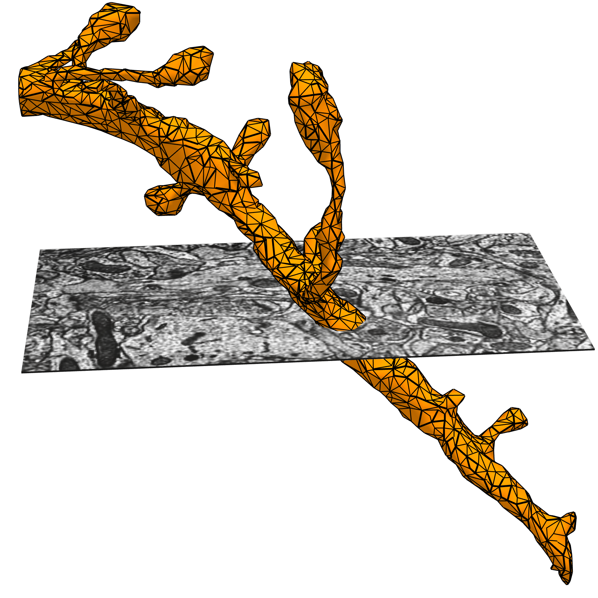 -->

</img>

</div>
<div>

Skeleton
(_Coarse medial axis_)

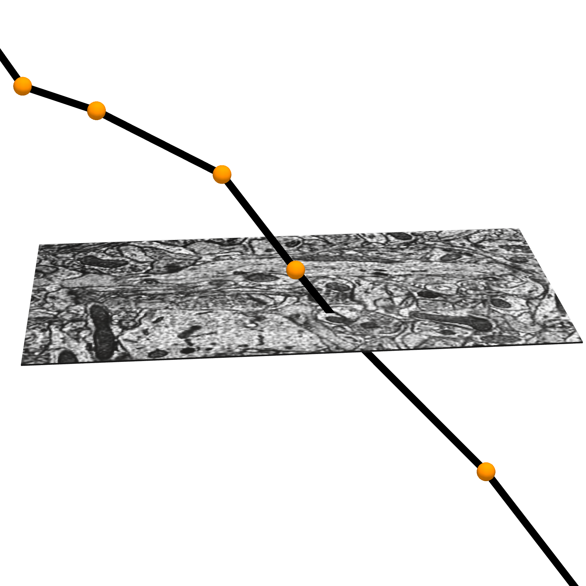

</div>
</div>

<div style="text-align: center">

$\leftarrow$ More expensive &nbsp;&nbsp;&nbsp;&nbsp;&nbsp;&nbsp;&nbsp;&nbsp;&nbsp;&nbsp;&nbsp;&nbsp;&nbsp;&nbsp;&nbsp;&nbsp;&nbsp;&nbsp; Less expensive $\rightarrow$

</div>

<!-- _transition: fade 1s -->

---

# How to generate features for a mesh?

<div class="columns">
<div>

</img>

</div>
<div>


</div>
</div>


---

# Heat diffusion

Imagine placing a unit of heat at a point on a surface, watching how that heat diffuses


<!-- _footer: https://en.wikipedia.org/wiki/Heat_equation -->

---

<div style="font-size:20px">
<span style="color: var(--soma);"> &nbsp;&nbsp;&nbsp;&nbsp;&nbsp;&nbsp;&nbsp;&nbsp;&nbsp;&nbsp;&nbsp;&nbsp;&nbsp;&nbsp;&nbsp;&nbsp; soma</span> <span style="color: var(--shaft);">shaft</span> <span style="color: var(--spine);">spine</span>

<!--  -->

</img>

<div style="font-size:30px; text-align: center; top: -40px; position: relative;">

Increasing time $\rightarrow$

</div>

<!-- _transition: fade 0.5s -->

---

<!-- TODO EXP fix this up so the y axis starts the same for the panel at right -->

# Tracking heat diffusion

<div class="columns">
<div>

<!--  -->

</img>

</div>
<div>

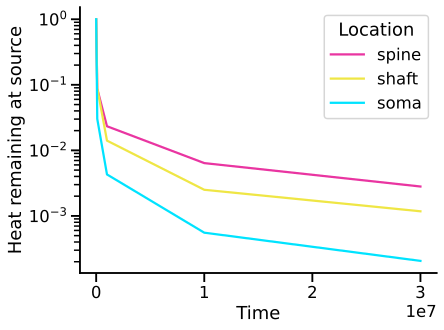</img>


</div>
</div>

<!-- _transition: fade 0.5s -->

---

# Defining the heat kernel signature (HKS)

<div class="columns">
<div>

</img>

</div>
<div>

* $k_{t}(x)$: amount of heat left at $x$ after time $t$.
* For timescales $\{t_1, ... t_d\}$ the HKS for point $x$ is
  $$HKS(x) = [k_{t_1}(x), ..., k_{t_d}(x)]$$
* Often scale these: $\frac{k_{t_1}(x)}{\sum_i k_{t_1}(i)}$
* <div id="highlightbox"> HKS is a vector for each <span style="font-weight: bold">node</span> in a mesh which describes its heat diffusion properties </div>


</div>
</div>

<!-- _footer: Sun et al., _Eurographics_ (2008) -->

---

# Intuition for HKS matching

<style scoped>

p {
  font-size: 20px;
}

</style>

<div class="columns">
<div>

<!-- 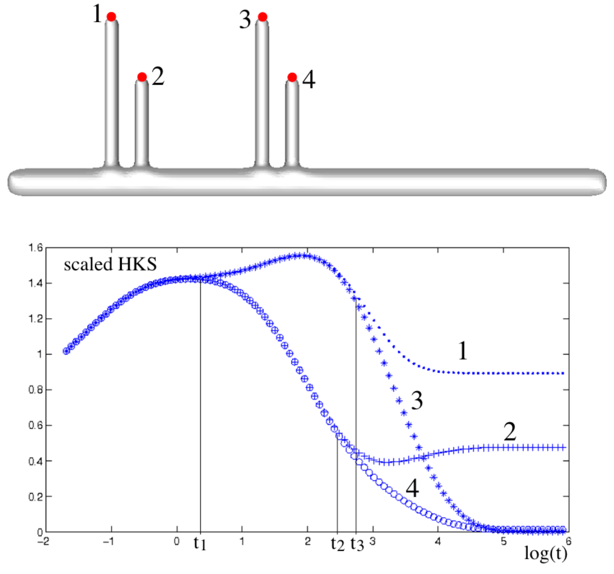 -->

</img>

> ...all four points have isometric neighborhoods at small scales, their HKS’s are the same for small $t$’s ($< t_1$).

</div>
<div>


<!-- </img> -->

</div>
</div>

<!-- _footer: Sun et al., _Eurographics_ (2008) -->

---

# Clustering on heat kernel signatures

<div class="columns">
<div>


<!-- </img> -->

</div>
<div>

<div>
<embed src="./images/show_heat_diffusion/hks_clustered.html" width="96%" height="550px" name="hks_clustered" data-morph="octopus"></embed>

</div>
</div>
</div>

---

# Postsynaptic structure prediction (with labels)

<div class="columns">
<div>


</div>
<div>

- Synapse target labels from VORTEX _(Erika Neace, Rachael Swanstrom, Bethanny Danskin)_
* HKS features from the mesh point closest to synapse
* Random forest classifier

</div>
</div>


<!-- --- -->

<!-- Import the component
<script type="module" src="https://ajax.googleapis.com/ajax/libs/model-viewer/4.0.0/model-viewer.min.js"></script>

<style>
model-viewer {
  width: 100%;
  height: 100%;
  background-color: #000;
  color: #3d3d3d
}
</style>

<model-viewer alt="A neuron" src="https://raw.githubusercontent.com/bdpedigo/talks/refs/heads/main/docs/slides/2025-03-25-brain-science-seminar/models/864691135855890478.gltf" camera-controls touch-action="pan-y"
auto-rotate rotation-per-second="150%" camera-target="0m 0m 0m" min-field-of-view="0.25deg" field-of-view="auto" max-field-of-view="6deg"> -->

<!--
<model-viewer alt="A neuron" src="http://localhost:9001/864691135855890478.gltf" camera-controls touch-action="pan-y"
auto-rotate rotation-per-second="150%" camera-target="0m 0m 0m" min-field-of-view="0.25deg" field-of-view="auto" max-field-of-view="6deg"> -->

<!--
<model-viewer alt="Neil Armstrong's Spacesuit from the Smithsonian Digitization Programs Office and National Air and Space Museum" src="shared-assets/models/NeilArmstrong.glb" ar environment-image="shared-assets/environments/moon_1k.hdr" poster="shared-assets/models/NeilArmstrong.webp" shadow-intensity="1" camera-controls touch-action="pan-y"></model-viewer>
-->

---

# <!-- fit --> Random forest on HKS is an accurate classifier

Train test split over _neurons_
<div class="columns">
<div>


</div>
<div>


</div>
</div>

---

<div style="font-size:16px">
<span style="color: var(--soma);">soma</span> <span style="color: var(--shaft);">shaft</span> <span style="color: var(--spine);">spine</span>
</div>

<div>
<embed src="./images/boosted_model_posteriors/864691135182486274_posterior.svg" width="96%" height="600px" name="864691135182486274_posterior"></embed>

<a href="./images/boosted_model_posteriors/864691135182486274_posterior.html" target="864691135182486274_posterior">
</img>
</a>
</div>

---

<div style="font-size:16px">
<span style="color: var(--soma);">soma</span> <span style="color: var(--shaft);">shaft</span> <span style="color: var(--spine);">spine</span>
</div>

<div>
<embed src="./images/boosted_model_posteriors/864691135361404743_posterior.svg" width="96%" height="600px" name="864691135361404743_posterior"></embed>

<a href="./images/boosted_model_posteriors/864691135361404743_posterior.html" target="864691135361404743_posterior">
</img>
</a>
</div>

---

<div style="font-size:16px">
<span style="color: var(--soma);">soma</span> <span style="color: var(--shaft);">shaft</span> <span style="color: var(--spine);">spine</span>
</div>

<div>
<embed src="./images/boosted_model_posteriors/864691135416507322_posterior.svg" width="96%" height="600px" name="864691135416507322_posterior"></embed>

<a href="./images/boosted_model_posteriors/864691135416507322_posterior.html" target="864691135416507322_posterior">
</img>
</a>
</div>

---

# Excitatory neurons

<div style="font-size:20px; padding: 0px; position: absolute; top: 0.6in; right: 0.7in;">
<span style="color: var(--soma);">soma</span> <span style="color: var(--shaft);">shaft</span> <span style="color: var(--spine);">spine</span>
</div>

<div class="columns">
<div>

<!--  -->

<figure class="fig">

<figcaption >
23P
</figcaption>
</figure>

</div>
<div>

<figure class="fig">

<figcaption >
4P
</figcaption>
</figure>

</div>
<div>

<figure class="fig">
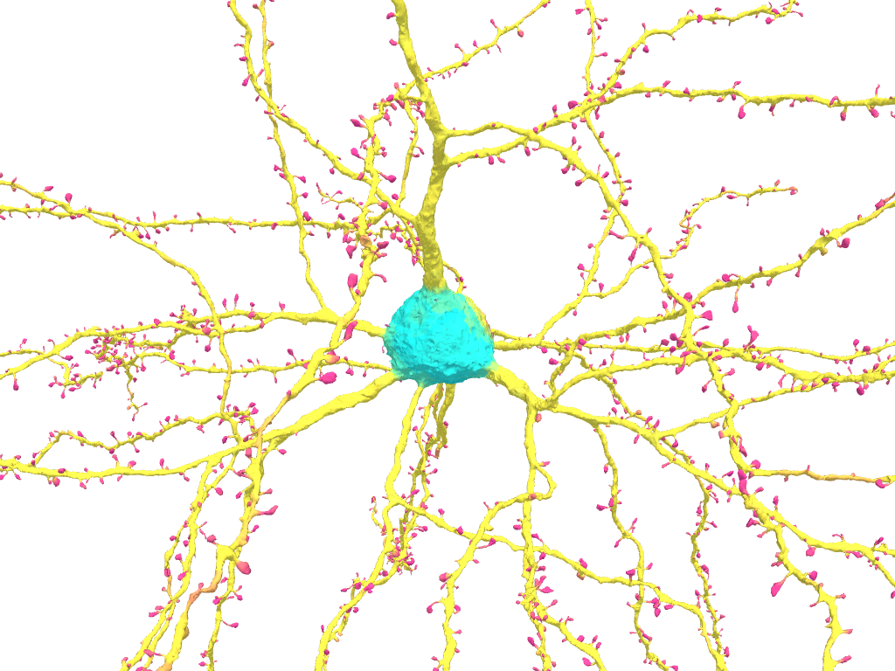
<figcaption >
5P-IT
</figcaption>
</figure>

</div>
</div>

<div class="columns">
<div>

<figure class="fig">

<figcaption >
5P-NP
</figcaption>
</figure>

</div>
<div>

<figure class="fig">

<figcaption >
5P-ET
</figcaption>
</figure>

</div>
<div>

<figure class="fig">
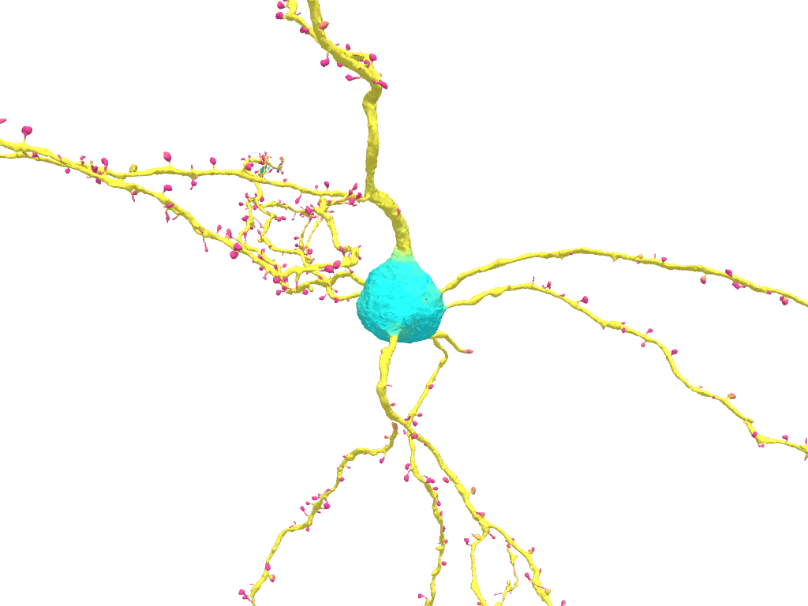
<figcaption >
6P-CT
</figcaption>
</figure>

</div>
</div>

<!-- _footer: Cell types from Schneider-Mizell et al. Nature (In press) -->

---

# Excitatory or inhibitory?

<style scoped>
a {
  position: relative;
}
img {

}
img:hover {
  box-shadow: 0 0 2px 1px rgba(0, 140, 186, 0.5);
}
</style>

<div class="columns">
<div>

##### A) <a href="https://spelunker.cave-explorer.org/#!middleauth+https://global.daf-apis.com/nglstate/api/v1/4927362740256768">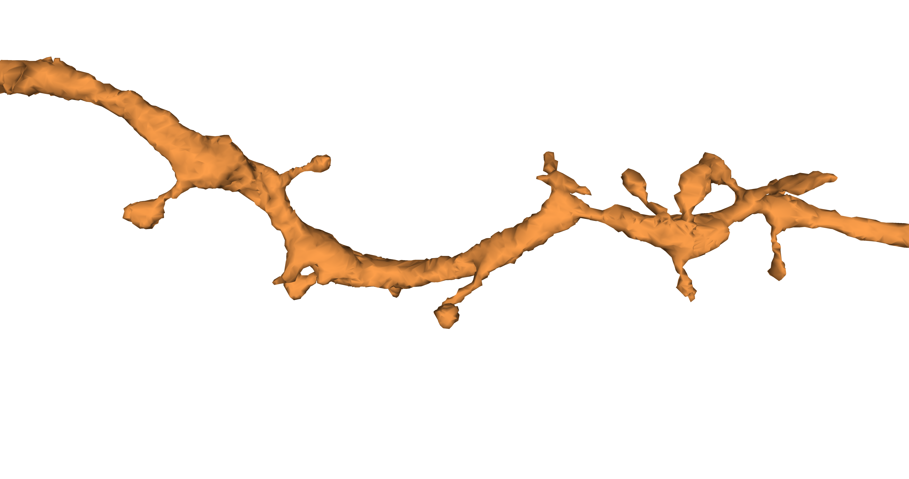</img></a>


</div>
<div>

##### B)

<a href="https://spelunker.cave-explorer.org/#!middleauth+https://global.daf-apis.com/nglstate/api/v1/5018403698900992">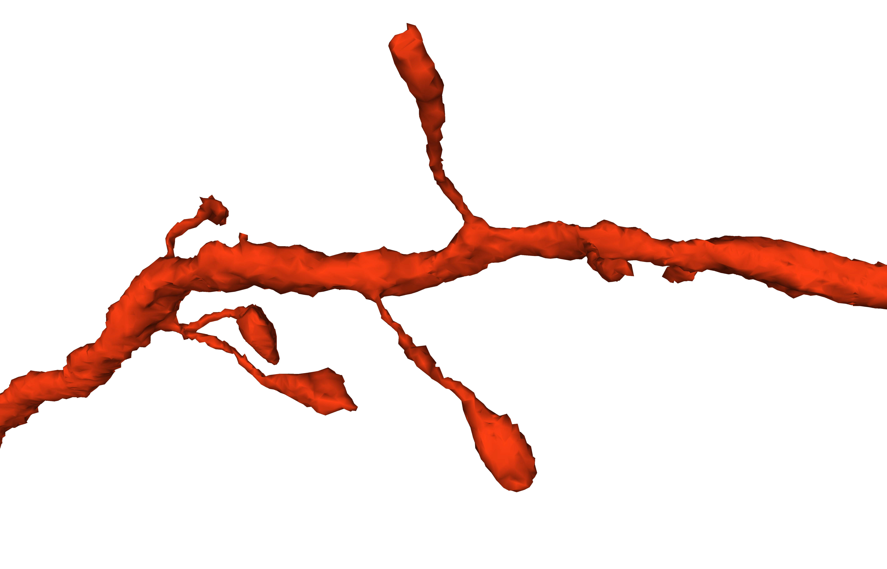</img></a>


</div>
<div>

##### C)

<a href="https://spelunker.cave-explorer.org/#!middleauth+https://global.daf-apis.com/nglstate/api/v1/5294319914188800"></img></a>

</div>
</div>

<div class="columns">
<div>

##### D)

<a href="https://spelunker.cave-explorer.org/#!middleauth+https://global.daf-apis.com/nglstate/api/v1/4938240147587072"></img></a>


</div>
<div>

##### E)

<a href="https://spelunker.cave-explorer.org/#!middleauth+https://global.daf-apis.com/nglstate/api/v1/5256989132193792">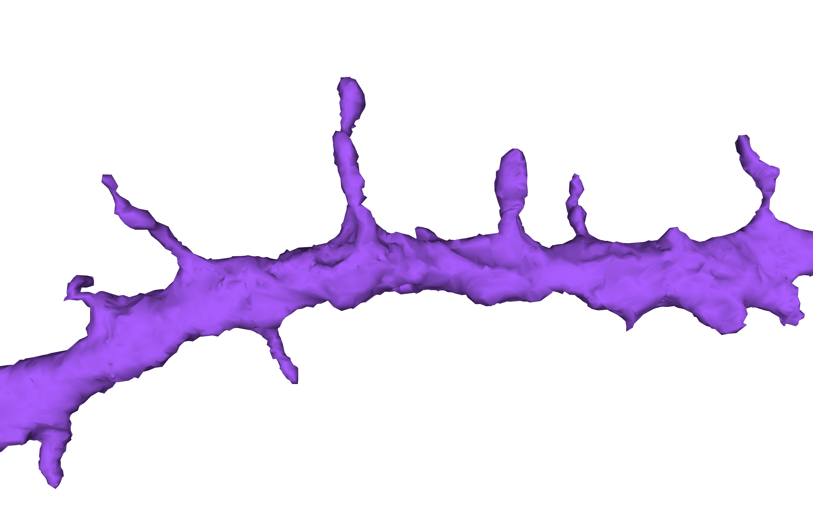</img></a>

</div>
<div>

##### F)

<a href="https://spelunker.cave-explorer.org/#!middleauth+https://global.daf-apis.com/nglstate/api/v1/6342512605134848"></img></a>

</div>
</div>

---

# Excitatory or inhibitory?

<style scoped>
a {
  position: relative;
}
img {

}
img:hover {
  box-shadow: 0 0 2px 1px rgba(0, 140, 186, 0.5);
}
</style>

<div class="columns">
<div>

##### Inhibitory <a href="https://spelunker.cave-explorer.org/#!middleauth+https://global.daf-apis.com/nglstate/api/v1/4927362740256768"></img></a>


</div>
<div>

##### Excitatory

<a href="https://spelunker.cave-explorer.org/#!middleauth+https://global.daf-apis.com/nglstate/api/v1/5018403698900992"></img></a>


</div>
<div>

##### Inhibitory

<a href="https://spelunker.cave-explorer.org/#!middleauth+https://global.daf-apis.com/nglstate/api/v1/5294319914188800"></img></a>

</div>
</div>

<div class="columns">
<div>

##### Excitatory

<a href="https://spelunker.cave-explorer.org/#!middleauth+https://global.daf-apis.com/nglstate/api/v1/4938240147587072"></img></a>


</div>
<div>

##### Inhibitory

<a href="https://spelunker.cave-explorer.org/#!middleauth+https://global.daf-apis.com/nglstate/api/v1/5256989132193792"></img></a>

</div>
<div>

##### Excitatory

<a href="https://spelunker.cave-explorer.org/#!middleauth+https://global.daf-apis.com/nglstate/api/v1/6342512605134848"></img></a>

</div>
</div>

---

# Inhibitory neurons

<div style="font-size:20px; padding: 0px; position: absolute; top: 0.6in; right: 0.7in;">
<span style="color: var(--soma);">soma</span> <span style="color: var(--shaft);">shaft</span> <span style="color: var(--spine);">spine</span>
</div>

<div class="columns">
<div>

<figure class="fig">
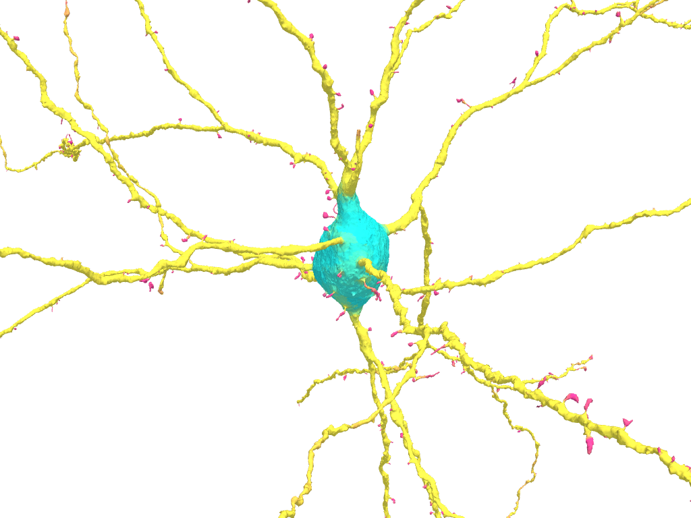
<figcaption >
Basket
</figcaption>
</figure>

</div>
<div>

<figure class="fig">

<figcaption >
Basket
</figcaption>
</figure>

</div>
<div>

<figure class="fig">

<figcaption >
Martinotti
</figcaption>
</figure>

</div>
</div>

<div class="columns">
<div>

<figure class="fig">
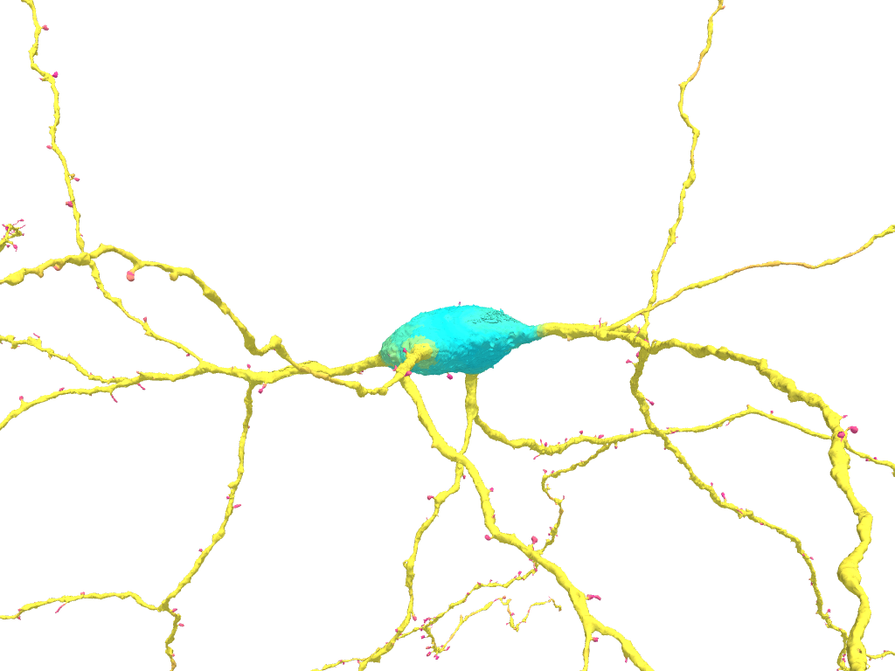
<figcaption >
Martinotti
</figcaption>
</figure>

</div>
<div>

<figure class="fig">
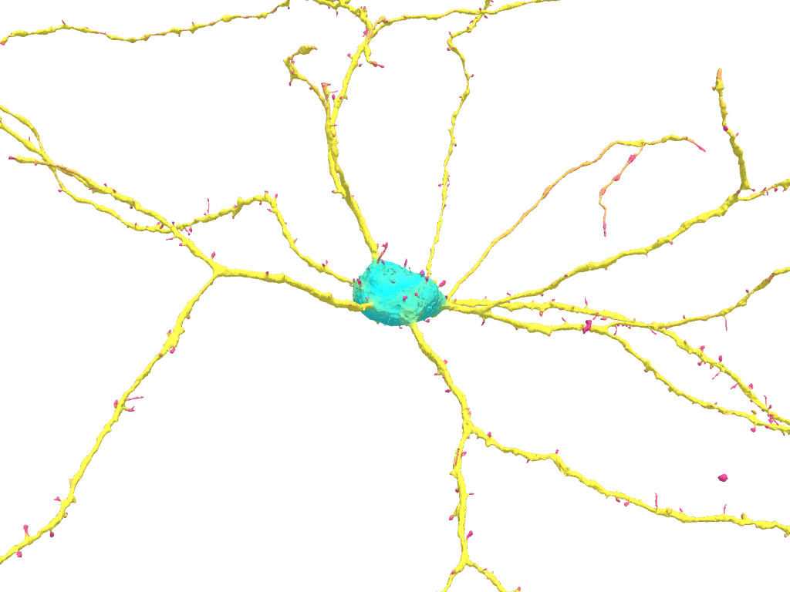
<figcaption >
Neurogliaform
</figcaption>
</figure>

<!-- cover some axon that didn't get pruned -->
<div style="position: absolute; top: 6.25in; left: 8.25in; background-color: white; width:10px; height:10px; border-width: 0px; border-color: black; border-style: solid;"></div>

</div>
<div>

<figure class="fig">

<figcaption >
Bipolar
</figcaption>
</figure>

</div>
</div>

<!-- _footer: Cell types from Schneider-Mizell et al. Nature (In press) -->

---

# Zero-shot prediction on a human neuron

<div style="font-size:16px">
<span style="color: var(--soma);">soma</span> <span style="color: var(--shaft);">shaft</span> <span style="color: var(--spine);">spine</span>
</div>

<div>
<embed src="./images/h01/h01_posterior.svg" width="96%" height="520px" name="h01_posterior"></embed>

<a href="./images/h01/h01_posterior.html" target="h01_posterior">
</img>
</a>
</div>

<!-- _footer: Shapson-Coe et al. _Science_ 2024  -->


---


# Outline

- Motivation
- Intuition for heat kernel signatures
- **Computational pipeline for postsynaptic structure prediction**
- Postsynaptic structures in MICrONS

---

# Heat diffusion

* Evolution of heat $u$ is governed by the heat equation:
  $$\frac{\partial{u}}{\partial{t}} = \Delta u$$  
  where $\Delta$ is the Laplacian (2nd derivative) operator
* Heat remaining at $x$ after $t$ is:
  $$k_t(x) = \sum_{i=0}^{\infty} e^{-\lambda_i t} \phi_i(x)^2 \approx \sum_{i=0}^{K} e^{-\lambda_i t} \phi_i(x)^2 $$
  where $\lambda_i$ and $\phi_i$ are the eigenvalues and eigenvectors of the Laplacian operator
* <div id="highlightbox"> We just need these eigenvectors/eigenvalues to compute HKS </div>

<!-- _footer: https://en.wikipedia.org/wiki/Heat_kernel -->

---

# Laplacian eigenvectors

<div class="columns">
<div>

### 1D grid


</div>
<div>

### 2D grid


</div>
<div>

### Mesh

<div>
<embed src="./images/show_heat_diffusion/eigenvector_on_mesh.html" width="96%" height="380px" name="eigenvector_on_mesh"></embed>

</div>

</div>
</div>

* Eigendecomposition allows you to compute HKS for every point simultaneously
* Takes several hours for a full neuron mesh

---

# Computational improvements

<div class="columns">
<div>

- Overlapping mesh subdivision
* Mesh simplification (Garland and Heckbert 1997)
* Band-by-band eigendecomposition (Vallet and Levy 2008)
* Robust laplacian (Sharp and Crane 2020)
* Mesh agglomeration (for compressed storage)

</div>
<div>

<figure class='fig'>

<figcaption>
Subdivided mesh
</figcaption>
</figure>

<figure class='fig'>

<figcaption>
Subdivided mesh with overlap
</figcaption>
</figure>

</div>
</div>

---

# Timing and compute

<!-- TODO SCI compare to the version without these speedups -->

<div class="columns">
<div>

- Deployed on Google Kubernetes Engine
- ~20 minutes per neuron per CPU
  - ~2 minutes on your laptop
- Mean cost **~0.5 cents per neuron**

<!--  -->

</div>
<div>

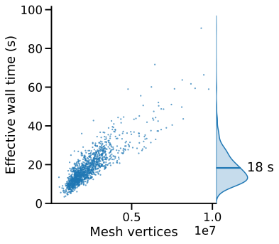

<!--  -->

</div>
</div>

---

# Run on MICrONS

<div class="columns">
<div>

- Ran on ~72,000 putative neurons
- ~204 million synapses classified into &nbsp; { <span style="color: rgb(0, 227, 255);">soma</span> <span style="color: rgb(239, 230, 69);">shaft</span> <span style="color: rgb(233, 53, 161);">spine</span> }
- ~$500 in cloud compute cost

</div>
<div>

<figure class="fig">

<belowcaption>

_~1 million (0.5%) of classified synapses_

</belowcaption>
</figure>

</div>
</div>

---


# Outline

- Motivation
- Intuition for heat kernel signatures
- Computational pipeline for postsynaptic structure prediction
- **Postsynaptic structures in MICrONS**

---

<!-- NOTE at a high level, we can look at things in terms of their laminar distribution -->
<!-- NOTE there is an abundance of synapses onto spines in upper layers  -->

# Spatial distribution of synapses

<div class="columns">
<div>

<div style="font-size:16px">
<span style="color: var(--soma);">soma</span> <span style="color: var(--shaft);">shaft</span> <span style="color: var(--spine);">spine</span>
</div>


<!-- 1.3M synapses (= .63% of classified) -->

</div>
<div>

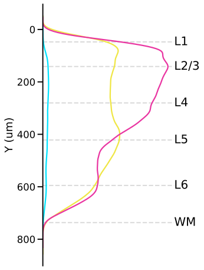

</div>
</div>

---

<div class="columns-br">
<div>

# Synapses by E/I

Synapses from cleaned axons where pre- and post- have E/I classifications (1.3M synapses total)

</div>
<div>

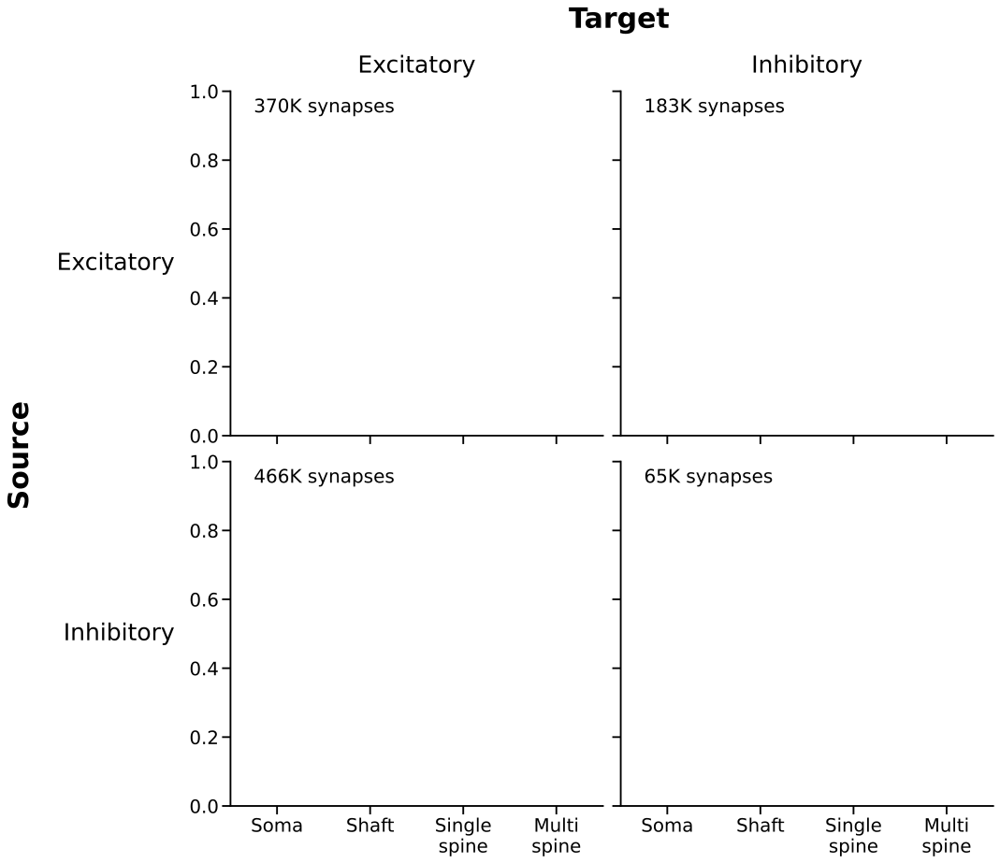

</div>
</div>

<!-- _footer: Cell types from Schneider-Mizell et al. Nature (In press), Elabbady et al. Nature (In press) -->

---

# Multi-input spines

<!-- TODO EXP add a nice image here of more than one axon onto a spine -->

<div class="columns">
<div>

* Most (>90%) excitatory spines receive a single excitatory input
* Some excitatory spines receive two
  - Specifically one E, one I
  - Enriched for thalamic input
  - More stable
* Multi-input spines common for inhibitory neurons

</div>
<div>

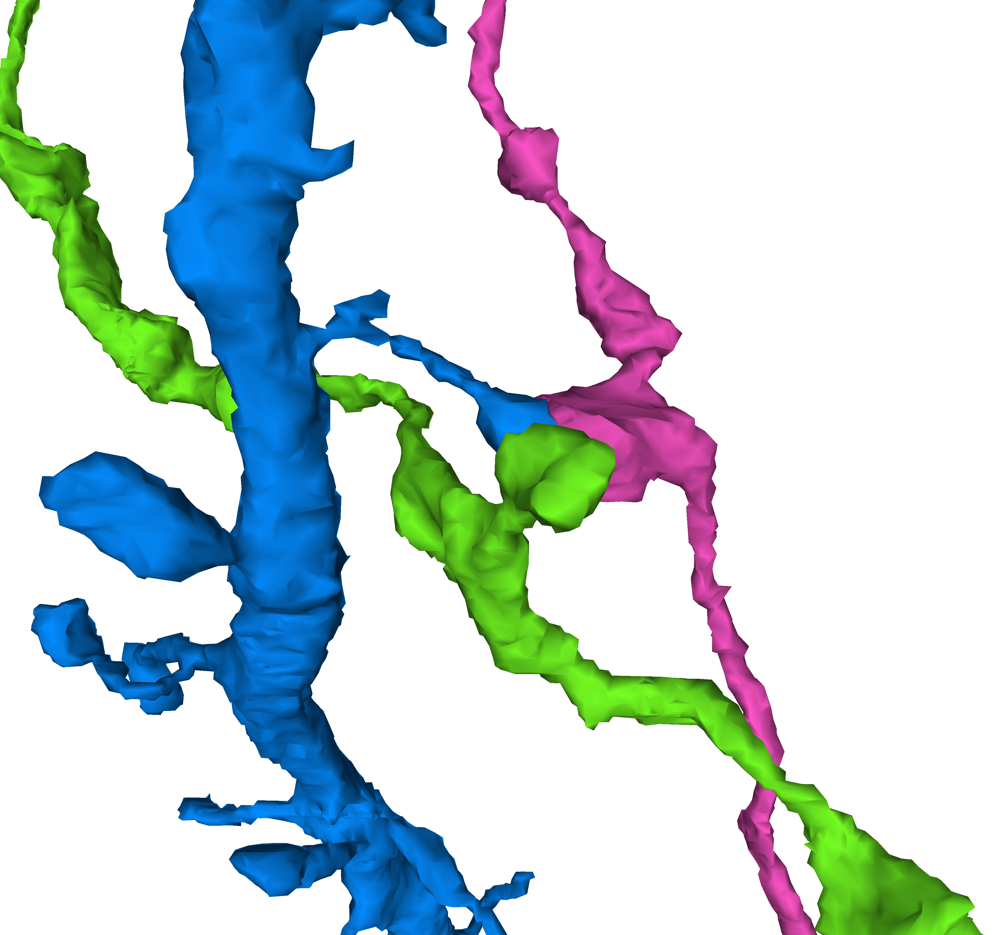

<!-- https://spelunker.cave-explorer.org/#!middleauth+https://global.daf-apis.com/nglstate/api/v1/6025508249665536 -->

</div>
</div>

<!-- _footer: Kubota et al _J. Neuroscience_ (2007), Villa et al _Neuron_ (2016), Hwang et al _Cerebral Cortex_ (2021) -->

---

# Finding multi-input spines

<div class="columns">
<div>

<span style="color: var(--soma);">soma</span> <span style="color: var(--shaft);">shaft</span> <span style="color: var(--spine);">spine</span> &nbsp;&nbsp;&nbsp; :black_circle: synapse detection


</div>
<div>

Connected components sharing a label


<div style="position: absolute; top: 1.8in; left: 9.5in;">Multi-input</div>
<div style="position: absolute; top: 2.2in; left: 9.5in; width: 140px; height: 140px; background-color: none; border-radius: 70px; border-width: 3px; border-color: black; border-style: solid;"></div>

<div style="position: absolute; top: 4.1in; left: 10.8in;">Single-input</div>
<div style="position: absolute; top: 4.5in; left: 10.8in; width: 140px; height: 140px; background-color: none; border-radius: 70px; border-width: 3px; border-color: black; border-style: solid;"></div>

</div>
</div>

---

# <!-- fit --> A triple-input spine onto an excitatory cell

<!-- https://spelunker.cave-explorer.org/#!middleauth+https://global.daf-apis.com/nglstate/api/v1/6077690223263744 -->


---

<div class="columns-br">
<div>

# Synapses by E/I

Synapses from cleaned axons where pre- and post- have E/I classifications (1.3M synapses total)

</div>
<div>

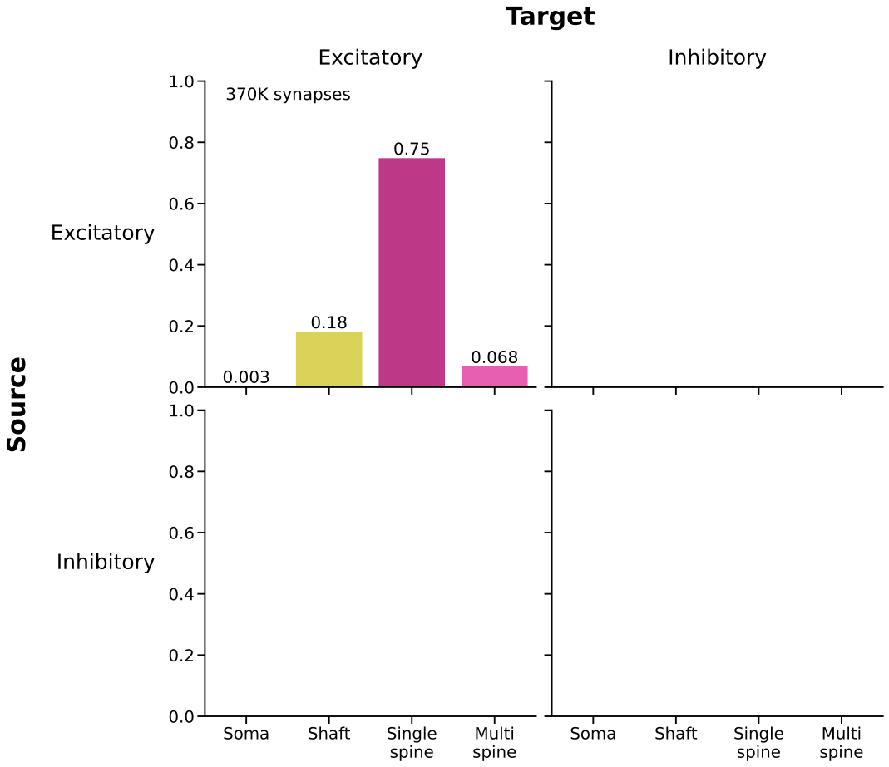

</div>
</div>

<!-- _footer: Cell types from Schneider-Mizell et al. Nature (In press), Elabbady et al. Nature (In press) -->

---

<div class="columns-br">
<div>

# Synapses by E/I

Synapses from cleaned axons where pre- and post- have E/I classifications (1.3M synapses total)

</div>
<div>

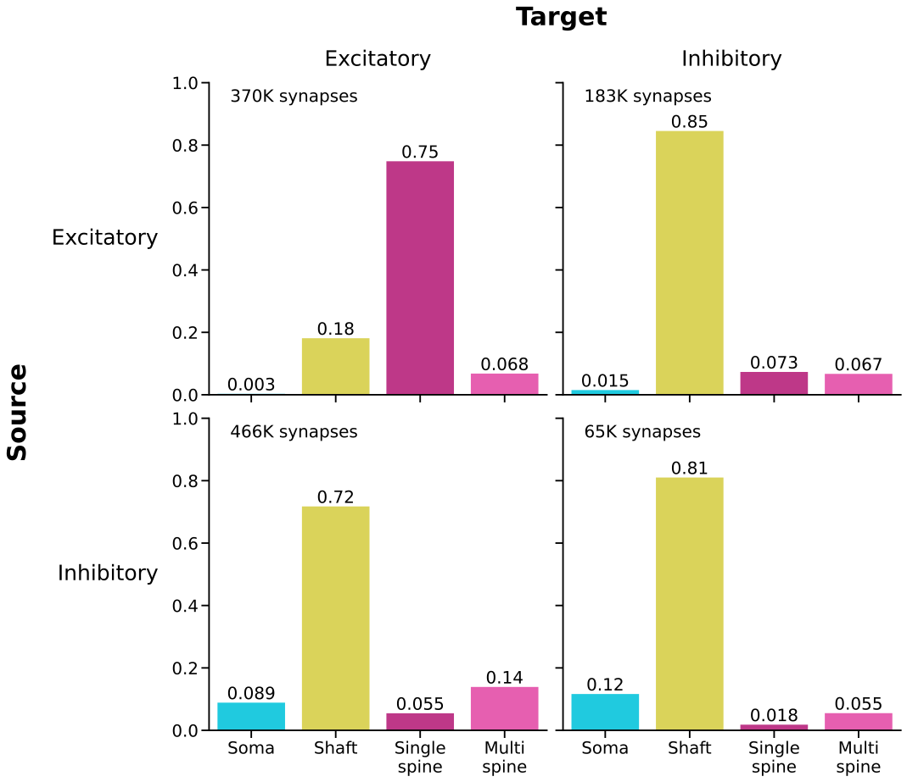

</div>
</div>

<!-- _footer: Cell types from Schneider-Mizell et al. Nature (In press), Elabbady et al. Nature (In press) -->

---

<!-- NOTE because microns also has some cell type information, we can also look at a similar plot but now broken out by cell type
-->
<!-- NOTE a lot going on here, but going to draw your attention to just a few things -->

<div class="columns-br">
<div>

# Synapses by cell type

</div>
<div>


</div>
</div>

<!-- _footer: Cell types from Schneider-Mizell et al. Nature (In press) -->

---

# Basket cells target somas, even of inhibitory cells


<div class="columns">
<div>


<!-- https://spelunker.cave-explorer.org/#!middleauth+https://global.daf-apis.com/nglstate/api/v1/4910284205457408 -->

<span style="color: #e1562c">Basket </span> $\rightarrow$ <span style="color: #00cb85"> Basket</span>

</div>
<div>


<!-- https://spelunker.cave-explorer.org/#!middleauth+https://global.daf-apis.com/nglstate/api/v1/6700069303615488 -->

<span style="color: #e1562c">Basket</span> $\rightarrow$ <span style="color: #00cb85"> Bipolar </span>

</div>
<div>


<!-- https://spelunker.cave-explorer.org/#!middleauth+https://global.daf-apis.com/nglstate/api/v1/6074562245558272 -->

<span style="color: #e1562c">Basket</span> $\rightarrow$ <span style="color: #00cb85"> Martinotti </span>

</div>
</div>

---

# L6 CT cells target shafts of other excitatory cells


<div class="columns">
<div>

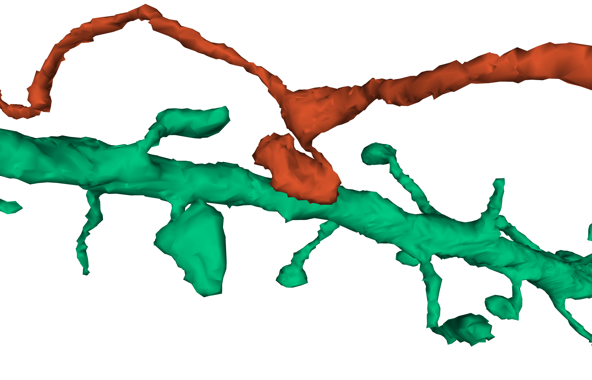

<!-- https://spelunker.cave-explorer.org/#!middleauth+https://global.daf-apis.com/nglstate/api/v1/4808939033067520 -->

<span style="color: #e1562c">6P-CT </span> $\rightarrow$ <span style="color: #00cb85"> 4P</span>

</div>
<div>

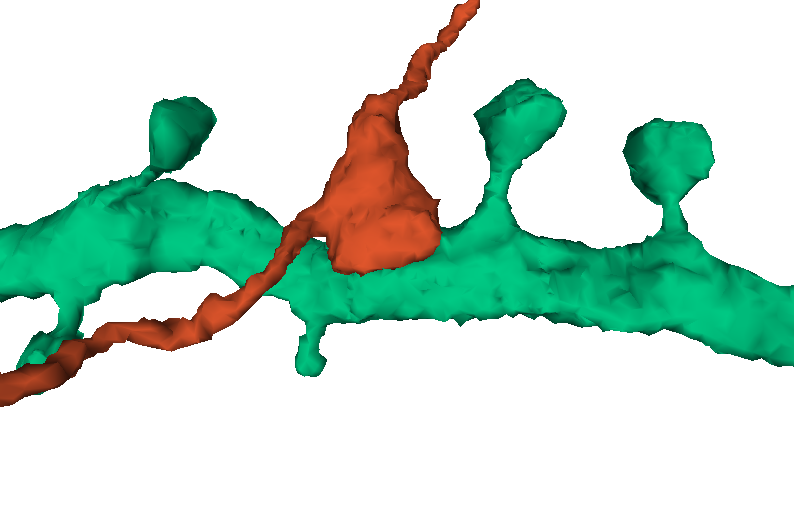

<!-- https://spelunker.cave-explorer.org/#!middleauth+https://global.daf-apis.com/nglstate/api/v1/6560729223135232 -->

<span style="color: #e1562c">6P-CT </span> $\rightarrow$ <span style="color: #00cb85"> 5P-ET</span>

</div>
<div>

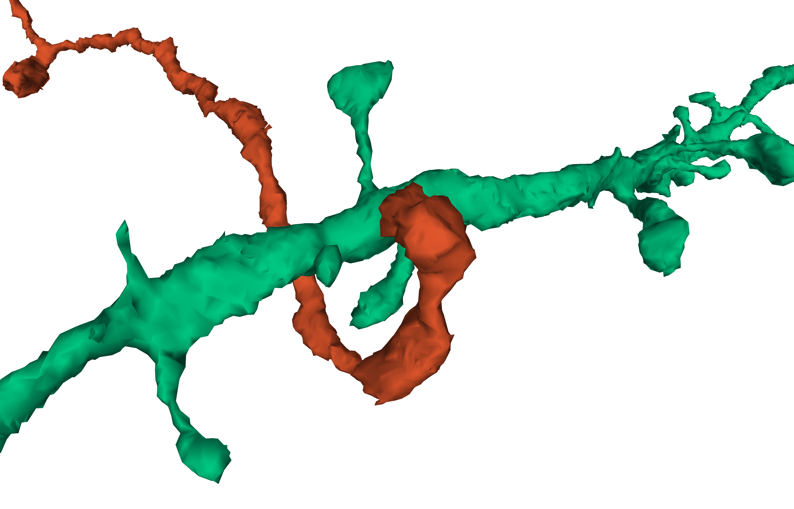

<span style="color: #e1562c">6P-CT </span> $\rightarrow$ <span style="color: #00cb85"> 5P-IT</span>

<!-- https://spelunker.cave-explorer.org/#!middleauth+https://global.daf-apis.com/nglstate/api/v1/4835245372211200 -->

</div>
</div>

---

# 5P-ET to Martinotti spines

<!-- TODO add text to this slide -->

<!-- __backgroundImage: ../themes/aibs-backgrounds/blank.png -->

<div class="columns">
<div>


<!-- add an absolute position white box without text, with black border -->

<!-- block out upper left corner -->
<div style="position: absolute; bottom: 5.26in; right: 7.76in; width: 4.4in; height: .94in; background-color: white; opacity:0.9; border: 0px solid black;"></div>

<!-- block out lower left corner -->
<div style="position: absolute; top:2.7in; right: 7.76in; width: 4.4in; height: 4.2in; background-color: white; opacity:0.9; border: 0px solid black;"></div>

<!-- block out upper right corner -->
<div style="position: absolute; bottom: 5.26in; left: 6.05in; width: .6in; height: .94in; background-color: white; opacity:0.9; border: 0px solid black;"></div>

<!-- block out lower right corner -->
<div style="position: absolute; top:2.7in; left: 6.05in; width: .6in; height: 4.2in; background-color: white; opacity:0.9; border: 0px solid black;"></div>

<!-- red block in the gap between the above -->
<div style="position: absolute; top: 2.35in; left: 5.7in; width: 0.4in; height: .5in; backbround-color: none; border: 3px solid red; border-radius:20px"></div>

</div>
<div>

<div class="columns-br-tight">
<div>

<span style="color: #e1562c">5P-ET </span> $\rightarrow$ <span style="color: #00cb85"> Martinotti</span>

</div>
<div>


</div>
</div>

<div class="columns-br-tight">
<div>

<span style="color: #e1562c">5P-ET </span> $\rightarrow$ <span style="color: #00cb85"> Martinotti</span>

</div>
<div>


</div>
</div>


<!-- 

 -->

<!--  -->

<!-- <figure class='fig'>

</figure> -->

</div>
</div>

<!-- _footer: Bodor et al. Nature Neuroscience (In press) -->

---

# Variability within type

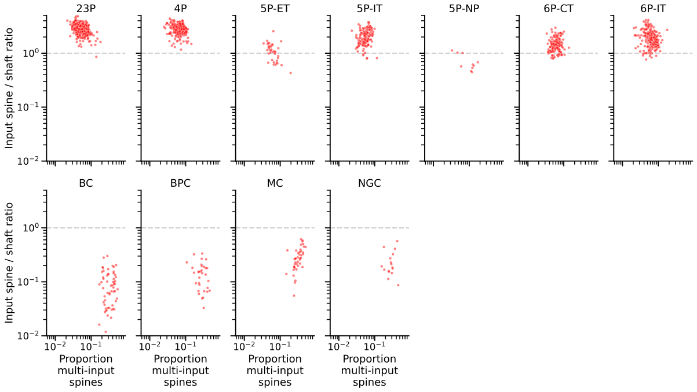

<!-- add an span with absolute positioning above the figure -->
<!-- 
<span style="position: absolute; top: 4in; left: 8in; font-size: 15px; background-color: white; padding: 5px; border-radius: 5px; color: red">Manually classified (Schneider-Mizell et al. Nature 2025)</span>

<span style="position: absolute; top: 4.25in; left: 8in; font-size: 15px; background-color: white; padding: 5px; border-radius: 5px; color: #1f77b4">Automatically classified (Elabbady et al. Nature 2025)</span> -->

<!-- _footer: Cells types from Schneider-Mizell et al. Nature (In press) -->

---

# Perisomatic targeting cells


<div class="columns">
<div>

<span style="color:#4da0ff; text-align: right; display: block">~1% inputs onto spines</span>

</div>
<div>

<span style="color: #FFA94D">~23% inputs onto spines</span>

</div>
</div>

<!-- https://spelunker.cave-explorer.org/#!middleauth+https://global.daf-apis.com/nglstate/api/v1/6748095493701632 -->


--- 

# Variability within type


<span style="position: absolute; top: 4in; left: 8in; font-size: 15px; background-color: white; padding: 5px; border-radius: 5px; color: red">Manually classified (Schneider-Mizell et al. Nature 2025)</span>

<span style="position: absolute; top: 4.25in; left: 8in; font-size: 15px; background-color: white; padding: 5px; border-radius: 5px; color:rgb(83, 83, 83)">Automatically classified (Elabbady et al. Nature 2025)</span>

<!-- _footer: Cells types from Schneider-Mizell et al. Nature (In press), Elabbady et al. Nature (In press) -->

---

# Accessing the data

* Cafe in AM
* Available in the **C**onnectome **A**nnotation and **V**ersioning **E**ngine (CAVE):
  ```python
  from caveclient import CAVEclient
  client = CAVEclient("minnie65_public", version=1300)
  client.materialize.query_table(
      "synapse_target_predictions_ssa",
      limit=2,
      select_columns=["target_id", "pre_pt_root_id", "post_pt_root_id", "tag", "size"],
  )
  ```

  ```plaintext
  pre_pt_root_id	        post_pt_root_id	        size	target_id	tag
  864691135468221308	864691135383487706	4284	306517361	spine
  864691135979239816	864691135383487706	1620	285512620	shaft
  ```

<!-- _footer: CAVE: Dorkenwald, Schneider-Mizell et al Nature Methods (In press) -->

---

# Summary

* Developed a method based on spectral shape analysis (HKS) for classifying postsynaptic structures based on mesh alone
* Scaled this system to robustly classify >200M synapses in MICrONS
* Described initial findings on how postsynaptic structure targeting varies by cell type

---

# Future directions

<div class="columns">
<div>

- Other classification/segmentation tasks (e.g. axonal boutons)
* Add morphometry (e.g. compute spine volumes, surface area, etc.)
* Study spatial distribution of spine densities on individual neurons
* Deploy on more datasets

</div>
<div>


_Segmenting thalamic axon boutons_

</div>
</div>

---

# Acknowledgements

<style scoped>
p {
    font-size: 10px;
}
h6 {
  font-size: 14px;
}

</style>

<div class="columns">
<div>

<ins>_Network Anatomy_</ins>
**Forrest Collman**
**Bethanny Danskin**
**Casey M. Schneider-Mizell**
**Erika Neace**
**Rachel Swanstrom**
Adam Bleckert
Agnes Bodor
Derrick Brittain
JoAnn Buchanan
Dan Bumbarger
Steven Cook
Nuno da Costa
Cameron Devine
Sven Dorkenwald
Leila Elabbady
Elizabeth Guadarrama
Kim Gruver
Emily Joyce
Dan Kapner
Sam Kinn
Cheryl Lea
Xiaoyu Lu
Gayathri Mahalingam
Sid Rath
Clay Reid
Jenna Schardt
Sharmi Seshamani
Marc Takeno
Russel Torres
Keith Wiley
Wenjing Yin
Chi Zhang

</div>
<div>

<ins>_PM_</ins>
Lynne Becker
Florence D'Orazi 
Melissa Lerch
Sarah Naylor
Shelby Suckow
Susan Sunkin
David Vumbaco

<ins>_Morphology and 3D Reconstruction_</ins>
Rachel Dalley
Clare Gamlin
Staci Sorensen
Grace Williams

<ins>_Modeling & Simulation_</ins>
Ani Nandi
Tom Chartrand
Anatoly Buchin
Yina Wei
Soo Yeun Lee
Costas Anastassiou

<ins>_Technology_</ins>
Tim Fliss
Rob Young
And others

<ins>_IT_</ins>
Brian Youngstrom
Stuart Kendrick
Scott Harrison
Nathaniel Middleton
And others

</div>
<div>

<ins>_MPE_</ins>
Jay Borseth
Collin Farrell
And others

<ins>_MindScope_</ins>
Reza Abbasi-Asi
Anton Arkhipov
Michael Buice
Daniel Denman
Brian Hu
Josh Larkin
Stefan Mihalas
Daniel Millmann
Gabe Ocker
Naveen Ouellette
Kevin Takasaki
Saskia de Vries
Jun Zhuang

<ins>_Alen Institute for Brain Science_</ins>
Tanya Daigle
Shenqin Yao
Nikolas Jorstad
Trygve Bakken
Rebecca Hodge
Nathan Gouwens
Bosiljka Tasic
Ed Lein
Hongkui Zeng
And many others

</div>
<div>

<ins>_Princeton_</ins>
Sven Dorkenwald
Tommy Macrina
Sebastian Seung
Nick Turner
And team

<ins>_Baylor_</ins>
Jake Riemer
Andreas Tolias
And team

<ins>_Harvard Medical School_</ins>
Brett Graham
Wei-Chung Lee
And team

<ins>_Janelia_</ins>
Khaled Khairy
Stephan Saalfeld
Carolyn Ott
Jennifer Lippincott-Schwartz
And others

<ins>_JHU_</ins>
Jenna Glatzer
Dwight Bergles

<ins>_APL_</ins>
Brock Wester
And team

</div>
<div>

<ins>_Neuro Surgery and Behavior_</ins>
<ins>_Lab Animal Services_</ins>
<ins>_Transgenic Colony Management_</ins>
<ins>_Finance_</ins>
<ins>_Legal_</ins>

<ins>_Computing Resources_</ins>
BBP5 Supercomputing Resources
National Energy Research Computing Center
AI HPC
Google Cloud

<ins>_Funding_</ins>
IARPA - MICRONS
NSF - NeuroNex
NIH – BICCN

</div>
</div>

###### We wish to thank the Allen Institute founder, Paul G. Allen, for his vision, encouragement, and support.


---

# Questions?

<!-- _backgroundImage: ../themes/aibs-backgrounds/blank.png -->


<br>
<br>
<br>
<br>
<br>
<br>
<br>

Ben Pedigo
(he/him)
Scientist I
Allen Institute for Brain Science
[ben.pedigo@alleninstitute.org](mailto:ben.pedigo@alleninstitute.org)

---

# Variability within type - outputs 

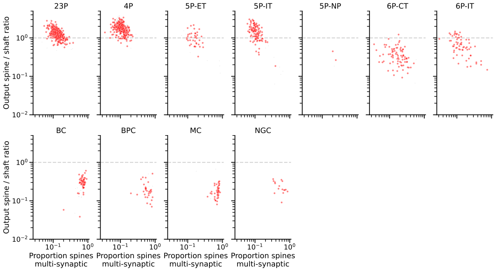

---

# An aside...

<div class="columns">
<div>

Many generalizations/extensions of HKS:

- Alternative computational schemes:
  <span style="font-size: 14px">Nasikun et al. 2018; Nasikun et al. 2022; Magnet and Ovsjanikov 2023, Hammond et al. 2009; Shuman et al. 2011; Huang et al. 2020 </span>
- Volumetric HKS:
  <span style="font-size: 14px">Raviv et al. 2010; Rustamov et al. 2009; Rustamov 2011</span>

</div>
<div>

HKS features:

$$h_t(x) = \sum_{i=0}^{D} e^{-\lambda_i t} \phi_i(x)^2$$

Learned spectral features (Litman & Bronstein 2014):

$$x_t(x) = \sum_{i=0}^{D} \textcolor{red}{f_t(\lambda)} \phi_i(x)^2$$

<!-- Spectral graph neural network layer (add citation): -->

</div>
</div>
