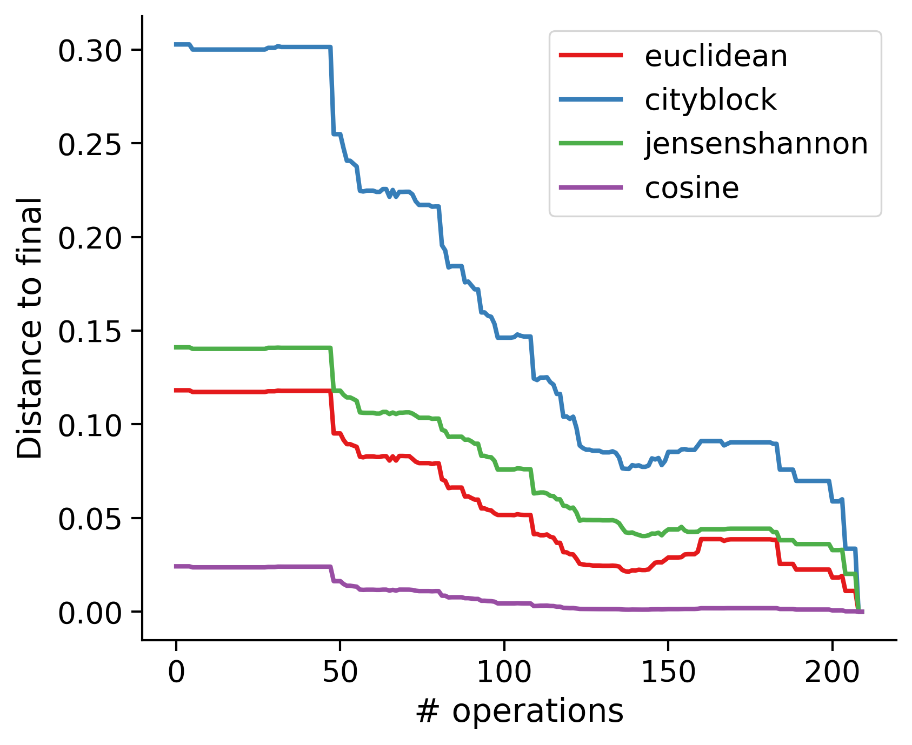
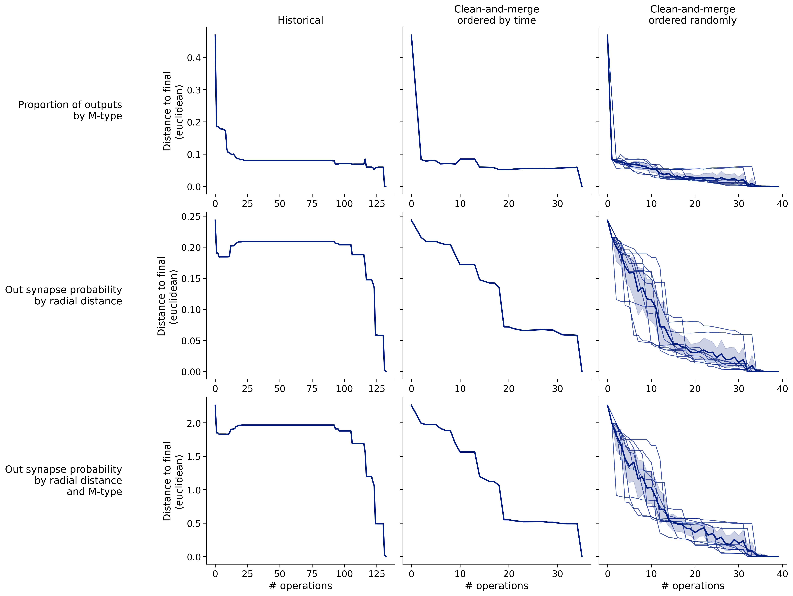
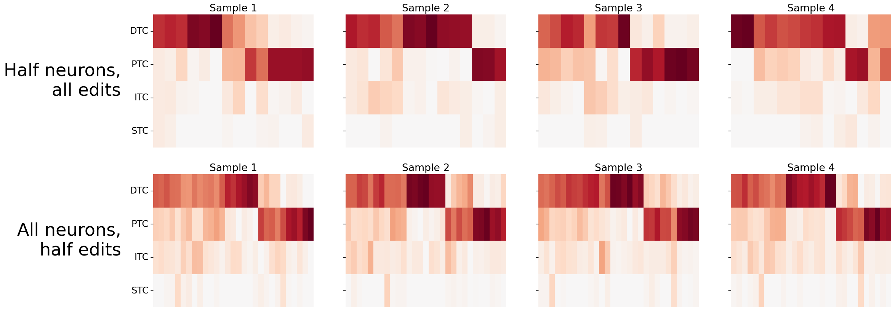
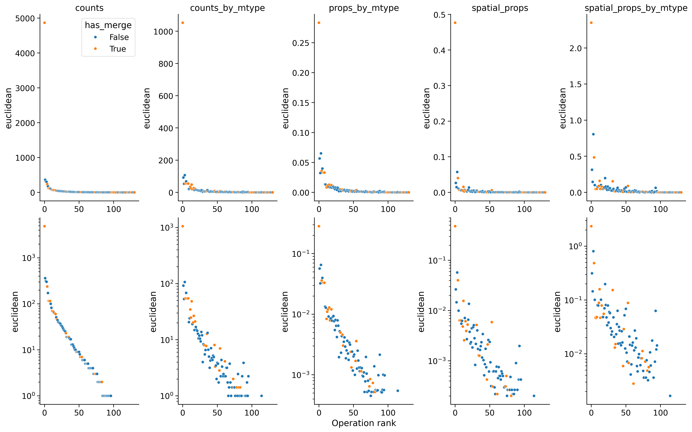
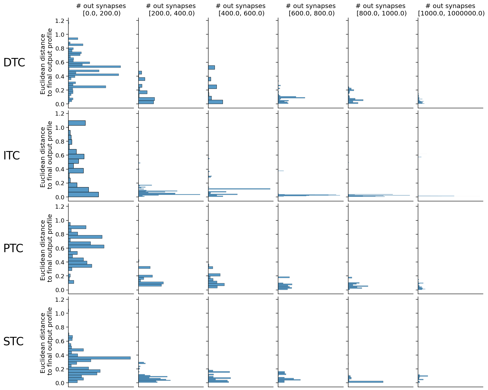

<!--  -->

<!-- _paginate: false -->
<!-- _class: title-slide -->

<!--  -->

<!-- <h1 style="margin-top: 200px;">
Connectivity properties in light of proofreading
</h1> -->

<!--   -->

# Connectivity properties in light of proofreading

Ben Pedigo
(he/him)
Scientist I
Allen Institute for Brain Science

 [ben.pedigo@alleninstitute.org](mailto:ben.pedigo@alleninstitute.org)
 [@bdpedigo (Github)](https://github.com/bdpedigo)
 [@bpedigod (Twitter)](https://twitter.com/bpedigod)
 [bdpedigo.github.io](https://bdpedigo.github.io/)

---

# Connectome proofreading

<!--  -->

CAVE: Connectome Annotation Versioning Engine
Dorkenwald, Schneider-Mizell et al. _bioRxiv_ (2023)

### How and how much do these edits matter for downstream conclusions?

<!-- _footer: MICrONS Consortium et al. *bioRxiv* (2023), Schneider-Mizell et al. *bioRxiv* (2023),  Schneider-Mizell et al. *bioRxiv* (2023) -->

---

# Inhibition in mouse visual cortex

<!--
# CAVE allows us to extract the complete edit history

_footer: Dorkenwald, Schneider-Mizell et al. *bioRxiv* (2023) -->

<!-- _footer: Schneider-Mizell et al. *bioRxiv* (2023) -->

---

# Quantifying proofreading impact

<!-- _footer: Neurons/colors from Schneider-Mizell et al *bioRxiv* (2023) -->

---

# Measuring distance from the fully proofread neuron

{ describe distances idea }

---

# Most neurons "converged" fairly quickly

---

# Counterfactual games

- So far, have looked at how neurons changed over the course of proofreading in actuality, but this is a somewhat arbitrary historical ordering
- Can replay edits (or not) according to alternative schemes

---

# (1) "sloppy" proofreading?

---

# (2) what if I omit individual edits? (importance)

---

# (3) which neurons are "good enough"?

---

# Summary

- Monitoring proofreading with specific analyses or metrics in mind ...
- Counterfactual replay of various edit schemes can help understand how ...
- Analyses could be applied to other datasets (especially CAVE-backed) or even to analyze automated proofreading systems
