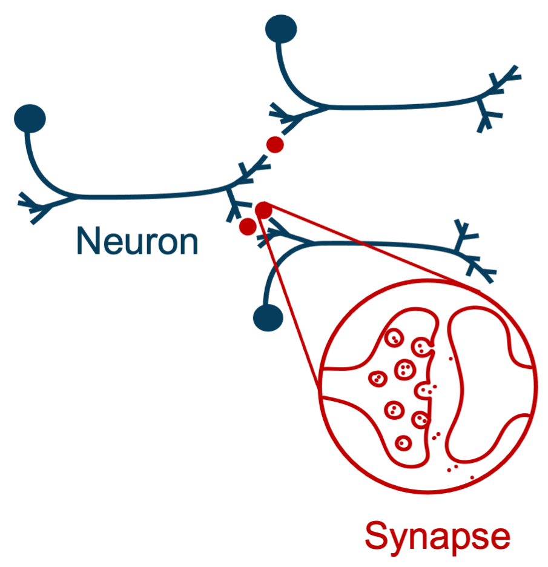

<!-- _paginate: false -->

# Connectometrics: developing and applying statistical network science towards understanding nanoscale connectomes

## Benjamin D. Pedigo

(he/him)
NSF Graduate Research Fellow
Department of Biomedical Engineering
Johns Hopkins University
<!-- [NeuroData lab](https://neurodata.io/) -->

 [bpedigo@jhu.edu](mailto:bpedigo@jhu.edu)
 [@bdpedigo (Github)](https://github.com/bdpedigo)
 [@bpedigod (Twitter)](https://twitter.com/bpedigod)
 [bdpedigo.github.io](https://bdpedigo.github.io/)

### These slides at: 

[bdpedigo.github.io/talks/defense.html](https://bdpedigo.github.io/talks/defense.html)

---

# Acknowledgements

<!-- before i get into the bulk of the talk, i want to steal a page from Mike Powell who was a graduate student in our lab, and start my defense with the acknowledgements. That way if you glaze over or fall asleep later in the talk, I hope you'll remember the important part, which is my graditute to the people which I should probably express more often. -->

---

<!-- First, I want to thank many current and former members of the neurodata lab and collaborators and hopkins. It has been a great honor to get to learn from you all on a daily basis, as well as unwinding by playing frisbee outside. -->

 
Alex 

<!-- Loftus -->

Ali

<!-- Saad-Eldin -->

Alice 

<!-- Wang -->

Ashwin 

<!-- ... -->

Bijan 

<!-- ... -->

Eric

<!-- Bridgeford -->

Devin

<!-- Crowley -->

Diane

<!-- Lee -->

Drishti

Ben 

<!-- Falk -->

Hao 

Hayden 

<!-- Helm -->

Jaewon 

<!-- Chung -->

Javier 

<!-- How -->

Jayanta 

<!-- Dey -->

Jesus 

<!-- Arroyo -->

Jong 

<!-- Shin -->

Kareef 

<!-- Ullah -->

Mike

<!-- Powell -->

Noga

Youngser 

<!-- Park -->

Heather 

<!-- Patsolic -->

Jesse 

<!-- Patsolic -->

Ronak 

<!-- Mehta -->

Ronan 

<!-- Perry -->

Ross 

<!-- Lawrence -->

Sambit 

<!-- Panda -->

Tingshan

Tyler

Tommy

Tommy

Vikram

Vivek

Yuxin 

<!-- Bai -->

---

<!-- To my advisors, my committee, and close collaborators at Cambridge. I will be forever humbled that you all trusted a rather fresh PhD student to work on data and problems that you all have spent so much time and energy on. I'm grateful for that opportunity and for all I've learned from you over the years, and I'm confident that we'll keep working together for a long while... -->

## Committee 

Joshua 
Vogelstein

Carey 
Priebe

Justus 
Kebschull

## Collaborators @ Cambridge

Michael 
Winding

Marta 
Zlatic

Albert Cardona

Lalanti 
 Venkatasubramanian 

---

<!-- To my friends, many of whom I met here in grad school - i feel very lucky to have met some of the most smart, driven people i know, but who somehow still come up with the idea to fry balls of pie in tempura batter. I honestly don't know how I would have done this without you all, and i look forward -->

---

<!-- To my parents - I obviously owe them everything that got me to this point. I just want to highlight that I think my parents instilled in me a sense of wonder and fascination with the natural world, and without that I never would have gotten into science or thought I should pursue a PhD.  -->

--- 

<!-- To my partner Claire. For a bit of background in case anyone doesn't know. This figure (panel A) the you see on the top left was taken at our graduation almost exactly 5 years ago, and that's also about the last time we lived in the same city. Despite that, Claire has been incredibly supportful, and heard me blabber more about the ups and downs of my PhD than anyone deserves to. Im so grateful for that support and that we've made it through this chapter stronger and with so many great memories, and i cant wait to see what the future holds for us in seattle. -->

---

# Connectomes: maps of neural wiring

- Brains contain **neurons**, which carry information via electrical signals
- Neurons connect to each other with **synapses**, allowing neurons to "talk" to each other
- **Connectome** is a map of the structure of neurons and the synapses between them
  - Shaped by evolution, experience, influences neural activity, behavior

<!-- _footer: Images from SciDraw -->

---

# How do we measure this structure?

<!-- _footer: Zheng et al. Cell (2018) -->

---

# Connectomes from electron microscopy volumes

<!-- _footer: Winding, Pedigo et al. Science (2023), Ohyama, Schneider-Mizell et al. Nature (2015)-->

---

<!-- _footer: Michael Winding -->

---

# Representing connectomes as networks

Networks are mathematical abstractions to represent *relational* data

- **Nodes** are the set of objects (neurons)
- **Edges** are the set of connections between those objects (synapses)
  - E.g. neuron $1$ connects to neuron $3$ with 2 synapses

---

# Connectomes: maps of neural wiring

<!-- _footer: Images from brain-map.org, SciDraw -->

---

# Linking connectivity to other phenotypes

<!-- _footer: Images from brain-map.org, SciDraw -->

---

# Linking connectivity to other phenotypes

<!-- _footer: Images from brain-map.org, SciDraw -->

---

# Linking connectivity to other phenotypes

<!-- _footer: Images from brain-map.org, SciDraw -->

---

# Linking connectivity to other phenotypes

<!-- _footer: Images from brain-map.org, SciDraw -->

--- 
# Comparative connectomics

#### How does a neuron's connectivity affect elicited behaviors?

#### How does connectivity change during development?

#### Requires methods of comparing connectivity within and between connectomes

--- 

# Outline

- ### **The connectome of a *Drosophila* larva brain**
- ### Connectome comparison via network hypothesis testing
- ### Pairing neurons across connectomes via graph matching
- ### Ongoing work

---

# Larval *Drosophila* as a model system

## Genetics

## Activity

## Behavior

Eschbach et al. Nat. Neuro (2020)

Eschbach & Zlatic Curr. Op. Neurobio. (2020)

Klein et al. bioRxiv (2021)

Almeida-Carvalho et al. J. Experimental Bio. (2017)

---

# Larval _Drosophila_ brain connectome 

 

~3k neurons
Both hemispheres reconstructed

<!-- _footer: Winding, Pedigo et al. Science (2023) -->

---

<!-- _footer: Winding, Pedigo et al. Science (2023) -->

---

# Neurons clustered by connectivity 

- Used a variation on spectral clustering
- How many clusters to include?

<!-- _footer: Winding, Pedigo et al. Science (2023) -->

---

# Stochastic block model

- Each node $i$ is assigned to a group, $\tau_{i}$
- $B$ is a matrix of connection probabilities between groups
- Edges generated independently according to these probabilities: 
  - $A_{ij} \sim Bernoulli(B_{\tau_{i} \tau_{j}})$

---
# Using models to evaluate candidate groupings

- How well do these models generalize to the other side of the brain (let alone the next maggot)?

---

# Bilateral symmetry

> "This brain is bilaterally symmetric."

> "What does that even mean? And how would we know if it wasn't?"

## Are the  left  and  right  sides of this connectome 
 
 *different*?

- Hints at how sterotyped wiring might be
- Testbed for connectome comparison methods

--- 

# Outline

- ### The connectome of a *Drosophila* larva brain
- ### **Connectome comparison via network hypothesis testing**
- ### Pairing neurons across connectomes via graph matching
- ### Future work

---
# Testing for differences

### Are these two populations different?

&nbsp; &nbsp; &nbsp; &nbsp; &nbsp; &nbsp; &nbsp; &nbsp; &nbsp;$\color{#66c2a5} Y^{(1)} \sim F^{(1)} \quad \color{#fc8d62} Y^{(2)} \sim F^{(2)}$

$H_0: \color{#66c2a5} F^{(1)} \color{black} = \color{#fc8d62} F^{(2)}$ vs. $H_A: \color{#66c2a5} F^{(1)} \color{black} \neq \color{#fc8d62} F^{(2)}$

### Are these two *networks* different?

&nbsp; &nbsp; &nbsp; &nbsp; &nbsp; &nbsp; $\color{#66c2a5} A^{(L)} \sim F^{(L)} \quad \quad \color{#fc8d62} A^{(R)} \sim F^{(R)}$

$H_0: \color{#66c2a5} F^{(L)} \color{black} = \color{#fc8d62}F^{(R)}$ 
vs. 
$H_A: \color{#66c2a5} F^{(L)} \color{black} \neq  \color{#fc8d62} F^{(R)}$

---
# Assumptions
- Know the direction of synapses, so network is *directed*
- Consider networks to be *unweighted*
- Not assuming any nodes are matched:

- If $F$ is again a stochastic block model, then...

---
# Connection probabilities between groups

<!-- _footer: Winding, Pedigo et al. Science (2023), Pedigo et al. eLife (2023) -->

--- 
# Detect differences in group connection probabilities

- Overall test (comparing all blocks): $H_0: \color{#66c2a5}B^{(L)} \color{black} = \color{#fc8d62}B^{(R)}$ p-value $<10^{-7}$

- 7 group-to-group connections are significantly different (after multiple comparisons correction)

$H_0: \color{#66c2a5}B^{(L)}_{kl} \color{black} = \color{#fc8d62}B^{(R)}_{kl}$ 

<!-- _footer: Pedigo et al. eLife (2023) -->

---
# An overall difference in density

- For significant comparisons, probabilities on right side are higher
- Even network densities are different (1-block/Erdos-Renyi model)
- Maybe the right is just a "scaled up" version of the left?
   - $H_0: \color{#66c2a5}B^{(L)} \color{black}  = c \color{#fc8d62}B^{(R)}$  
   $c$ is a density-adjusting constant
  

<!-- _footer: Pedigo et al. eLife (2023) -->

---
# After adjusting for density, differences are in KCs

Overall p-value: $<10^{-2}$

<!-- _footer: Pedigo et al. eLife (2023) -->

---
# To sum up...

> "This brain is bilaterally symmetric."

Depends on what you mean...

#### With Kenyon cells
|   Model   |                       $H_0$ (vs. $H_A \neq$)                       |    p-value    |
| :-------: | :----------------------------------------------------------------: | :-----------: |
|  **ER**   |  $\color{#66c2a5} p^{(L)} \color{black} = \color{#fc8d62}p^{(R)}$  | ${<}10^{-23}$ |
|  **SBM**  | $\color{#66c2a5} B^{(L)} \color{black} = \color{#fc8d62} B^{(R)}$  | ${<}10^{-7}$  |
| **daSBM** | $\color{#66c2a5}B^{(L)} \color{black}  = c \color{#fc8d62}B^{(R)}$ | ${<}10^{-2}$  |

#### Without Kenyon cells
|   Model   |                       $H_0$ (vs. $H_A \neq$)                       |    p-value     |
| :-------: | :----------------------------------------------------------------: | :------------: |
|  **ER**   |  $\color{#66c2a5} p^{(L)} \color{black} = \color{#fc8d62}p^{(R)}$  | ${<}10^{-26}$  |
|  **SBM**  | $\color{#66c2a5} B^{(L)} \color{black} = \color{#fc8d62} B^{(R)}$  |  ${<}10^{-2}$  |
| **daSBM** | $\color{#66c2a5}B^{(L)} \color{black}  = c \color{#fc8d62}B^{(R)}$ | $\approx 0.60$ |

<!-- _footer: Pedigo et al. eLife (2023) -->

---
# Examining the effect of edge weights

<!-- _footer: Pedigo et al. eLife (2023) -->

<!-- ---

# Even high synapse count networks show asymmetry

 
 
 

 -->

<!-- __footer: Pedigo et al. eLife (2023) -->

---

# High input percentage networks show no asymmetry

<!-- 

## Synapse count thresholding  -->

<!--  -->

<!-- 

## Input proportion thresholding -->
<!-- 

 -->

 
 
 

<!-- _footer: Pedigo et al. eLife (2023) -->

--- 

# Outline

- ### The connectome of a *Drosophila* larva brain
- ### Connectome comparison via network hypothesis testing
- ### **Pairing neurons across connectomes via graph matching**
- ### Ongoing work

---

# Bilaterally homologous neuron pairs 

<!-- _footer: Eschbach et al. eLife (2021), Winding, Pedigo et al. Science (2023) -->

--- 
# How can we pair on connectivity?

$\min_{P \in \mathcal{P}} \underbrace{\|A_1 - \overbrace{PA_2P^T}^{\text{reordered } A_2}\|_F^2}_{\text{distance between adj. mats.}}$

where $\mathcal{P}$ is the set of permutation matrices

---
# Simple matching performs fairly well

With "vanilla" graph matching: ~80% correct (according to expert annotator)...
but ignores ~1/3 of synapses!

---
# From graph matching to bisected graph matching

We generalized a state-of-the-art GM algorithm to solve BGM!

In simulations, this helps when contralaterals have sufficient edge correlation

<!-- _footer: Pedigo et al. Network Neuroscience (2022), Vogelstein et al. PLOS One (2015)-->

--- 
# Contralateral connections aid matching!

<!-- _footer: Pedigo et al. Network Neuroscience (2022) -->

---
# Many other ways to try to improve on matching...

- Partial knowledge of the matching (seeds)
- Incorporate morphology (e.g. NBLAST)
- **Edge types allow for "multilayer" graph matching**

<!-- _footer: Pantazis et al. Applied Network Science (2022), Fishkind et al. Pattern Recognition (2019) -->

---

# Performance improvement from edge types

<!-- _footer: Pedigo et al. Network Neuroscience (2022), Winding, Pedigo et al. Science (2023), Pantazis et al. Applied Network Science (2022) -->

---

<!-- Beyond simple systems like the larva, however, it is often thought that neurons are present not in one-to-one matches, but rather in populations. this is thought to be the case in the adult drosophila, for example. Here I am showing an example of a matching in the antennal lobe of the FlyWire adult drosophila dataset, in this case matching based on morphological similarity of left/right neurons. In the middle column you see the "hard" matching solution or permutation matrix, akin to what I've been talking about today, where a filled square indicates that a row neuron gets matched to an individual column neuron. Conversely, using tools from optimal transport, we're able to find a soft assignment, or in other words a potentially many-to-many match. This kind of approach might be really relevant to transferring some of these alignment ideas to cortex to potentially find correspondences across datasets or regions. -->

<!-- ### Morphology similarity

 -->

# Beyond 1-to-1 neuron matching

### 1-to-1 matching

<!-- $$\min_P trace(SP^T)$$ -->

### Soft assignment

<!-- $$\min_D trace(SD^T) + \lambda \Omega(D)$$ -->

<!-- _footer: Cuturi NeurIPS (2013), Costa et al. Neuron (2016)  - Work with Philipp Schlegel, Greg Jefferis, unpublished -->

---
# Open source tools

  

[github.com/microsoft/graspologic](https://github.com/microsoft/graspologic)

[Chung, Pedigo et al. JMLR (2019)](https://jmlr.org/papers/v20/19-490.html)

## Application to larva brain

[github.com/neurodata/graspologic-demo](https://github.com/neurodata/graspologic-demo)

---

# Outline

- ### The connectome of a *Drosophila* larva brain
- ### Connectome comparison via network hypothesis testing
- ### Pairing neurons across connectomes via graph matching
- ### **Ongoing work**

---

# Stereotypy beyond connection probabilities

<!-- Beyond cell type connection probabilities, are cortical subgraphs more correlated than expected by chance? -->

Matching and null models can be combined to test for significant subgraph correlation in edge structure

<!-- _footer: Eichler et al. Nature (2017), Fishkind et al. Applied Network Science (2021) -->

---

<!-- 
Evidence that characterizing variability in connectivity (in this case, specific projections to brain output neurons), can be related to differences in behavioral outputs
 -->

# A structure-function relationship in the larva

### Behavior probabilities significantly related to projections to brain outputs

RV coefficient: 0.12, p-value: 0.0044
Distance correlation: 0.067, p-value: 0.0087

<!-- _footer: Work w/ L. Venkatasubramanian, C. Barré, JB Masson, C. Priebe, M. Zlatic -->

---

## References

[Winding, M. & Pedigo, B.D. et al. The connectome of an insect brain. Science (2023).](https://www.science.org/doi/10.1126/science.add9330)

[Pedigo, B. D. et al. Generative network modeling reveals quantitative definitions of bilateral symmetry exhibited by a whole insect brain connectome. eLife (2023).](https://elifesciences.org/articles/83739)

[Pedigo, B. D. et al. Bisected graph matching improves automated pairing of bilaterally homologous neurons from connectomes. Network Neuroscience (2022).](https://direct.mit.edu/netn/article/doi/10.1162/netn_a_00287/113527/Bisected-graph-matching-improves-automated-pairing)

## Code

[github.com/neurodata/maggot_models](github.com/neurodata/maggot_models)

[github.com/neurodata/bilateral-connectome](github.com/neurodata/bilateral-connectome)

[github.com/neurodata/bgm](github.com/neurodata/bgm)

--- 

# Acknowledgements

#### Team

Michael Winding

Mike Powell

Eric Bridgeford

Ali   Saad-Eldin

Marta Zlatic

Albert Cardona

Carey Priebe

Joshua Vogelstein

Tracers who contributed to larva connectome, Lalanti Venkatasubramanian, Chloé Barré, Jean-Baptiste Masson, Heather Patsolic, Youngser Park, NeuroData lab, Microsoft Research

Figures from Scidraw (A. Bates, V. Kumar, E. Tyler, L. Kravitz, H. Robinson, E. Thompson), brain-map.org

#### Funding
NSF Graduate Research Fellowship (B.D.P.), NSF CAREER Award (J.T.V.), NSF NeuroNex Award (J.T.V and C.E.P.), NIH BRAIN Initiative (J.T.V.)

---

# Questions?

### Benjamin D. Pedigo
 [bpedigo@jhu.edu](mailto:bpedigo@jhu.edu)
 [@bdpedigo](https://github.com/bdpedigo)
 [@bpedigod](https://twitter.com/bpedigod)
 [bdpedigo.github.io](https://bdpedigo.github.io/)

### These slides at:
[bdpedigo.github.io/talks/aibs.html](https://bdpedigo.github.io/talks/aibs.html)

---

# Appendix

---

# Do wiring rules generalize across region? Dataset? 

<!--  -->

- Application of model-based network comparison tools
- Would likely require extensions: 
  - Parameters to deal with subcellular wiring specificity 
  - Modeling known errors (e.g. amount of orphan synapses)

<!-- _footer: MICrONS Consortium et al. bioRxiv (2023), Schneider-Mizell et al. bioRxiv (2023) -->

---

# Winding, Pedigo et al. Science (2023)

---

# Mapping a larval _Drosophila_ brain connectome 

<!-- _footer: Winding, Pedigo et al. Science (2023), Ohyama et al. Nature (2015)-->

---

---

---

---

---

---

---

---

# Sorting the network

<!-- _footer: Carmel et al. IEEE Vis. and Comp. Graphics (2004), Burkard et al. Assignment Problems (2009)  -->

---

# "Feedback minimization" as graph matching

$$\min_P \sum_{i=1}^n \sum_{j < i}^n (PAP^T)_{ij}^2$$

- Minimand is the sum of squared elements in the lower triangle of reshuffled adjacency
- Solving produces an ordering of the network under which connections are likely to go "forward" in this ordering
- Equivalent to graph matching $A$ to an upper triangular matrix of all $1$s

---
# Quantifying high-level "feedforward/feedback"

<!--  -->

 

<!-- _footer: Winding, Pedigo et al. Science (2023) -->

--- 

# Morphology enables splitting axons/dendrites 

<!--  -->

---
# Spectral embedding

- Spectral decomposition of the adjacency matrix (or Laplacian)

--- 

<!-- ### Cluster morphology  -->

--- 

# Cluster morphology 

## Discriminability:
$P[$ within cluster NBLAST sim. $>$ between cluster NBLAST sim. $] \approx 0.81$ 

<!-- _footer: Costa et al. Neuron (2016), Bridgeford et al. PLOS Comp. Bio. (2021)-->

---

# Pedigo et al. eLife (2023)

---

---

---

---

---

---

---

---

---

---

---

---

---

---

---

---

---

---

---

<!-- ---

# This split induces 4 graphs (or layers)

 -->

<!-- _footer: Winding, Pedigo et al. bioRxiv (2022) -->

<!-- # What are these different "channels" doing?

 -->

<!-- _footer: Winding, Pedigo et al. bioRxiv (2022) -->

<!--
---

# Sorting the network

-->

<!-- ---

# Comparing independently sorted "channels"

 -->

<!-- _footer: Winding, Pedigo et al. bioRxiv (2022) -->

<!-- --- 
# Edge reciprocity

_footer: Winding, Pedigo et al. bioRxiv (2022) -->

---

# Pedigo et al. Network Neuroscience (2022)

---
# How do we do graph matching?

- Relax the problem to a continuos space
  - Convex hull of permutation matrices
- Minimize a linear approximation of objective function (repeat)
- Project back to the closest permutation matrix

<!-- _footer: Vogelstein et al. PLOS One (2015) -->

---

# Algorithm

---

Pearson's corr = 0.82

---

### Unpaired

### Paired 

---

# Using predicted groups

---

<!-- 
As mentioned, interested in leveraging this work on how we can compare connectomes to find links to these various other phenotypes. 

This is what makes the work being done at the Allen institute and UW so exciting to me; given that you all are not just measuring connectomes, but also many other modalities of data.

I’d like to give an example of how I’m approaching this kind of question in the larva, and how I think with some development, these approaches would be relevant to apply to the allen institute data. 

 -->

