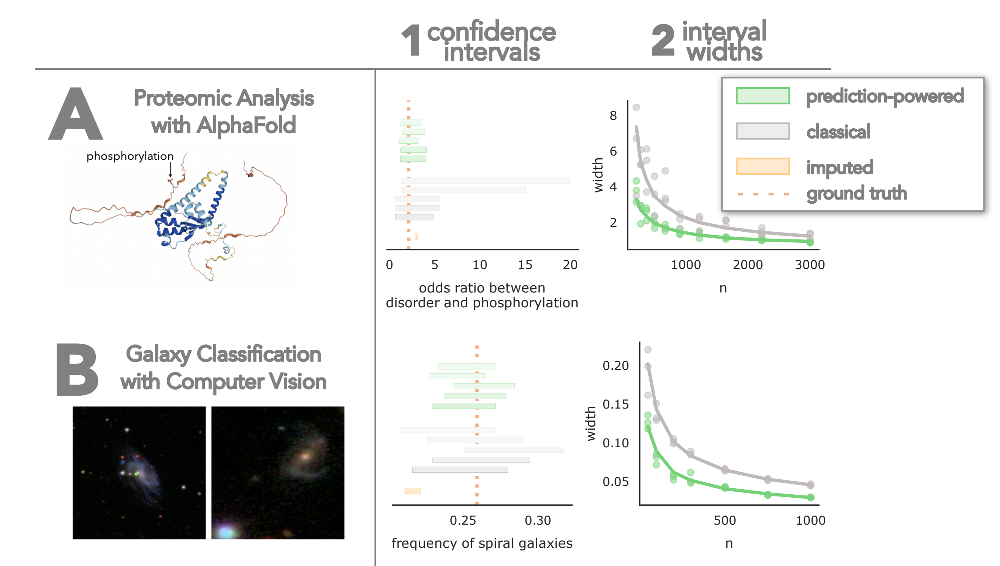
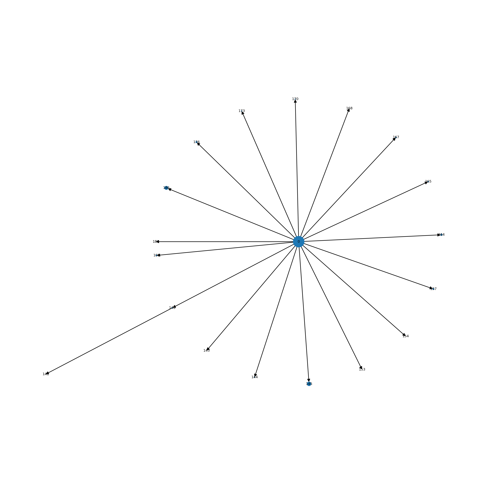

<!-- _paginate: false -->

# Proofreading retrospective

## Project ideas and discussion

##### Ben Pedigo

(he/him)
Scientist I
Allen Institute for Brain Science

 [ben.pedigo@alleninstute.org](mailto:ben.pedigo@alleninstitute.org)
 [@bdpedigo (Github)](https://github.com/bdpedigo)
 [@bpedigod (Twitter)](https://twitter.com/bpedigod)
 [bdpedigo.github.io](https://bdpedigo.github.io/)

<!-- Nodes on slide one -->

---

# Big picture

- We have a record of many edits, especially in Minnie
- Opportunity to learn from these edits, see what they can teach us going forward
- Still some work required in terms of code/tooling, would like to focus that effort

---

---

# Overview

- For each:
  - What I mean by these ideas
  - Approach
  - Brief proof-of-concepts
- Interest / Significance / Feasibility

---

# Sensitivity to proofreading: connectivity

- Understand {how, which} connectivity features change with proofreading
  - Are cell type connection probabilities stable?
  - How much proofreading needs to happen to be able to identify a cell as belonging to a particular connectivity class?
  - How much more proofreading is needed to find long-range vs. short-range connections?
  - What is the technical variability associated w/ proofreading?
- Motivate extending analyses to volumes which include unproofread material
  - Argue that particular features don't change, or
  - Developing a convincing corrective models of the bias corrected by proofreading

---

# Stable neuron

Replaying some proportion of merges onto a neuron, evaluating connectivity

---

# Unstable neurons

\* super high variance comes from axon/soma merger, I think

---

# Approach

- Choose connectivity estimands,
  - e.g. $P(\text{type } i \rightarrow \text{type } j)$, $P(\text{type } i \rightarrow \text{type } j) \circledast \text{compartment}$, etc.
- For proofread neurons/volume, examine how estimand changes w/ proofreading
  - Likely need a "proofreading model" for replaying edits in a plausible way

- Develop quantitative model of this relationship
  - e.g. predict mean and variance of # of synapses from an $i$ to a $j$ neuron
- Apply model to unproofread data, assess how much proofreading would change estimand

---

# Prior work on quality-quantity tradeoff

## Would you rather have bit of highly-curated data, or lots of messy data?

Depends on the question, but there exist theoretical cases where you want the latter

## Would you rather have a bit of highly-curated data or lots of ~~messy~~ _unproofread, biased_ data?

---

# Analogy to "prediction powered inference"

<!-- _footer: Angelopoulos et al. arXiv (2023) -->

---

# Analogy from "prediction powered inference"

<!-- _footer: Angelopoulos et al. arXiv (2023) -->

---

# Challenges

<!--
- Does not require running much classification code that hasn't already been run, since just operating on the unproofread bulk of Minnie, say -->

- Information already accessible in CAVE, have code for mapping synapses onto their dependant edits
  - May need some new API features to make it scalable
- More specific the question, the smaller our sample size for this kind of approach
- Need to assume some kind of homogeneity across the volume for this to work
  - May not be palatable to the community
- Feature set for a model on how proofreading errors affect connectivity?
- Results are likely question-specific; unclear to what extent any lessons will generalize

---

# Resampling skeletons

- Understand {whether, how} skeleton features are affected by proofreading
- Develop classifiers/clustering methods which are robust to such differences
  - E.g. train classifiers on many "messy" neurons

---

# Example frankeneurons

<iframe height=500 frameborder=0 src="images/skeleton_samples_root_id=864691135915450982_use_cc=True.html">
</iframe>

---

# Frankeneuron   features

---

# Challenges

- Have the basic tooling for this already; some parts are naive and may not scale well
- Need to decide how to "play back" edits in a plausible way
  - E.g. make proximal edits more likely?
- Running skeletonizaiton/featurization code on $O(100,000)$ neurons $\times$ $O(1,000)$
  - May be possible to run some code on the "final" skeleton, map those features (e.g. axon/dendrite labels) onto the rest
- Open-ended in terms of the deliverable/impact...
  - What models would we be interested in training with this kind of data?
    - PSS already tells a lot about cell type for minimally proofread neurons!

---

<!-- Null space of the idea above -->

# Machine-guided or hypothesis-driven proofreading

Now that we have these connectome volumes, how should we spend our time?

- Algorithm that eats a neuron and predicts completeness
- Algorithm that eats a segmentation and predicts sites for edits
  - Better version: eats a segmentation and a _statistic_, predicts _impactful_ edits
    - Find neurons where we need information to assign C-type
    - Find edits likely to attach many synapses

---

# Approach

- Develop feature set, ideally reusing relevant tested models (PSS, SegCLR, ...)
  - Features could involve anything in power set of {image, segmentation, skeleton, skeleton attributes}
- Train {NN, RFC, ...} using training set of available edits to predict {edit locations, completeness level, ...}
- Validate on held out neurons or subvolume
- Deployment is a tricker question
  - V$0$ Could run predictions on a fixed materialization prior to bout of proofreading
- More elaborate version: predict (edit location, importance)
  - E.g. find me edits likely to add many synapses

---

# Example differential edit importance

Merge dependency graphs for two neurons, size of node = # of dependent synapses

---

# Challenges

- Little proof-of-concept for feasibility (as far as I know)
  - For a random neuron, can we predict where its primary axon might be?
  - What if you know something about its cell type, say from PSS features?
  - Ditto for predicting completeness from a cell you know nothing else about
- Dynamics: to be useful, would this be running on neurons all the time as they are edited, like the L2cache?
- How would a proofreader interact with such a system?
- Overlap with other work on auto-proofreading?

---

# Summary

---

# Thoughts?

Paper on how proofreading affects connectivity estimand

- Have a specific analysis goal, but message could be a general perspective on how to do analysis in light of noisy proofreading
- Side output: defining specific notions of connectivity estimands we care about super clearly
  - Connection probability: $P(i \rightarrow j | i,j)$
  - What we often plot: how cells distribute outputs over output classes: $P(i \rightarrow j \in K)$, $P(i \rightarrow j \in K | d_{ij})$
- Have something that we do expect to fail if there is little proofreading
- Maybe worth keeping this simple...
- Relationship between segmentation error and neuroanatomy

---

- System for identifying
- Models already exist
  - neurd
  - amazon
  - humans
- How do i make something that could be agnostic to the model
- 
