

<!-- _paginate: false -->

# Connectome inference in light of proofreading

 

##### Ben Pedigo

(he/him)
Scientist I
Allen Institute for Brain Science

 [ben.pedigo@alleninstitute.org](mailto:ben.pedigo@alleninstitute.org)
 [@bdpedigo (Github)](https://github.com/bdpedigo)
 [@bpedigod (Twitter)](https://twitter.com/bpedigod)
 [bdpedigo.github.io](https://bdpedigo.github.io/)

<!-- Nodes on slide one -->

---

# Background

<!-- - EM connectomics is done by automated segmentation, followed by human proofreading
- This process is labor intensive, takes a while, and costly -->

<!-- _footer: MICrONS Consortium et al. (2023) -->

---

# Background

<!-- - EM connectomics is done by automated segmentation, followed by human proofreading
- This process is labor intensive, takes a while, and costly -->

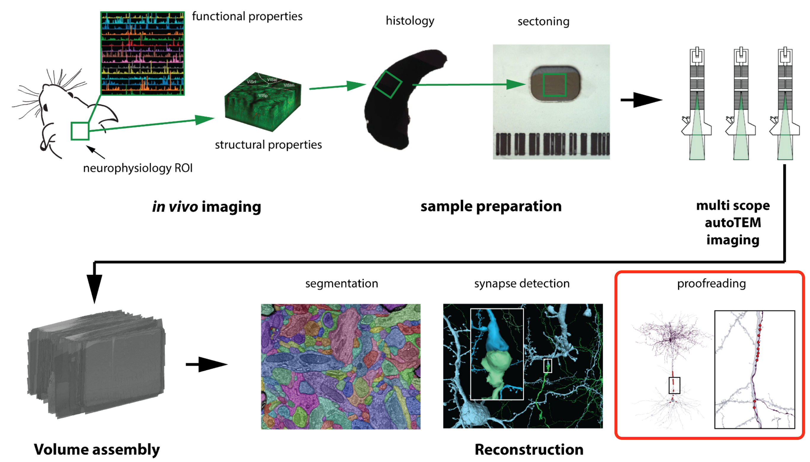

- Labor-intensive
- Costly
- Takes time

<!-- _footer: MICrONS Consortium et al. *bioRxiv* (2023), Dorkenwald et al. *bioRxiv* (2023) -->

---

<!-- TODO: better title -->

# Proofreading edits

- We have a record of many edits now, across several datasets
  - **>800K in Minnie, ~2.5 million in V1dd**
    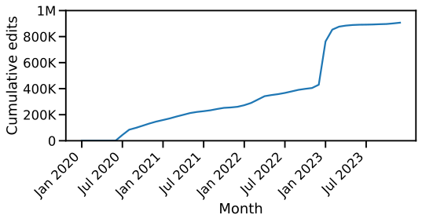

### How (and how much) do these edits matter for downstream conclusions?

---

# Why investigate the effect of proofreading?

- Learn how much proofreading is needed to answer a question
  - E.g. how much proofreading to identify connectivity type?
- Understand what quantitative claims we can make given proofreading-induced variability
  - E.g. how to compare short-range vs. long-range connections?
- Learn what future proofreading strategies could be most effective

<!-- _footer: Schlegel et al. bioRxiv (2023) -->

---

# Aims

- Aim 1 (paper): develop a quantitative understanding of how proofreading affects connectivity
  - Characterize which connectivity measures are stable/unstable
  - Characterize which edits are impactful
- Aim 2 (system/paper): develop a system for deploying predictions of _impactful_ edits to prioritize for human or automated proofreading

---

# Aim 1: sensitivity to proofreading

Map how connectivity features change with proofreading, e.g.:

- Probability cell $i$ connects to cell $j$
- Proportion of cell $i$'s outputs onto cell type $k$
- Proportion of cell $i$'s outputs onto cell type $k$ in compartment $c$

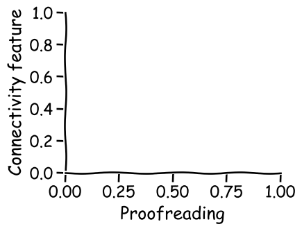

---

# Approach

---

# Approach

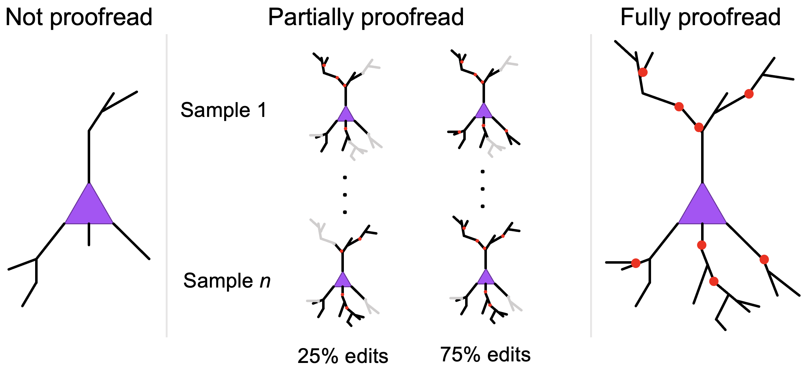

#### Allows us to examine connectivity for various "what if" proofreading scenarios

<!-- ---

# Approach

<!-- make these examples more concrete/less mathy -->
<!-- maybe use this more specific language earlier -->

<!-- - Apply a set of edits to a neuron

  - E.g., 50% of edits at random, all edges within $d$ distance to soma, etc.

- For proofread neurons/volume, examine how connectivity features change w/ proofreading
  <!-- - Likely need a "proofreading model" for replaying edits in a plausible way -->

<!-- - Choose connectivity estimands,
  - e.g. $P(\text{type } i \rightarrow \text{type } j)$
  - $P(\text{type } i \rightarrow \text{type } j) \circledast \text{compartment}$, etc. -->

<!-- TODO: create diagram for this -->

---

# Examples: stable neuron

<!-- Replaying some proportion of merges onto a neuron, evaluating connectivity -->

<!-- 
 -->

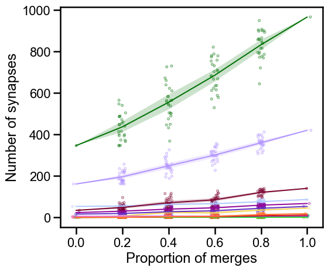

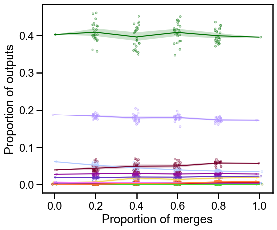

<!-- _footer: Neurons/colors from Schneider-Mizell et al *bioRxiv* (2023) -->

---

# Examples: unstable neuron

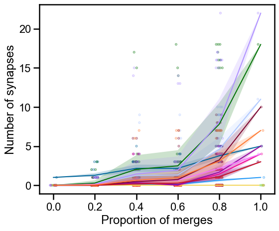

<!-- _footer: Neurons/colors from Schneider-Mizell et al *bioRxiv* (2023) -->

---

# Differential edit importance

Distal edits and synapses depend on more proximal merges

<!-- **Dependency graph of merges** -->

<!-- 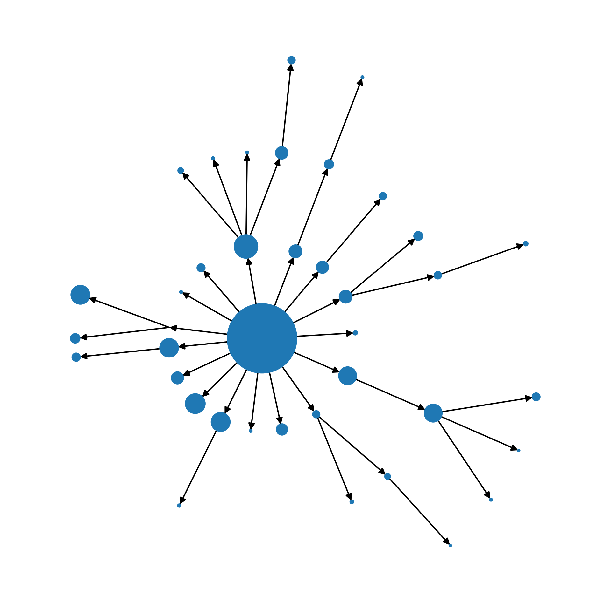 -->

<!--  -->

---

# Comparing edit dependencies

## Stable neuron

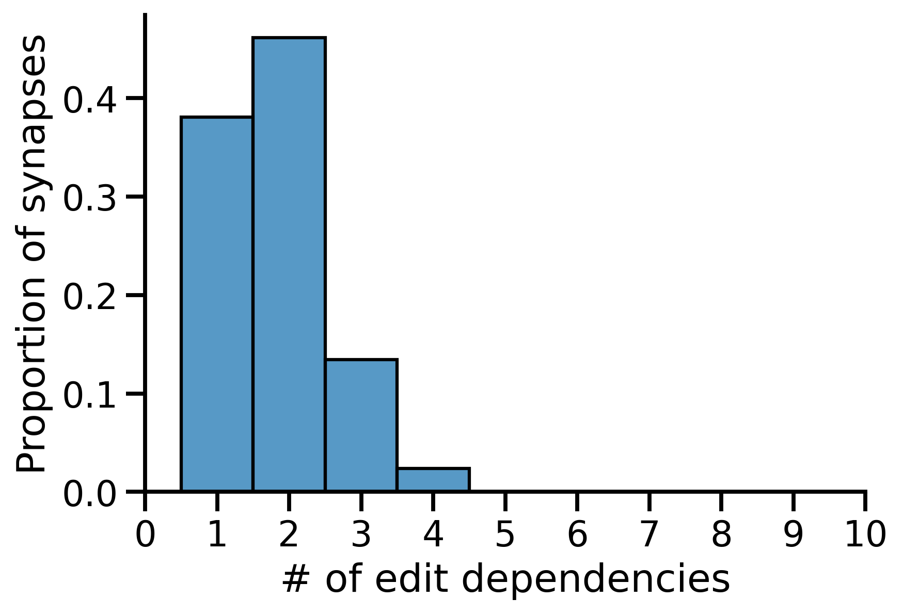

## Unstable neuron

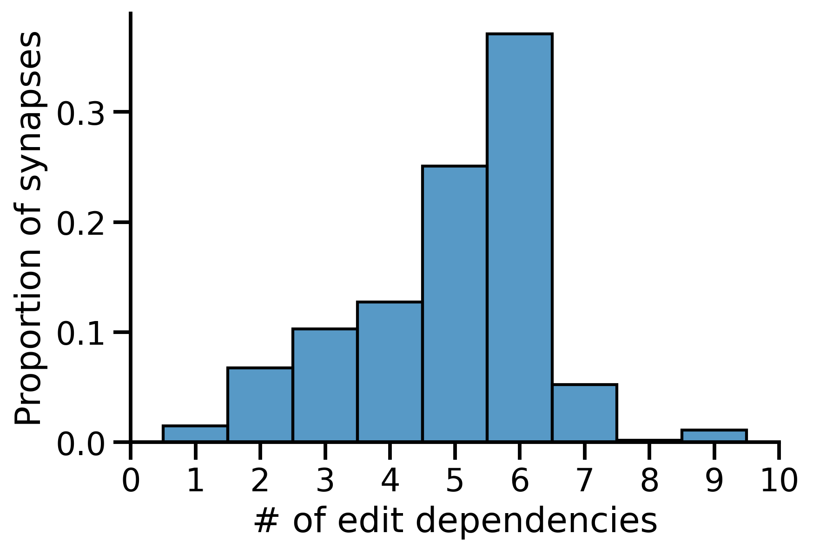

<!--  -->

## <!-- **Proximal edits with many dependents are more important** -->

---

# Ordered by time

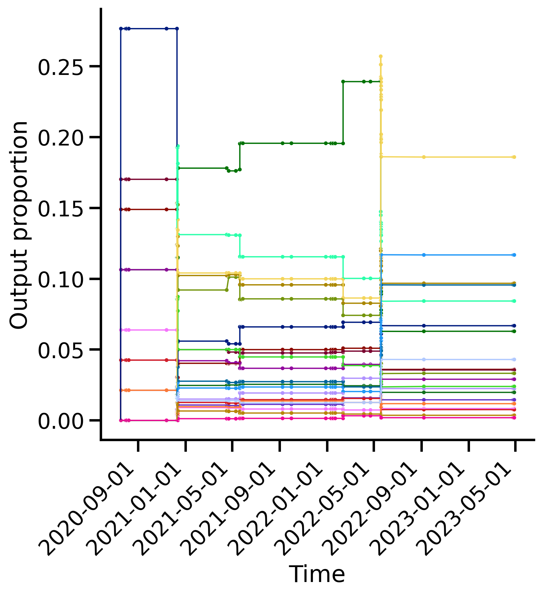

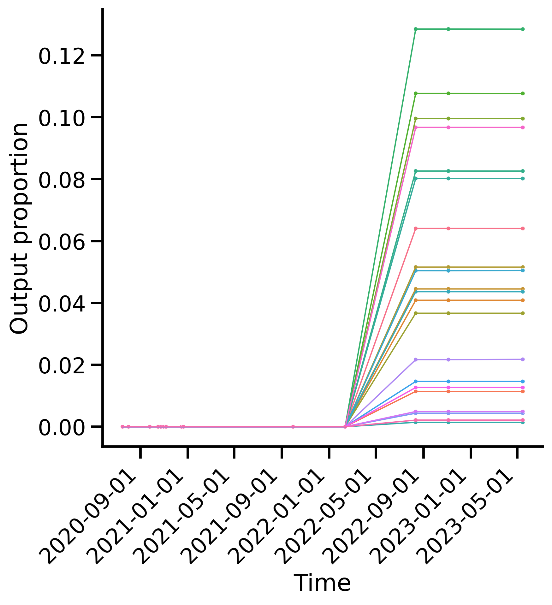

<!-- _footer: Neurons/colors from Schneider-Mizell et al *bioRxiv* (2023) -->

---

# Ordered by distance from soma

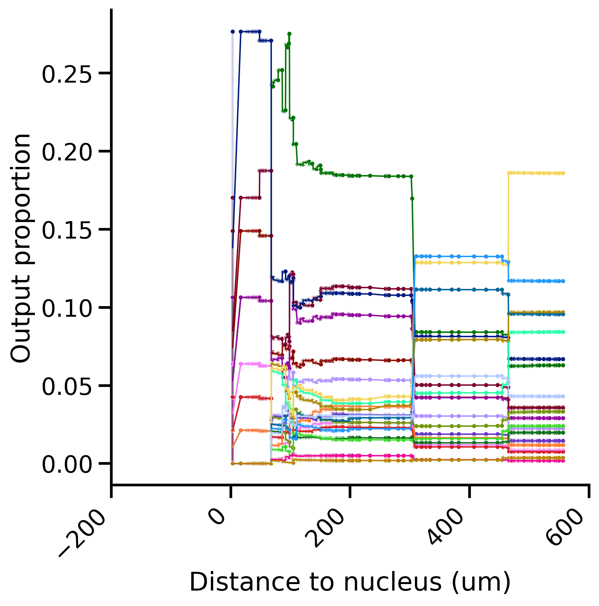

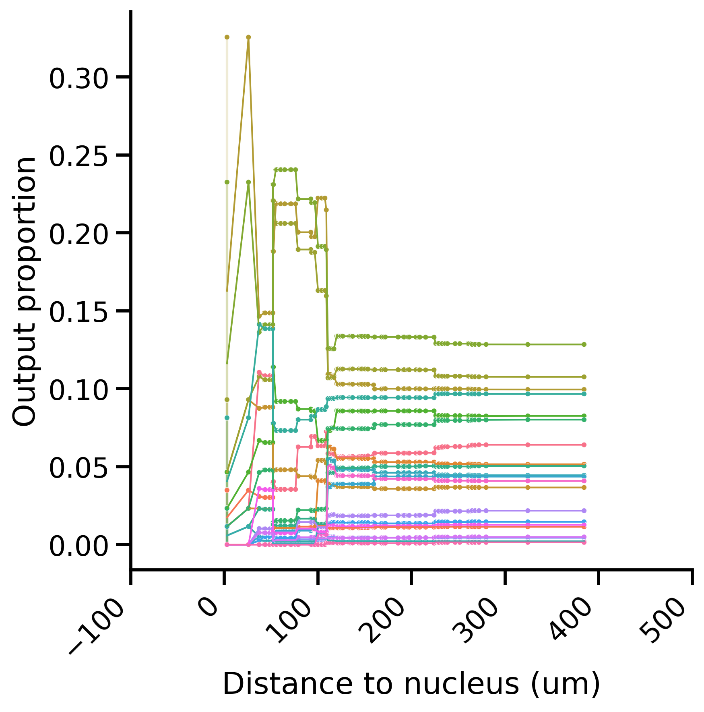

<!-- _footer: Neurons/colors from Schneider-Mizell et al *bioRxiv* (2023) -->

---

# To summarize

- Have the tooling to replay arbitrary sets of edits onto a neuron and examine the effect on connectivity
- Clear there is heterogeneity...
  - In the importance of individual edits
  - In spatial patterns of edit importance
  - In temporal patterns of edit history
- **Need to decide on some useful ways of replaying edits, depending on the question**
  - Feels like we want an x-axis which represents "amount of effort"

---

# How to replay edits

- Time ordering is "spikey" and somewhat arbitrary
- Selecting random edits doesn't reflect reality, high variance since there are likely to be a few key edits
- Could develop a statistical model of proofreading itself...
  - Deep rabbit hole? :sweat_smile:
- Could view this as allowing us to examine alternative proofreading strategies
  - E.g. if we strictly proofread radially from the soma, did a depth-first search from the soma, etc.

<!-- https://neuroglancer.neuvue.io/?json_url=https://global.daf-apis.com/nglstate/api/v1/5754695438041088 -->

---

# Aim 2

- Develop a system for predicting edit _impact_ to prioritize for proofreading
  - May be specific to the question at hand

## Why do it?

- Maximize utility of future proofreading efforts given limited resources

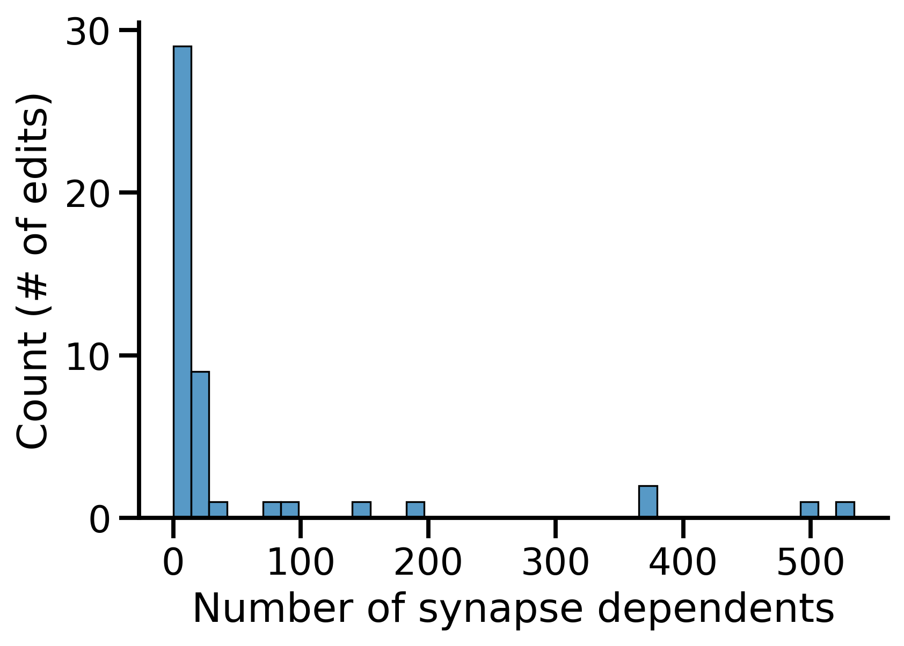

---

# Approach

- Use Aim 1 to quantify impact of edits
- Relate morphological features to this impact score

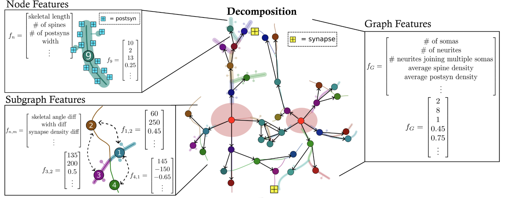

- Test by deploying high-priority edits to proofreaders

<!-- _footer: Celii et al. bioRxiv 2023 -->

---

<!-- set the text color to white -->

# Targeted questions embedded in a survey

<!--  _footer: NASA, ESA, CSA, STScI, D. Milisavljevic (Purdue University), T. Temim (Princeton University), I. De Looze (Ghent University) -->

---

<!-- try to think i could give it uninterrupted in 12-13 mins -->

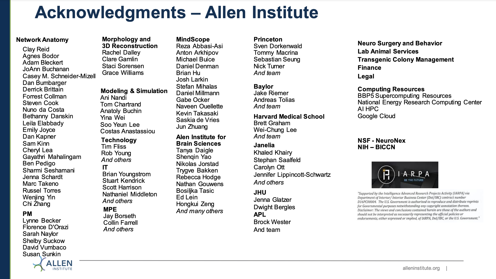

 
 
 
 
 
 
 
 
 
 
 
 

## Proofreaders!

---

# Questions/comments?

---

# Appendix

---

# Prior work on quality-quantity tradeoff

## Would you rather have bit of highly-curated data, or lots of messy data?

Depends on the question, but there exist theoretical cases where you want the latter

## Would you rather have a bit of highly-curated data or lots of ~~messy~~ _unproofread, biased_ data?

---

# Analogy to "prediction powered inference"

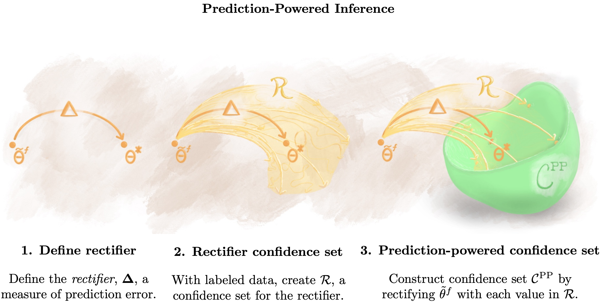

<!-- _footer: Angelopoulos et al. arXiv (2023) -->

---

# Analogy from "prediction powered inference"

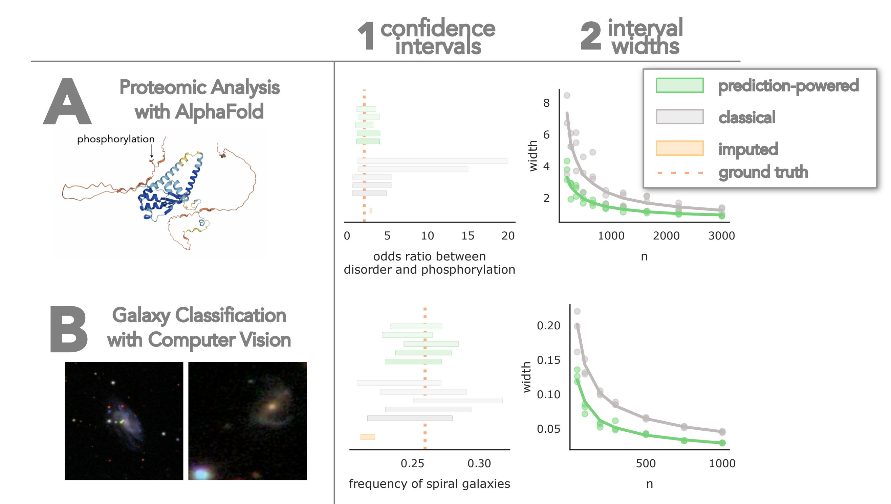

<!-- _footer: Angelopoulos et al. arXiv (2023) -->

---

# Resampling skeletons

- Understand {whether, how} skeleton features are affected by proofreading
- Develop classifiers/clustering methods which are robust to such differences
  - E.g. train classifiers on many "messy" neurons

---

# Example frankeneurons

<iframe height=500 frameborder=0 src="images/skeleton_samples_root_id=864691135915450982_use_cc=True.html">
</iframe>

---

# Frankeneuron   features

---

# Challenges

<!--
- Does not require running much classification code that hasn't already been run, since just operating on the unproofread bulk of Minnie, say -->

- Information already accessible in CAVE, have code for mapping synapses onto their dependant edits
  - May need some new API features to make it scalable
- More specific the question, the smaller our sample size for this kind of approach
- Need to assume some kind of homogeneity across the volume for this to work
  - May not be palatable to the community
- Feature set for a model on how proofreading errors affect connectivity?
- Results are likely question-specific; unclear to what extent any lessons will generalize

---

<!-- Null space of the idea above -->

# Machine-guided or hypothesis-driven proofreading

Now that we have these connectome volumes, how should we spend our time?

- Algorithm that eats a neuron and predicts completeness
- Algorithm that eats a segmentation and predicts sites for edits
  - Better version: eats a segmentation and a _statistic_, predicts _impactful_ edits
    - Find neurons where we need information to assign C-type
    - Find edits likely to attach many synapses

---

# Approach

- Develop feature set, ideally reusing relevant tested models (PSS, SegCLR, ...)
  - Features could involve anything in power set of {image, segmentation, skeleton, skeleton attributes}
- Train {NN, RFC, ...} using training set of available edits to predict {edit locations, completeness level, ...}
- Validate on held out neurons or subvolume
- Deployment is a tricker question
  - V$0$ Could run predictions on a fixed materialization prior to bout of proofreading
- More elaborate version: predict (edit location, importance)
  - E.g. find me edits likely to add many synapses

---

# Challenges

- Little proof-of-concept for feasibility (as far as I know)
  - For a random neuron, can we predict where its primary axon might be?
  - What if you know something about its cell type, say from PSS features?
  - Ditto for predicting completeness from a cell you know nothing else about
- Dynamics: to be useful, would this be running on neurons all the time as they are edited, like the L2cache?
- How would a proofreader interact with such a system?
- Overlap with other work on auto-proofreading?

---

# Thoughts?

Paper on how proofreading affects connectivity estimand

- Have a specific analysis goal, but message could be a general perspective on how to do analysis in light of noisy proofreading
- Side output: defining specific notions of connectivity estimands we care about super clearly
  - Connection probability: $P(i \rightarrow j | i,j)$
  - What we often plot: how cells distribute outputs over output classes: $P(i \rightarrow j \in K)$, $P(i \rightarrow j \in K | d_{ij})$
- Have something that we do expect to fail if there is little proofreading
- Maybe worth keeping this simple...
- Relationship between segmentation error and neuroanatomy

---

<!-- explain this better, makes sense in context of aim 2 -->
<!-- make a diagram that can describe this post hoc importance idea -->

# Example differential edit importance

Merge dependency graphs for two neurons, size of node = # of dependent synapses

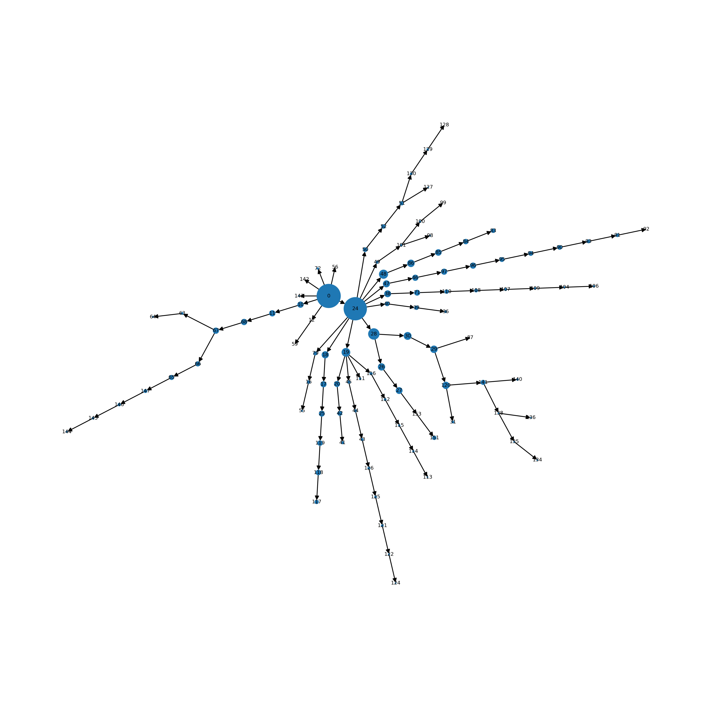

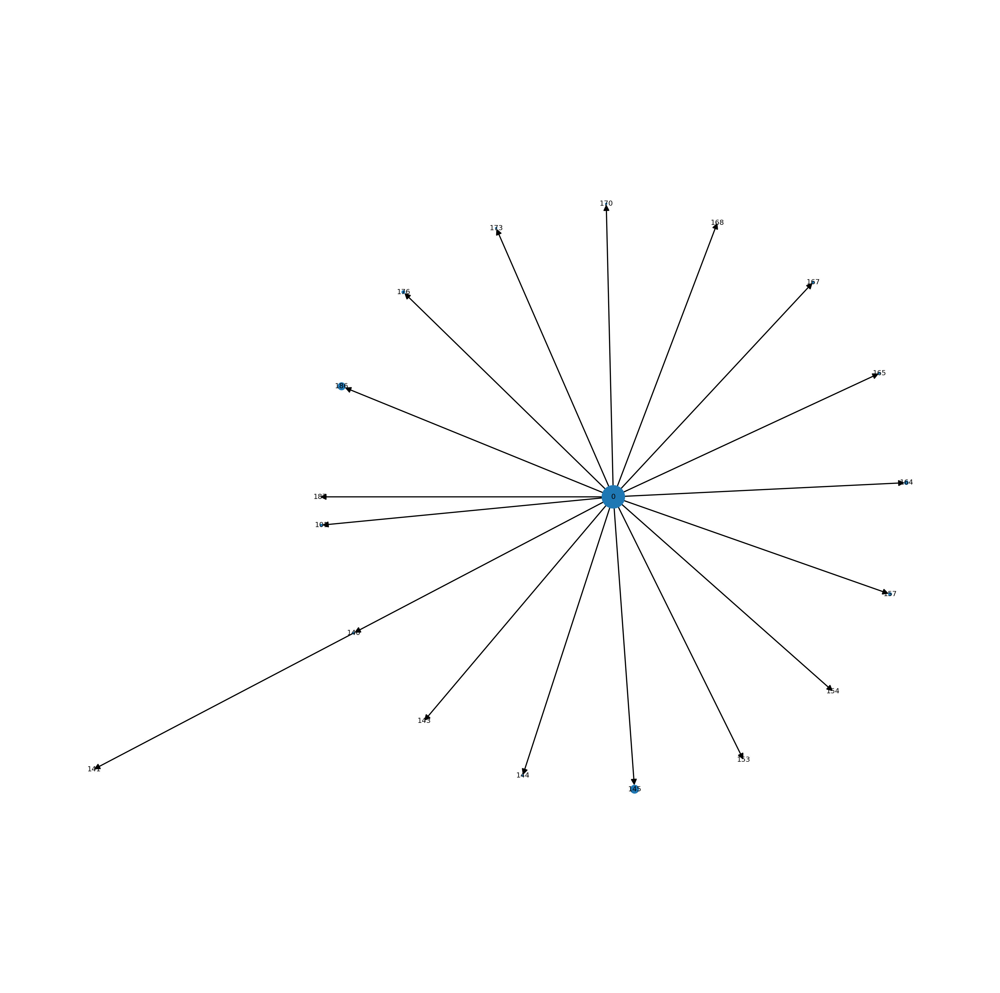

