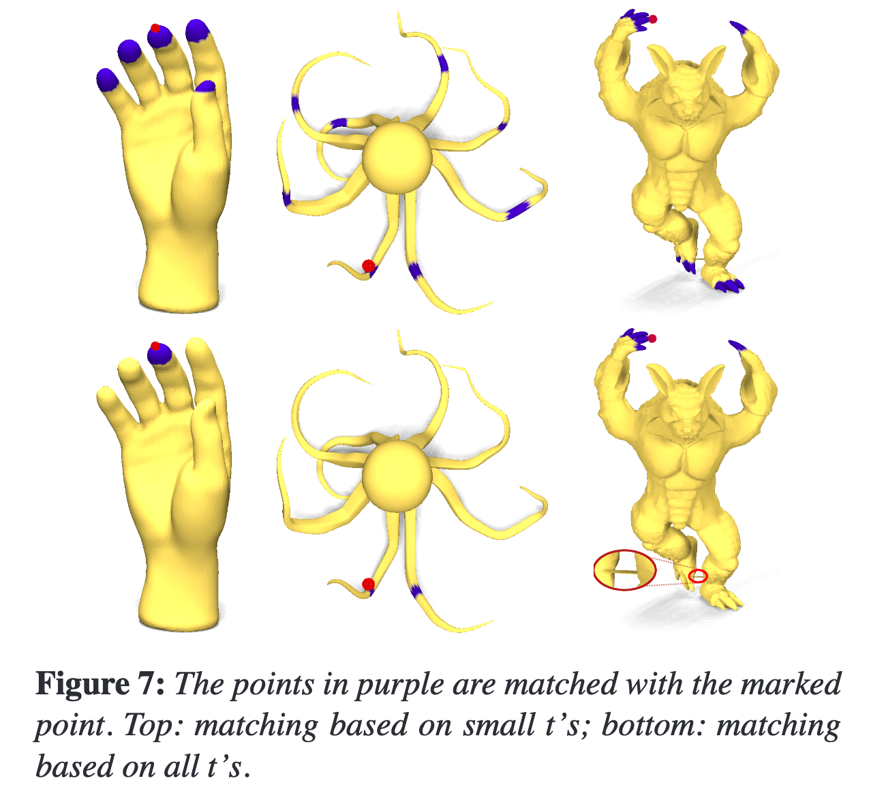
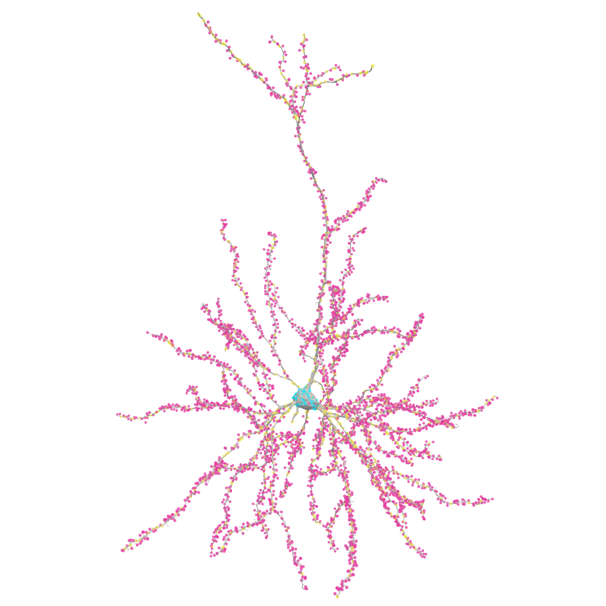
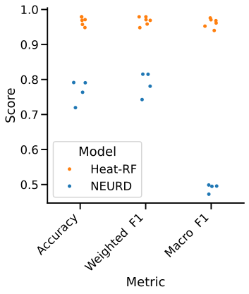
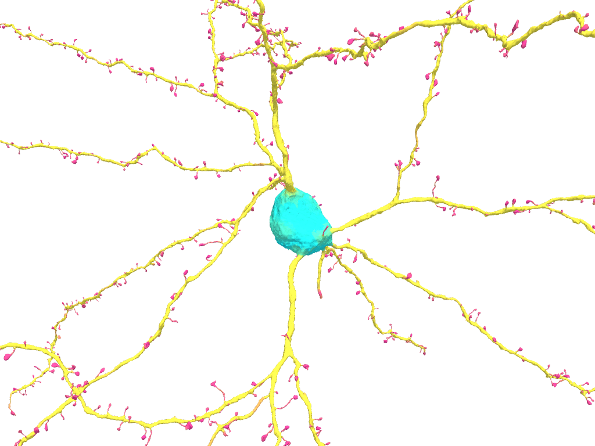
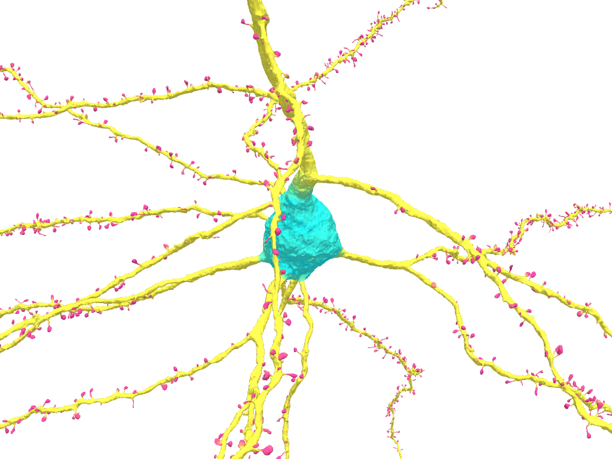
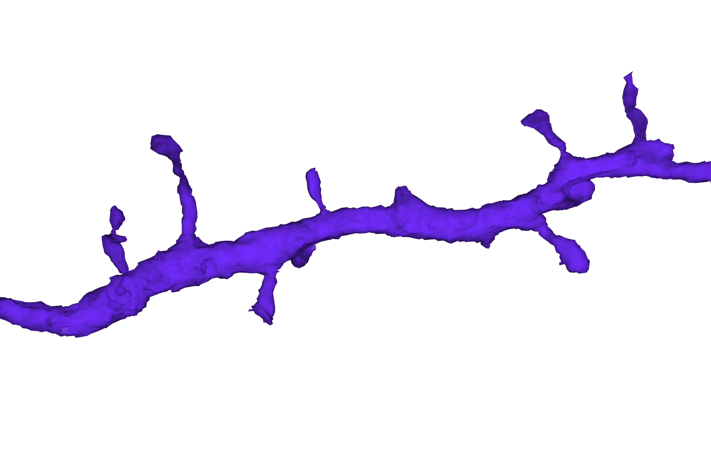
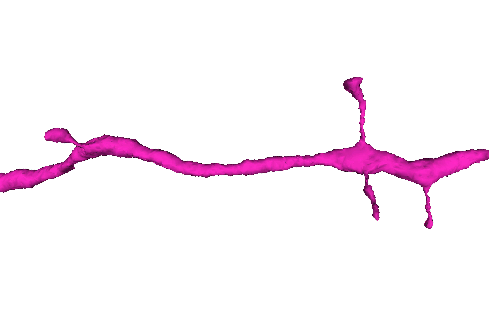
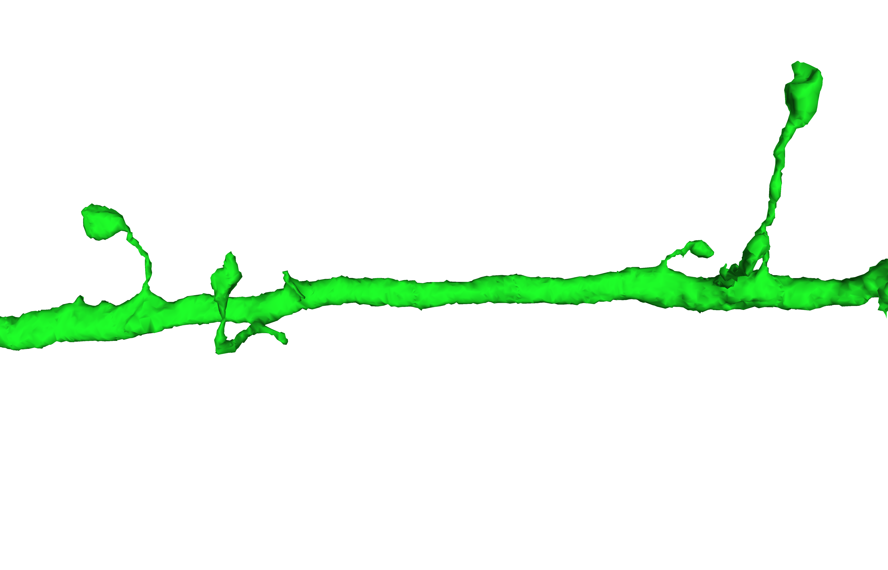
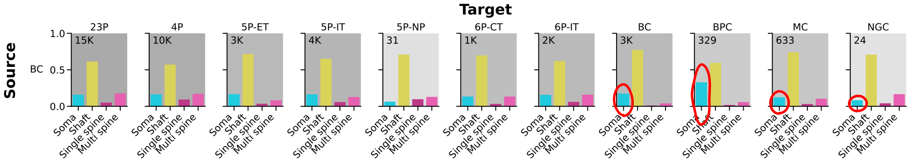
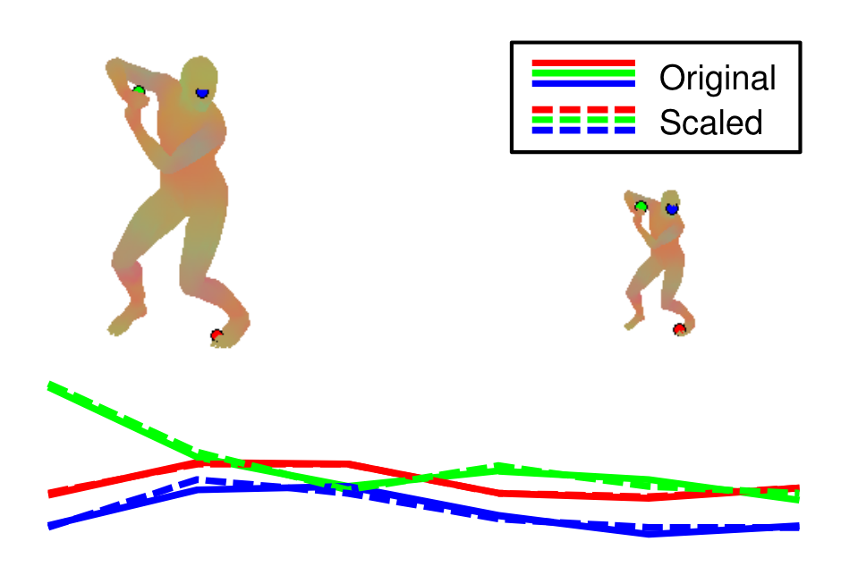

<style>
a {
  position: fixed;
}
embed{
  border: 0px;
}
h1 {
  margin-bottom: 0px;
  padding-bottom: 5px;
}
section {
  --soma: rgb(0, 227, 255);
  --shaft: rgb(239, 230, 69);
  --spine: rgb(233, 53, 161);
  --legend: |
  <div style="font-size:16px">
  <span style="color: var(--soma);">soma</span> <span style="color: var(--shaft);">shaft</span> <span style="color: var(--spine);">spine</span> 
  </img> vortex
  </img> model
  </div>;
}
img {
  display: inline;
  position: relative;
  top: 2px
}
[data-morph] {
  view-transition-name: attr(data-morph type(<custom-ident>), none);
}
section::after {
    content: attr(data-marpit-pagination) '/47';
}
</style>

<!-- _paginate: false -->
<!-- _backgroundImage: ../themes/aibs-backgrounds/blank.png -->


<br>

# <!-- fit --> Mapping million spines in EM with spectral shape analysis

<div class="columns">
<div>

<br>
<br>
<br>
<br>
<br>
<br>

Ben Pedigo
(he/him)
Scientist I
Allen Institute for Brain Science
[ben.pedigo@alleninstitute.org](mailto:ben.pedigo@alleninstitute.org)

<div style='' >

</div>

</div>
<div>

</div>
</div>

---

<!-- NOTE spines are a prevalent morphological features, and a fundamental building block of connectivity between neurons -->

# Dendritic spines

<div class="columns">
<div>

<embed src="./images/new_posterior_plots/basic_neuron.html" width="99%" height="550px" name="basic_neuron" style="border-width: 0px; border-color: white; display: block; margin: 0 auto;" data-morph="microns"></embed>

</div>
<div>

* Primary site of excitatory $\rightarrow$ excitatory synapses
* Chemo-electrically isolated
* Dynamic
* Mechanism for neurons to "reach out" to partners

</div>
</div>

<!-- _transition: fade 0.5s -->

---
<style scoped>
.fig belowcaption {
    position: absolute;
    bottom: 5%;
    left: 15%;
    vertical-align: top;
    text-anchor: start;
    font-size: 20px;
    font-weight: normal;
}
</style>

# MICrONS

<div class="columns-bl">
<div>

<figure class='fig'>
</img>

<belowcaption>

Forrest Collman

</belowcaption>

</figure>

</div>
<div>

* Scale
* Pre- and post-synaptic partners
* Cell types
* EM imagery

<!-- * Correlated activity -->

</div>
</div>

<!-- _footer: MICrONS consortium et al. Nature (In press) -->


<!--  -->


<!-- NOTE Once you've gotten all this cool EM data, there's still a lot of work to add semantic information -->

<!-- NOTE can see all sorts of patterns like myelin, somas, spines, etc but it is still a lot of work to measure -->

<!-- NOTE Briefly mention some papers that have worked on adding this info, like cell type, dendritic features  -->

---

# Community interest in spines in EM: VORTEX

<!-- NOTE Nothing existed in this space for doing something as fine as spines -->
<!-- NOTE Many people had questions about spines -->
<!-- NOTE This led to Virtual observatory of cortex grant doing a bunch of hand annotation -->


<div class="columns">
<div>

VORTEX: supporting community interest in MICrONS:

* Basket cells onto spines with multiple inputs
* Spines with spine head apparatus
* Computational questions about modeling spine heads as distinct compartments
<!-- * Analyzing how passing axons relate to dendritic morphology -->

</div>
<div>

</div>
</div>

---

# Community interest in spines in EM: VORTEX

<div class="columns">
<div>

VORTEX: supporting community interest in MICrONS:

- Basket cells onto spines with multiple inputs
-  Spines with spine head apparatus
- Computational questions about modeling spine heads as distinct compartments
<!-- * Analyzing how passing axons relate to dendritic morphology -->

</div>
<div>

<div style="font-size:20px">

_Bethanny Danskin, Erika Neace, Rachael Swanstrom_

Synapses labeled <span style="color: var(--soma);">soma</span> <span style="color: var(--shaft);">shaft</span> <span style="color: var(--spine);">spine</span>

</div>

<div>
<embed src="./images/vortex_labels/vortex_labels_example.svg" width="96%" height="450px" name="vortex_labels_example"></embed>

<a href="./images/vortex_labels/vortex_labels_example.html" target="vortex_labels_example">
</img>
</a>
</div>

<div style="font-size:20px">
</div>

</div>
</div>


---

<style scoped>
section {
  align-content: center;
}
p {
  font-size: 30px;
}
</style>

<div id='highlightbox'>

# <!-- fit --> Goal: pipeline for automated postsynaptic structure prediction

<!-- Develop an accurate, robust, and scaleable prediction of postsynaptic structure -->

</div>

---


# Outline

- Motivation
* **Intuition for heat kernel signatures**
* Computational pipeline for postsynaptic structure prediction
* Postsynaptic structures in MICrONS

---

<!-- First choice to make is what representation to use -->
<!-- Explain what segmentation, mesh, and skeleton are -->
<!-- Each of these differs in scale and size and ease of operaition etc. -->
<!-- First intuition was that we should be able to use the mesh to find spines, because people do -->

# Morphological representations

<div class="columns">
<div>

Segmentation/imagery
(_Voxels_)


</div>
<div>

Mesh
(_Triangulation of surface_)

<!--  -->

</img>

</div>
<div>

Skeleton
(_Coarse medial axis_)


</div>
</div>

<div style="text-align: center">

$\leftarrow$ More expensive &nbsp;&nbsp;&nbsp;&nbsp;&nbsp;&nbsp;&nbsp;&nbsp;&nbsp;&nbsp;&nbsp;&nbsp;&nbsp;&nbsp;&nbsp;&nbsp;&nbsp;&nbsp; Less expensive $\rightarrow$

</div>

<!-- _transition: fade 1s -->

---

# How to generate features for a mesh?

<div class="columns">
<div>

</img>

</div>
<div>


</div>
</div>


---

# Heat diffusion

Imagine placing a unit of heat at a point on a surface, watching how that heat diffuses


<!-- _footer: https://en.wikipedia.org/wiki/Heat_equation -->

---

<div style="font-size:20px">
<span style="color: var(--soma);"> &nbsp;&nbsp;&nbsp;&nbsp;&nbsp;&nbsp;&nbsp;&nbsp;&nbsp;&nbsp;&nbsp;&nbsp;&nbsp;&nbsp;&nbsp;&nbsp; soma</span> <span style="color: var(--shaft);">shaft</span> <span style="color: var(--spine);">spine</span>

<!--  -->

</img>

<div style="font-size:30px; text-align: center">

Increasing time $\rightarrow$

</div>

<!-- _transition: fade 0.5s -->

---

<!-- TODO EXP fix this up so the y axis starts the same for the panel at right -->

# Tracking heat diffusion

<div class="columns">
<div>

<!--  -->

</img>

</div>
<div>


</div>
</div>

---

<!-- TODO add the plot of 3 heat kernel signatures back in here -->

# Defining the heat kernel signature (HKS)

$k_{t}(x, y)$: the amount of heat that diffuses from point $x$ to point $y$ after time $t$.

Consider $k_{t}(x, x)$: how much heat is left at $x$ after some amount of time $t$.

For timescales $T = \{t_1, t_2, ... t_d\}$, the HKS for a point on the mesh $x$ is

$$HKS(x) = [k_{t_1}(x,x), k_{t_2}(x,x), ..., k_{t_d}(x,x)]$$

Often scale these: $\frac{k_{t_1}(x,x)}{\sum_i k_{t_1}(i,i)}$

<div id="highlightbox">

HKS is a vector for each **node** in a mesh which describes its heat diffusion properties

</div>

<!-- _footer: Sun et al., _Eurographics_ (2008) -->

---

# Intuition for HKS matching

<style scoped>

p {
  font-size: 20px;
}

</style>

<div class="columns">
<div>

<!--  -->

</img>

> ...all four points have isometric neighborhoods at small scales, their HKS’s are the same for small $t$’s ($< t_1$).

</div>
<div>

<!--  -->

</img>

</div>
</div>

<!-- _footer: Sun et al., _Eurographics_ (2008) -->

<!-- _transition: fade 0.7s -->

---

# Clustering on heat kernel signatures

<div class="columns">
<div>


<!-- </img> -->

</div>
<div>

<div>
<embed src="./images/show_heat_diffusion/hks_clustered.svg" width="96%" height="550px" name="hks_clustered" data-morph="octopus"></embed>

<a href="./images/show_heat_diffusion/hks_clustered.html" target="hks_clustered">
</img>
</a>

</div>
</div>
</div>

---

# Postsynaptic structure prediction (with labels)

<!-- TODO EXP add something to depict features on this slide -->

<div class="columns">
<div>



</div>
<div>

- Synapse target labels from VORTEX _(Erika Neace, Rachael Swanstrom, Bethanny Danskin)_
* HKS features from the mesh point closest to synapse
* Random forest classifier

</div>
</div>


<!-- --- -->

<!-- Import the component
<script type="module" src="https://ajax.googleapis.com/ajax/libs/model-viewer/4.0.0/model-viewer.min.js"></script>

<style>
model-viewer {
  width: 100%;
  height: 100%;
  background-color: #000;
  color: #3d3d3d
}
</style>

<model-viewer alt="A neuron" src="https://raw.githubusercontent.com/bdpedigo/talks/refs/heads/main/docs/slides/2025-03-25-brain-science-seminar/models/864691135855890478.gltf" camera-controls touch-action="pan-y"
auto-rotate rotation-per-second="150%" camera-target="0m 0m 0m" min-field-of-view="0.25deg" field-of-view="auto" max-field-of-view="6deg"> -->

<!--
<model-viewer alt="A neuron" src="http://localhost:9001/864691135855890478.gltf" camera-controls touch-action="pan-y"
auto-rotate rotation-per-second="150%" camera-target="0m 0m 0m" min-field-of-view="0.25deg" field-of-view="auto" max-field-of-view="6deg"> -->

<!--
<model-viewer alt="Neil Armstrong's Spacesuit from the Smithsonian Digitization Programs Office and National Air and Space Museum" src="shared-assets/models/NeilArmstrong.glb" ar environment-image="shared-assets/environments/moon_1k.hdr" poster="shared-assets/models/NeilArmstrong.webp" shadow-intensity="1" camera-controls touch-action="pan-y"></model-viewer>
-->

---

# <!-- fit --> Random forest on HKS is an accurate classifier

Train test split over _neurons_
<div class="columns">
<div>



</div>
<div>


</div>
</div>

---

<div style="font-size:16px">
<span style="color: var(--soma);">soma</span> <span style="color: var(--shaft);">shaft</span> <span style="color: var(--spine);">spine</span>
</div>

<div>
<embed src="./images/boosted_model_posteriors/864691135182486274_posterior.svg" width="96%" height="600px" name="864691135182486274_posterior"></embed>

<a href="./images/boosted_model_posteriors/864691135182486274_posterior.html" target="864691135182486274_posterior">
</img>
</a>
</div>

---

<div style="font-size:16px">
<span style="color: var(--soma);">soma</span> <span style="color: var(--shaft);">shaft</span> <span style="color: var(--spine);">spine</span>
</div>

<div>
<embed src="./images/boosted_model_posteriors/864691135361404743_posterior.svg" width="96%" height="600px" name="864691135361404743_posterior"></embed>

<a href="./images/boosted_model_posteriors/864691135361404743_posterior.html" target="864691135361404743_posterior">
</img>
</a>
</div>

---

<div style="font-size:16px">
<span style="color: var(--soma);">soma</span> <span style="color: var(--shaft);">shaft</span> <span style="color: var(--spine);">spine</span>
</div>

<div>
<embed src="./images/boosted_model_posteriors/864691135416507322_posterior.svg" width="96%" height="600px" name="864691135416507322_posterior"></embed>

<a href="./images/boosted_model_posteriors/864691135416507322_posterior.html" target="864691135416507322_posterior">
</img>
</a>
</div>

---

# Excitatory neurons

<div style="font-size:20px; padding: 0px; position: absolute; top: 0.6in; right: 0.7in;">
<span style="color: var(--soma);">soma</span> <span style="color: var(--shaft);">shaft</span> <span style="color: var(--spine);">spine</span>
</div>

<div class="columns">
<div>

<!--  -->

<figure class="fig">

<figcaption >
23P
</figcaption>
</figure>

</div>
<div>

<figure class="fig">

<figcaption >
4P
</figcaption>
</figure>

</div>
<div>

<figure class="fig">

<figcaption >
5P-IT
</figcaption>
</figure>

</div>
</div>

<div class="columns">
<div>

<figure class="fig">

<figcaption >
5P-NP
</figcaption>
</figure>

</div>
<div>

<figure class="fig">

<figcaption >
5P-ET
</figcaption>
</figure>

</div>
<div>

<figure class="fig">

<figcaption >
6P-CT
</figcaption>
</figure>

</div>
</div>

<!-- _footer: Cell types from Schneider-Mizell et al. Nature (In press) -->

---

# Excitatory or inhibitory?

<style scoped>
a {
  position: relative;
}
img {

}
img:hover {
  box-shadow: 0 0 2px 1px rgba(0, 140, 186, 0.5);
}
</style>

<div class="columns">
<div>

##### A) <a href="https://spelunker.cave-explorer.org/#!middleauth+https://global.daf-apis.com/nglstate/api/v1/4927362740256768"></img></a>


</div>
<div>

##### B)

<a href="https://spelunker.cave-explorer.org/#!middleauth+https://global.daf-apis.com/nglstate/api/v1/5018403698900992"></img></a>


</div>
<div>

##### C)

<a href="https://spelunker.cave-explorer.org/#!middleauth+https://global.daf-apis.com/nglstate/api/v1/5294319914188800"></img></a>

</div>
</div>

<div class="columns">
<div>

##### D)

<a href="https://spelunker.cave-explorer.org/#!middleauth+https://global.daf-apis.com/nglstate/api/v1/4938240147587072"></img></a>


</div>
<div>

##### E)

<a href="https://spelunker.cave-explorer.org/#!middleauth+https://global.daf-apis.com/nglstate/api/v1/5256989132193792"></img></a>

</div>
<div>

##### F)

<a href="https://spelunker.cave-explorer.org/#!middleauth+https://global.daf-apis.com/nglstate/api/v1/6342512605134848"></img></a>

</div>
</div>

---

# Excitatory or inhibitory?

<style scoped>
a {
  position: relative;
}
img {

}
img:hover {
  box-shadow: 0 0 2px 1px rgba(0, 140, 186, 0.5);
}
</style>

<div class="columns">
<div>

##### Inhibitory <a href="https://spelunker.cave-explorer.org/#!middleauth+https://global.daf-apis.com/nglstate/api/v1/4927362740256768"></img></a>


</div>
<div>

##### Excitatory

<a href="https://spelunker.cave-explorer.org/#!middleauth+https://global.daf-apis.com/nglstate/api/v1/5018403698900992"></img></a>


</div>
<div>

##### Inhibitory

<a href="https://spelunker.cave-explorer.org/#!middleauth+https://global.daf-apis.com/nglstate/api/v1/5294319914188800"></img></a>

</div>
</div>

<div class="columns">
<div>

##### Excitatory

<a href="https://spelunker.cave-explorer.org/#!middleauth+https://global.daf-apis.com/nglstate/api/v1/4938240147587072"></img></a>


</div>
<div>

##### Inhibitory

<a href="https://spelunker.cave-explorer.org/#!middleauth+https://global.daf-apis.com/nglstate/api/v1/5256989132193792"></img></a>

</div>
<div>

##### Excitatory

<a href="https://spelunker.cave-explorer.org/#!middleauth+https://global.daf-apis.com/nglstate/api/v1/6342512605134848"></img></a>

</div>
</div>

---

# Inhibitory neurons

<div style="font-size:20px; padding: 0px; position: absolute; top: 0.6in; right: 0.7in;">
<span style="color: var(--soma);">soma</span> <span style="color: var(--shaft);">shaft</span> <span style="color: var(--spine);">spine</span>
</div>

<div class="columns">
<div>

<figure class="fig">

<figcaption >
Basket
</figcaption>
</figure>

</div>
<div>

<figure class="fig">

<figcaption >
Basket
</figcaption>
</figure>

</div>
<div>

<figure class="fig">

<figcaption >
Martinotti
</figcaption>
</figure>

</div>
</div>

<div class="columns">
<div>

<figure class="fig">

<figcaption >
Martinotti
</figcaption>
</figure>

</div>
<div>

<figure class="fig">

<figcaption >
Neurogliaform
</figcaption>
</figure>

</div>
<div>

<figure class="fig">

<figcaption >
Bipolar
</figcaption>
</figure>

</div>
</div>

<!-- _footer: Cell types from Schneider-Mizell et al. Nature (In press) -->

---

# Zero-shot prediction on a human neuron

<div style="font-size:16px">
<span style="color: var(--soma);">soma</span> <span style="color: var(--shaft);">shaft</span> <span style="color: var(--spine);">spine</span>
</div>

<div>
<embed src="./images/h01/h01_posterior.svg" width="96%" height="520px" name="h01_posterior"></embed>

<a href="./images/h01/h01_posterior.html" target="h01_posterior">
</img>
</a>
</div>

<!-- _footer: Shapson-Coe et al. _Science_ 2024  -->


---


# Outline

- Motivation
- Intuition for heat kernel signatures
- **Computational pipeline for postsynaptic structure prediction**
- Postsynaptic structures in MICrONS

---

<!-- TODO EXP reduce math here -->

# Heat diffusion

Evolution of heat $u$ over time $t$ is governed by the heat equation:

$$\frac{\partial{u}}{\partial{t}} = \Delta u$$

where $\Delta$ is the Laplacian (2nd derivative) operator.

Heat transferred from point $x$ to $y$ at time $t$ is given by the heat kernel $k_t(x,y)$:

$$k_t(x,y) = \sum_{i=0}^{\infty} e^{-\lambda_i t} \phi_i(x) \phi_i(y)$$

where $\lambda_i$ and $\phi_i$ are the eigenvalues and eigenvectors of the Laplacian operator

<div id="highlightbox">

We just need these eigenvectors/eigenvalues to describe heat

</div>

<!-- _footer: https://en.wikipedia.org/wiki/Heat_kernel -->

---

# Laplacian eigenvectors

<div class="columns">
<div>

### 1D grid


</div>
<div>

### 2D grid


</div>
<div>

### Mesh

<div>
<embed src="./images/show_heat_diffusion/eigenvector_on_mesh.svg" width="96%" height="380px" name="eigenvector_on_mesh"></embed>

<a href="./images/show_heat_diffusion/eigenvector_on_mesh.html" target="eigenvector_on_mesh">
</img>
</a>
</div>

</div>
</div>

* Just need a truncated eigendecomposition
* Takes several hours for a full neuron mesh

---

# Computational improvements

<div class="columns">
<div>

- Overlapping mesh subdivision
* Mesh simplification (Garland and Heckbert 1997)
* Band-by-band eigendecomposition (Vallet and Levy 2008)
* Robust laplacian (Sharp and Crane 2020)
* Mesh agglomeration (for compressed storage)

</div>
<div>

<figure class='fig'>

<figcaption>
Subdivided mesh
</figcaption>
</figure>

<figure class='fig'>

<figcaption>
Subdivided mesh with overlap
</figcaption>
</figure>

</div>
</div>

---

# Timing and compute

<!-- TODO SCI compare to the version without these speedups -->

<div class="columns">
<div>

- Deployed on Google Kubernetes Engine
- ~20 minutes per neuron per CPU
- Mean cost **~0.5 cents per neuron**

<!--  -->

</div>
<div>


<!--  -->

</div>
</div>

---

# Run on MICrONS

<div class="columns">
<div>

- Ran on ~72,000 putative neurons
- ~204 million synapses classified into &nbsp; { <span style="color: rgb(0, 227, 255);">soma</span> <span style="color: rgb(239, 230, 69);">shaft</span> <span style="color: rgb(233, 53, 161);">spine</span> }
- ~$500 in cloud compute cost

</div>
<div>

<figure class="fig">

<belowcaption>

_~1 million (0.5%) of classified synapses_

</belowcaption>
</figure>

</div>
</div>

---


# Outline

- Motivation
- Intuition for heat kernel signatures
- Computational pipeline for postsynaptic structure prediction
- **Postsynaptic structures in MICrONS**

---

<!-- NOTE at a high level, we can look at things in terms of their laminar distribution -->
<!-- NOTE there is an abundance of synapses onto spines in upper layers  -->

# Spatial distribution of synapses

<div class="columns">
<div>

<div style="font-size:16px">
<span style="color: var(--soma);">soma</span> <span style="color: var(--shaft);">shaft</span> <span style="color: var(--spine);">spine</span>
</div>


<!-- 1.3M synapses (= .63% of classified) -->

</div>
<div>


</div>
</div>

---

# Multi-input spines

<!-- TODO EXP add a nice image here of more than one axon onto a spine -->

- Most (>90%) excitatory spines receive a single excitatory input
- Some excitatory spines receive two
  - Thought to be specifically one E, one I
  - Enriched for thalamic input
  - More stable
- Multi-input spines common for inhibitory neurons

<!-- _footer: Kubota et al _J. Neuroscience_ (2007), Villa et al _Neuron_ (2016) -->

---

# Finding multi-input spines

<div class="columns">
<div>

<span style="color: var(--soma);">soma</span> <span style="color: var(--shaft);">shaft</span> <span style="color: var(--spine);">spine</span> &nbsp;&nbsp;&nbsp; :black_circle: synapse detection


</div>
<div>

Connected components sharing a label


<div style="position: absolute; top: 1.8in; left: 9.5in;">Multi-input</div>
<div style="position: absolute; top: 2.2in; left: 9.5in; width: 140px; height: 140px; background-color: none; border-radius: 70px; border-width: 3px; border-color: black; border-style: solid;"></div>

<div style="position: absolute; top: 4.1in; left: 10.8in;">Single-input</div>
<div style="position: absolute; top: 4.5in; left: 10.8in; width: 140px; height: 140px; background-color: none; border-radius: 70px; border-width: 3px; border-color: black; border-style: solid;"></div>

</div>
</div>

---

# <!-- fit --> A triple-input spine onto an excitatory cell

<!-- https://spelunker.cave-explorer.org/#!middleauth+https://global.daf-apis.com/nglstate/api/v1/6077690223263744 -->


---

<!-- NOTE E -> E is mainly onto single input spines -->
<!-- NOTE All other connection types are predominantly onto shaft -->
<!-- NOTE Inhibitory neurons more likely to target somas-->
<!-- NOTE Inhibitory neurons do target other inhibitory "spines" but often onto multi input structures -->

<!-- TODO EXP add dynamics to this slide here to make things disappear -->
<!-- TODO EXP move the legend somewhere nicer here -->

<div class="columns-br">
<div>

# Synapses by E/I

Synapses from cleaned axons where pre- and post- have E/I classifications (1.3M synapses total)

</div>
<div>

<!-- 
<div style="font-size:20px; right: 1in; position: absolute;">
<span style="color: var(--soma);">soma</span> <span style="color: var(--shaft);">shaft</span> <span style="color: var(--spine);">spine</span>
</div> -->


</div>
</div>

---

<!-- NOTE because microns also has some cell type information, we can also look at a similar plot but now broken out by cell type
-->
<!-- NOTE a lot going on here, but going to draw your attention to just a few things -->

<div class="columns-br">
<div>

# Synapses by cell type

</div>
<div>


</div>
</div>

---

# Basket cells target somas, even of inhibitory cells



<div class="columns">
<div>


<!-- https://spelunker.cave-explorer.org/#!middleauth+https://global.daf-apis.com/nglstate/api/v1/4910284205457408 -->

<span style="color: #e1562c">Basket </span> $\rightarrow$ <span style="color: #00cb85"> Basket</span>

</div>
<div>


<!-- https://spelunker.cave-explorer.org/#!middleauth+https://global.daf-apis.com/nglstate/api/v1/6700069303615488 -->

<span style="color: #e1562c">Basket</span> $\rightarrow$ <span style="color: #00cb85"> Bipolar </span>

</div>
<div>


<!-- https://spelunker.cave-explorer.org/#!middleauth+https://global.daf-apis.com/nglstate/api/v1/6074562245558272 -->

<span style="color: #e1562c">Basket</span> $\rightarrow$ <span style="color: #00cb85"> Martinotti </span>

</div>
</div>

---

# L6 CT cells target shafts of other excitatory cells


<div class="columns">
<div>


<!-- https://spelunker.cave-explorer.org/#!middleauth+https://global.daf-apis.com/nglstate/api/v1/4808939033067520 -->

<span style="color: #e1562c">6P-CT </span> $\rightarrow$ <span style="color: #00cb85"> 4P</span>

</div>
<div>


<!-- https://spelunker.cave-explorer.org/#!middleauth+https://global.daf-apis.com/nglstate/api/v1/6560729223135232 -->

<span style="color: #e1562c">6P-CT </span> $\rightarrow$ <span style="color: #00cb85"> 5P-ET</span>

</div>
<div>


<span style="color: #e1562c">6P-CT </span> $\rightarrow$ <span style="color: #00cb85"> 5P-IT</span>

<!-- https://spelunker.cave-explorer.org/#!middleauth+https://global.daf-apis.com/nglstate/api/v1/4835245372211200 -->

</div>
</div>

<!-- https://spelunker.cave-explorer.org/#!middleauth+https://global.daf-apis.com/nglstate/api/v1/4808939033067520 -->
<!-- https://spelunker.cave-explorer.org/#!middleauth+https://global.daf-apis.com/nglstate/api/v1/4637776583589888 -->
<!-- https://spelunker.cave-explorer.org/#!middleauth+https://global.daf-apis.com/nglstate/api/v1/5895863655202816 -->

<!-- ---

# Martinotti cells are spiniest inhibitory, multi-input spines are overrepresented

---

-->

<!-- ---

# L5ET to Martinotti cell spines

<div class="columns">
<div>


https://spelunker.cave-explorer.org/#!middleauth+https://global.daf-apis.com/nglstate/api/v1/6411529894232064

<span style="color: #e1562c">5P-ET </span> $\rightarrow$ <span style="color: #00cb85"> Martinotti</span>

</div>
<div>


https://spelunker.cave-explorer.org/#!middleauth+https://global.daf-apis.com/nglstate/api/v1/6128785033265152

<span style="color: #e1562c">5P-ET </span> $\rightarrow$ <span style="color: #00cb85"> Martinotti</span>

</div>
<div>


https://spelunker.cave-explorer.org/#!middleauth+https://global.daf-apis.com/nglstate/api/v1/6310820913872896

<span style="color: #e1562c">5P-ET </span> $\rightarrow$ <span style="color: #00cb85"> Martinotti</span>

</div>
</div> -->

<!-- ---

<div class="columns-bl">
<div>


</div>
<div>


</div>
</div> -->

---

<!-- _backgroundImage: ../themes/aibs-backgrounds/blank.png -->

<div class="columns-bl">
<div>


<!-- add an absolute position white box without text, with black border -->

<!-- block out upper left corner -->
<div style="position: absolute; bottom: 5.74in; right: 6.8in; width: 5.55in; height: 1.07in; background-color: white; opacity:0.9; border: 0px solid black;"></div>

<!-- block out lower left corner -->
<div style="position: absolute; top:2.32in; right: 6.9in; width: 5.45in; height: 10in; background-color: white; opacity:0.9; border: 0px solid black;"></div>

<!-- block out upper right corner -->
<div style="position: absolute; bottom: 5.74in; left: 7.0in; width: .6in; height: 1.07in; background-color: white; opacity:0.9; border: 0px solid black;"></div>

<!-- block out lower right corner -->
<div style="position: absolute; top:2.32in; left: 7.0in; width: .6in; height: 10in; background-color: white; opacity:0.9; border: 0px solid black;"></div>

<!-- red block in the gap between the above -->
<div style="position: absolute; top: 2.0in; left: 6.7in; width: 0.35in; height: .4in; backbround-color: none; border: 3px solid red; border-radius:10px"></div>

</div>
<div>


</div>
</div>

---

# Nano-targeting patterns as a possible method for future cell typing

<!-- TODO SCI Refine a figure showing outputs of inhibitory proofread axons and their type distributions -->

- Another feature in a connectivity-based descriptor of cell type

---

# Variability within type - inputs


<!-- add an span with absolute positioning above the figure -->

<span style="position: absolute; top: 4in; left: 8in; font-size: 15px; background-color: white; padding: 5px; border-radius: 5px; color: red">Manually classified (Schneider-Mizell et al. Nature 2025)</span>

<span style="position: absolute; top: 4.25in; left: 8in; font-size: 15px; background-color: white; padding: 5px; border-radius: 5px; color: #1f77b4">Automatically classified (Elabbady et al. Nature 2025)</span>

---

# Accessing the data

* Cafe in AM
* Available in the **C**onnectome **A**nnotation and **V**ersioning **E**ngine (CAVE):
  ```python
  from caveclient import CAVEclient
  client = CAVEclient("minnie65_public", version=1300)
  client.materialize.query_table(
      "synapse_target_predictions_ssa",
      limit=2,
      select_columns=["target_id", "pre_pt_root_id", "post_pt_root_id", "tag", "size"],
  )
  ```

  ```plaintext
  pre_pt_root_id	        post_pt_root_id	        size	target_id	tag
  864691135468221308	864691135383487706	4284	306517361	spine
  864691135979239816	864691135383487706	1620	285512620	shaft
  ```

<!-- _footer: CAVE: Dorkenwald, Schneider-Mizell et al Nature Methods (2025) -->

---

# Summary

* Developed a method based on spectral shape analysis (HKS) for classifying postsynaptic structures based on mesh alone
* Scaled this system to robustly classify >200M synapses in MICrONS
* Described initial findings on how postsynaptic structure targeting varies by cell type

---

# Future directions

<div class="columns">
<div>

- Other classification/segmentation tasks (e.g. axonal boutons)
* Add morphometry (e.g. compute spine volumes, surface area, etc.)
* Study spatial distribution of spine densities on individual neurons
* Deploy on more datasets

</div>
<div>


_Segmenting thalamic axon boutons_

</div>
</div>

---

# Acknowledgements

<style scoped>
p {
    font-size: 11px;
}

</style>

<div class="columns">
<div>

_Network Anatomy_
Clay Reid
Agnes Bodor
Adam Bleckert
JoAnn Buchanan
**Casey M. Schneider-Mizell**
Dan Bumbarger
Derrick Brittain
**Forrest Collman**
Steven Cook
Nuno da Costa
**Bethanny Danskin**
Cameron Devine
Sven Dorkenwald
Leila Elabbady
Emily Joyce
Dan Kapner
Sam Kinn
Cheryl Lea
Melissa Lerch
Xiaoyu Lu
Gayathri Mahalingam
**Erika Neace**
Ben Pedigo
Sharmi Seshamani
Jenna Schardt
**Rachael Swanstrom**
Marc Takeno
Russel Torres
Keith Wiley
Wenjing Yin
Chi Zhang

</div>
<div>

_PM_
Lynne Becker
Florence D'Orazi
Sarah Naylor
Shelby Suckow
David Vumbaco
Susan Sunkin

_Morphology and 3D Reconstruction_
Rachel Dalley
Clare Gamlin
Staci Sorensen
Grace Williams

_Modeling & Simulation_
Ani Nandi
Tom Chartrand
Anatoly Buchin
Yina Wei
Soo Yeun Lee
Costas Anastassiou

_Technology_
Tim Fliss
Rob Young
And others

_IT_
Brian Youngstrom
Stuart Kendrick
Scott Harrison
Nathaniel Middleton
And others

</div>
<div>

_MPE_
Jay Borseth
Collin Farrell
And others

_MindScope_
Reza Abbasi-Asi
Anton Arkhipov
Michael Buice
Daniel Denman
Brian Hu
Josh Larkin
Stefan Mihalas
Daniel Millmann
Gabe Ocker
Naveen Ouellette
Kevin Takasaki
Saskia de Vries
Jun Zhuang

_Alen Institute for Brain Science_
Tanya Daigle
Shenqin Yao
Nikolas Jorstad
Trygve Bakken
Rebecca Hodge
Nathan Gouwens
Bosiljka Tasic
Ed Lein
Hongkui Zeng
And many others

</div>
<div>

_Princeton_
Sven Dorkenwald
Tommy Macrina
Sebastian Seung
Nick Turner
And team

_Baylor_
Jake Riemer
Andreas Tolias
And team

_Harvard Medical School_
Brett Graham
Wei-Chung Lee
And team

_Janelia_
Khaled Khairy
Stephan Saalfeld
Carolyn Ott
Jennifer Lippincott-Schwartz
And others

_JHU_
Jenna Glatzer
Dwight Bergles

_APL_
Brock Wester
And team

</div>
<div>

_Neuro Surgery and Behavior_
_Lab Animal Services_
_Transgenic Colony Management_
_Finance_
_Legal_

_Computing Resources_
BBP5 Supercomputing Resources
National Energy Research Computing Center
AI HPC
Google Cloud

_Funding_
IARPA - MICRONS
NSF - NeuroNex
NIH – BICCN

</div>
</div>

---

# Questions?

<!-- _backgroundImage: ../themes/aibs-backgrounds/blank.png -->


<br>
<br>
<br>
<br>
<br>
<br>
<br>

Ben Pedigo
(he/him)
Scientist I
Allen Institute for Brain Science
[ben.pedigo@alleninstitute.org](mailto:ben.pedigo@alleninstitute.org)

---

# An aside...

<div class="columns">
<div>

Many generalizations/extensions of HKS:

- Alternative computational schemes:
  <span style="font-size: 14px">Nasikun et al. 2018; Nasikun et al. 2022; Magnet and Ovsjanikov 2023, Hammond et al. 2009; Shuman et al. 2011; Huang et al. 2020 </span>
- Volumetric HKS:
  <span style="font-size: 14px">Raviv et al. 2010; Rustamov et al. 2009; Rustamov 2011</span>

</div>
<div>

HKS features:

$$h_t(x) = \sum_{i=0}^{D} e^{-\lambda_i t} \phi_i(x)^2$$

Learned spectral features (Litman & Bronstein 2014):

$$x_t(x) = \sum_{i=0}^{D} \textcolor{red}{f_t(\lambda)} \phi_i(x)^2$$

Spectral graph neural network layer (add citation):

</div>
</div>

---

<div style="font-size:16px">
<span style="color: rgb(0, 227, 255);">soma</span> <span style="color: rgb(239, 230, 69);">shaft</span> <span style="color: rgb(233, 53, 161);">spine</span> 
</img> vortex
</img> model
</div>

<div>
<embed src="./images/model0/incorrect_gallery.svg" width="96%" height="600px" name="incorrect_gallery"></embed>

<a href="./images/model0/incorrect_gallery.html" target="incorrect_gallery">
</img>
</a>
</div>

---

<div>
<embed src="./images/boosted_model_posteriors/864691135182839810_posterior.svg" width="100%" height="600px" name="864691135182839810_posterior"></embed>

<a href="./images/boosted_model_posteriors/864691135182839810_posterior.html" target="864691135182839810_posterior" style="position: relative; left: -60px; top: -580px;">
</img>
</a>
</div>

<!-- ---

# Morphological featurization of neuron morphology

- "Kernel" based: compare all $n$ neurons to all other $n-1$ neurons, build up a similarity/dissimilarity matrix
  - NBLAST
  - CAJAL
- Hand-crafted features:
  - IVSCC pipeline features
  - Nuclear features
- Learning-based:
  - GNNs on skeletons (Weis papers)
  - NEURD
  - SegCLR -->

<!-- ---

# Problem statement

## Current spine classifcations have remained unsatisfying -->

<!-- ---

# NEURD classifies many spines as shaft

_Bethanny Danskin, Erika Neace, Rachael Swanstrom_

<div class="columns">
<div>


</div>
<div>

Coverage: 66% of VORTEX compartment labels are in the NEURD table

</div>
</div>

Celii et al. _bioRxiv_ (2024) -->

<!-- ---

<div style="font-size:16px">
<span style="color: var(--soma);">soma</span> <span style="color: var(--shaft);">shaft</span> <span style="color: var(--spine);">spine</span>
</img> vortex
</img> model
</div>

<div>
<embed src="./images/vortex_neurd/vortex_neurd_sample_meshes_0.svg" width="96%" height="600px" name="vortex_neurd_sample_meshes_0"></embed>

<a href="./images/vortex_neurd/vortex_neurd_sample_meshes_0.html" target="vortex_neurd_sample_meshes_0">
</img>
</a>

</div>

_footer:  -->

<!-- ---

##

<div style="font-size:16px">
<span style="color: var(--soma);">soma</span> <span style="color: var(--shaft);">shaft</span> <span style="color: var(--spine);">spine</span>
</img> vortex
</img> model
</div>

<div>
<embed src="./images/vortex_neurd/vortex_neurd_sample_meshes_1.svg" width="96%" height="600px" name="vortex_neurd_sample_meshes_1"></embed>

<a href="./images/vortex_neurd/vortex_neurd_sample_meshes_1.html" target="vortex_neurd_sample_meshes_1">
</img>
</a>
</div>

---

<div style="font-size:16px">
<span style="color: var(--soma);">soma</span> <span style="color: var(--shaft);">shaft</span> <span style="color: var(--spine);">spine</span>
</img> vortex
</img> model
</div>

<div>
<embed src="./images/vortex_neurd/vortex_neurd_sample_meshes_2.svg" width="96%" height="600px" name="vortex_neurd_sample_meshes_2"></embed>

<a href="./images/vortex_neurd/vortex_neurd_sample_meshes_2.html" target="vortex_neurd_sample_meshes_2">
</img>
</a>
</div>

---

<div style="font-size:16px">
<span style="color: var(--soma);">soma</span> <span style="color: var(--shaft);">shaft</span> <span style="color: var(--spine);">spine</span>
</img> vortex
</img> model
</div>

<div>
<embed src="./images/vortex_neurd/vortex_neurd_sample_meshes_3.svg" width="96%" height="600px" name="vortex_neurd_sample_meshes_3"></embed>

<a href="./images/vortex_neurd/vortex_neurd_sample_meshes_3.html" target="vortex_neurd_sample_meshes_3">
</img>
</a>
</div>

---

<div style="font-size:16px">
<span style="color: var(--soma);">soma</span> <span style="color: var(--shaft);">shaft</span> <span style="color: var(--spine);">spine</span>
</img> vortex
</img> model
</div>

<div>
<embed src="./images/vortex_neurd/vortex_neurd_sample_meshes_4.svg" width="96%" height="600px" name="vortex_neurd_sample_meshes_4"></embed>

<a href="./images/vortex_neurd/vortex_neurd_sample_meshes_4.html" target="vortex_neurd_sample_meshes_4">
</img>
</a>
</div> -->

---

<div>
<embed src="./images/boosted_model_posteriors/864691135851482823_posterior.svg" width="96%" height="600px" name="864691135851482823_posterior"></embed>

<a href="./images/boosted_model_posteriors/864691135851482823_posterior.html" target="864691135851482823_posterior">
</img>
</a>
</div>

---

<div>
<embed src="./images/boosted_model_posteriors/864691135875972691_posterior.svg" width="96%" height="600px" name="864691135875972691_posterior"></embed>

<a href="./images/boosted_model_posteriors/864691135875972691_posterior.html" target="864691135875972691_posterior">
</img>
</a>
</div>

---

<div>
<embed src="./images/boosted_model_posteriors/864691136005566154_posterior.svg" width="96%" height="600px" name="864691136005566154_posterior"></embed>

<a href="./images/boosted_model_posteriors/864691136005566154_posterior.html" target="864691136005566154_posterior">
</img>
</a>
</div>

---

<div>
<embed src="./images/boosted_model_posteriors/864691136109645240_posterior.svg" width="96%" height="600px" name="864691136109645240_posterior"></embed>

<a href="./images/boosted_model_posteriors/864691136109645240_posterior.html" target="864691136109645240_posterior">
</img>
</a>
</div>

---

<div>
<embed src="./images/boosted_model_posteriors/864691136437250718_posterior.svg" width="96%" height="600px" name="864691136437250718_posterior"></embed>

<a href="./images/boosted_model_posteriors/864691136437250718_posterior.html" target="864691136437250718_posterior">
</img>
</a>
</div>

---

<div>
<embed src="./images/boosted_model_posteriors/864691136923636708_posterior.svg" width="96%" height="600px" name="864691136923636708_posterior"></embed>

<a href="./images/boosted_model_posteriors/864691136923636708_posterior.html" target="864691136923636708_posterior">
</img>
</a>
</div>

<!-- ---

# Best neuron

<div style="font-size:16px">
<span style="color: var(--soma);">soma</span> <span style="color: var(--shaft);">shaft</span> <span style="color: var(--spine);">spine</span>
</img> vortex
</img> model
</div>

<div>
<embed src="./images/model0/neuron_posterior_best.svg" width="96%" height="520px" name="neuron_posterior_best"></embed>

<a href="./images/model0/neuron_posterior_best.html" target="neuron_posterior_best">
</img>
</a>
</div> -->

<!-- ---

# Worst neuron

<div style="font-size:16px">
<span style="color: var(--soma);">soma</span> <span style="color: var(--shaft);">shaft</span> <span style="color: var(--spine);">spine</span>
</img> vortex
</img> model
</div>

<div>
<embed src="./images/model0/neuron_posterior_worst.svg" width="96%" height="520px" name="neuron_posterior_worst"></embed>

<a href="./images/model0/neuron_posterior_worst.html" target="neuron_posterior_worst">
</img>
</a>
</div> -->

<!-- ---

# Pseudo-active learning

<div class="columns">
<div>

- Used model from these 6 neurons to predict on 20 more neurons
  - These varied more in dendrite thickness and spine density
- Plotted the posterior on the mesh, hand-labeled points I thought looked bad
- Took $\thicksim 2$ clicky hours
- Retrain
- Applied model to another 20 more neurons (not the ones trained on)

</div>
<div>


</div>
</div> -->

<!-- REF: https://www.w3schools.com/howto/howto_js_image_zoom.asp -->
<style>
* {box-sizing: border-box;}

.img-zoom-container {
  position: relative;
}

.img-zoom-lens {
  position: absolute;
  border: 1px solid #d4d4d4;
  /*set the size of the lens:*/
  width: 40px;
  height: 40px;
}

.img-zoom-result {
  border: 1px solid #d4d4d4;
  /*set the size of the result div:*/
  width: 300px;
  height: 300px;
}
</style>
<script>
function imageZoom(imgID, resultID) {
  var img, lens, result, cx, cy;
  img = document.getElementById(imgID);
  result = document.getElementById(resultID);
  /*create lens:*/
  lens = document.createElement("DIV");
  lens.setAttribute("class", "img-zoom-lens");
  /*insert lens:*/
  img.parentElement.insertBefore(lens, img);
  /*calculate the ratio between result DIV and lens:*/
  cx = result.offsetWidth / lens.offsetWidth;
  cy = result.offsetHeight / lens.offsetHeight;
  /*set background properties for the result DIV:*/
  result.style.backgroundImage = "url('" + img.src + "')";
  result.style.backgroundSize = (img.width * cx) + "px " + (img.height * cy) + "px";
  /*execute a function when someone moves the cursor over the image, or the lens:*/
  lens.addEventListener("mousemove", moveLens);
  img.addEventListener("mousemove", moveLens);
  /*and also for touch screens:*/
  lens.addEventListener("touchmove", moveLens);
  img.addEventListener("touchmove", moveLens);
  function moveLens(e) {
    var pos, x, y;
    /*prevent any other actions that may occur when moving over the image:*/
    e.preventDefault();
    /*get the cursor's x and y positions:*/
    pos = getCursorPos(e);
    /*calculate the position of the lens:*/
    x = pos.x - (lens.offsetWidth / 2);
    y = pos.y - (lens.offsetHeight / 2);
    /*prevent the lens from being positioned outside the image:*/
    if (x > img.width - lens.offsetWidth) {x = img.width - lens.offsetWidth;}
    if (x < 0) {x = 0;}
    if (y > img.height - lens.offsetHeight) {y = img.height - lens.offsetHeight;}
    if (y < 0) {y = 0;}
    /*set the position of the lens:*/
    lens.style.left = x + "px";
    lens.style.top = y + "px";
    /*display what the lens "sees":*/
    result.style.backgroundPosition = "-" + (x * cx) + "px -" + (y * cy) + "px";
  }
  function getCursorPos(e) {
    var a, x = 0, y = 0;
    e = e || window.event;
    /*get the x and y positions of the image:*/
    a = img.getBoundingClientRect();
    /*calculate the cursor's x and y coordinates, relative to the image:*/
    x = e.pageX - a.left;
    y = e.pageY - a.top;
    /*consider any page scrolling:*/
    x = x - window.pageXOffset;
    y = y - window.pageYOffset;
    return {x : x, y : y};
  }
}
</script>

<div class="img-zoom-container">
  
  <div id="myresult" class="img-zoom-result"></div>
</div>

<script>
// Initiate zoom effect:
imageZoom("myimage", "myresult");
</script>

---

<div>
<embed src="./images/boosted_model_posteriors/864691135335398121_posterior.svg" width="96%" height="600px" name="864691135335398121_posterior"></embed>

<a href="./images/boosted_model_posteriors/864691135335398121_posterior.html" target="864691135335398121_posterior">
</img>
</a>
</div>

## <!--

# HKS modifications

<div class="columns">
<div>

Volumetric HKS (w/ or w/o voxelization): Raviv et al. 2010; Rustamov et al. 2009; Rustamov 2011


</div>
<div>

Scale-invariance: Bronstein et al. 2011



</div>
</div> -->

<!-- ---

# Computation

<div class="columns">
<div>

Projection-based methods: Nasikun et al. 2018; Nasikun et al. 2022; Magnet and Ovsjanikov 2023


</div>
<div>

Chebyshev polynomials: Hammond et al. 2009; Shuman et al. 2011; Huang et al. 2020


</div>
</div> -->

<!-- ---

# Learning

<div class="columns">
<div>

Learning more general functions of eigenvectors to discriminate classes: Litman & Bronstein 2014; Boscaini et al. 2015; Smirnov & Solomon 2021


<!-- - Halimi et al. 2019: Self-supervised learning  -->
<!--
</div>
<div>

Using approximate diffusion as an operator for local aggregation: Sharp et al. 2020


</div>
</div> -->

<!--
>
> ...Point 1 and point 3 have isometric neighborhoods at middle scales and thus their HKS’s coincide even for middle $t$’s ($[t_1,t_3]$)... -->

<!-- **Resolution:**

Segmentation/imagery $>$ Mesh $>$ Skeleton

**Speed:**

Skeleton $>$ Mesh $>$ Segmentation/imagery -->

<!--
Segmentation/imagery: SegCLR
Skeleton: Weis et al (GNNs), Dendrite features
Mesh: Soma-nucleus model -->

<!--
- _Accurate_: trust downstream science
- _Scaleable_: run across massive EM datasets
- _Robust_: get coverage on many cells/objects -->

<!--
- _Accurate_: trust downstream science
- _Scaleable_: run across massive EM datasets
- _Robust_: get coverage on many cells/objects -->

<!-- ---

# Computing the eigendecomposition

- :white_check_mark: Very sparse problem: power iteration methods/ARPACK are efficient
- :white_check_mark: Can truncate the eigendecomposition to get an approximate solution
- :x: Need $O(\text{Thousands})$ of eigenvectors to get resolution down to the scale of spines, mesh has $O(\text{Millions})$ of points
  - Was taking $\thicksim$ 1-3 Hours to compute eigendecomposition on a single neuron -->

<!-- ---

# Improvement #1: band-by-band algorithm

Band-by-band algorithm of Vallet and Levy (2008):

- Use the "shift-invert" trick, do $\tilde{L} = L - \lambda_S I$ for some $\lambda_S$
  - Converts the problem to one where power iteration methods are efficient for that range of eigenvalues
- Compute eigenpairs (ARPACK)
- Compute contribution of each eigenpair to HKS, throw away
  - Memory efficient
- Compute a new $\lambda_S$, repeat until reach desired eigenvalue -->

<!-- _footer: Vallet and Levy, _Eurographics_ (2008) -->

<!-- ---

# Improvement #2: chunking

- Intuition: don't need low frequency information to distinguish local features
- Can break the mesh into pieces, compute the eigendecomposition on each chunk
- Use overlapping mesh chunking to minimize edge effects at borders

<div class="columns">
<div>


</div>
<div>


</div>
</div> -->

<!-- --- -->

<!-- backgroImage: ../themes/aibs-backgrounds/blank.png -->
<!-- pagie: false -->

<!-- # Synapses by cell type -->

<!-- <div class="columns-br">
<div>

# Connections by cell type

<!-- Synapses from cleaned axons where pre- and post- have cell type classifications (1M synapses total) -->

<!-- </div>
<div>


</div>
</div> -->

<!--  -->

<!-- --- -->

<!-- ---

# Summary

- Introduced the application of heat kernel signatures to neuron morphology
  - Even without learning, capture some local structures of morphology
- Showed how to scale computation of HKS to scale/resolution of neuronal meshes
- Showed these features can be used to create accurate classifiers (at least for spines) with relatively little training data
- There is a rich literature extending these ideas with different computational and learning techniques -->

<!-- ---

# Acknowledgements

Casey M. Schneider-Mizell
Forrest Collman
Bethanny Danskin
Erika Neace
Rachael Swanstrom -->

<!-- new -->
<!-- BC to BPC
https://spelunker.cave-explorer.org/#!middleauth+https://global.daf-apis.com/nglstate/api/v1/6700069303615488
 -->

<!-- screenshotable -->
<!-- https://spelunker.cave-explorer.org/#!middleauth+https://global.daf-apis.com/nglstate/api/v1/4666052953767936 -->
<!-- https://spelunker.cave-explorer.org/#!middleauth+https://global.daf-apis.com/nglstate/api/v1/5360043131142144 -->
<!-- https://spelunker.cave-explorer.org/#!middleauth+https://global.daf-apis.com/nglstate/api/v1/6750579394084864 -->
<!-- https://spelunker.cave-explorer.org/#!middleauth+https://global.daf-apis.com/nglstate/api/v1/6581222592479232 -->

<!-- BC to BPC good examples -->
<!-- https://spelunker.cave-explorer.org/#!middleauth+https://global.daf-apis.com/nglstate/api/v1/6138769892704256 -->
<!-- https://spelunker.cave-explorer.org/#!middleauth+https://global.daf-apis.com/nglstate/api/v1/6204468061274112 -->
<!-- https://spelunker.cave-explorer.org/#!middleauth+https://global.daf-apis.com/nglstate/api/v1/4589006978285568 -->
<!-- https://spelunker.cave-explorer.org/#!middleauth+https://global.daf-apis.com/nglstate/api/v1/6054340096688128 -->

<!-- BC to BPC examples -->
<!-- https://spelunker.cave-explorer.org/#!middleauth+https://global.daf-apis.com/nglstate/api/v1/5794013639606272 -->
<!-- https://spelunker.cave-explorer.org/#!middleauth+https://global.daf-apis.com/nglstate/api/v1/5958557628366848 -->
<!-- https://spelunker.cave-explorer.org/#!middleauth+https://global.daf-apis.com/nglstate/api/v1/6600367711191040 -->
<!-- https://spelunker.cave-explorer.org/#!middleauth+https://global.daf-apis.com/nglstate/api/v1/6047743026921472 -->
<!-- https://spelunker.cave-explorer.org/#!middleauth+https://global.daf-apis.com/nglstate/api/v1/4646713487785984 -->

---


---

# Heat on a 1D grid

<div class="columns">
<div>

For a 1D grid,


the eigenvectors of the Laplacian are the Fourier series:

</div>
<div>


</div>
</div>


<!-- ---

# Inhibitory neurons

<div style="font-size:16px">
<span style="color: var(--soma);">soma</span> <span style="color: var(--shaft);">shaft</span> <span style="color: var(--spine);">spine</span>
</div>

<div>
<embed src="./images/boosted_model_posteriors/864691135014021110_posterior.svg" width="96%" height="550px" name="864691135014021110_posterior"></embed>

<a href="./images/boosted_model_posteriors/864691135014021110_posterior.html" target="864691135014021110_posterior">
</img>
</a>
</div>

---

# Inhibitory neurons

<div style="font-size:16px">
<span style="color: var(--soma);">soma</span> <span style="color: var(--shaft);">shaft</span> <span style="color: var(--spine);">spine</span>
</div>

<div>
<embed src="./images/boosted_model_posteriors/864691135497617939_posterior.svg" width="96%" height="550px" name="864691135497617939_posterior"></embed>

<a href="./images/boosted_model_posteriors/864691135497617939_posterior.html" target="864691135497617939_posterior">
</img>
</a>
</div>

---

# Inhibitory neurons

<div style="font-size:16px">
<span style="color: var(--soma);">soma</span> <span style="color: var(--shaft);">shaft</span> <span style="color: var(--spine);">spine</span>
</div>

<div>
<embed src="./images/boosted_model_posteriors/864691136195002188_posterior.svg" width="96%" height="550px" name="864691136195002188_posterior"></embed>

<a href="./images/boosted_model_posteriors/864691136195002188_posterior.html" target="864691136195002188_posterior">
</img>
</a>
</div>

---

# Inhibitory neurons

<div style="font-size:16px">
<span style="color: var(--soma);">soma</span> <span style="color: var(--shaft);">shaft</span> <span style="color: var(--spine);">spine</span>
</div>

<div>
<embed src="./images/boosted_model_posteriors/864691136143786292_posterior.svg" width="96%" height="550px" name="864691136143786292_posterior"></embed>

<a href="./images/boosted_model_posteriors/864691136143786292_posterior.html" target="864691136143786292_posterior">
</img>
</a>
</div>

---

# Inhibitory neurons

<div style="font-size:16px">
<span style="color: var(--soma);">soma</span> <span style="color: var(--shaft);">shaft</span> <span style="color: var(--spine);">spine</span>
</div>

<div>
<embed src="./images/boosted_model_posteriors/864691137020205166_posterior.svg" width="96%" height="550px" name="864691137020205166_posterior"></embed>

<a href="./images/boosted_model_posteriors/864691137020205166_posterior.html" target="864691137020205166_posterior">
</img>
</a>
</div> -->

<!-- ---

<div style="font-size:16px; padding: 10px">
<span style="color: var(--soma);">soma</span> <span style="color: var(--shaft);">shaft</span> <span style="color: var(--spine);">spine</span>
</div>

<style scoped>
section {
  align-content: center;
  padding: 20px;
  margin: 10px;
},
p{ font-size: 0px; },
img {
  height: 200px;
  padding: 0px;
  margin: 0px;
  border: 0px;
  margin: 0px;
  /* position: relative; */
  /* top: -50px; */
  /* display: inline-block; */
}
</style>

<!-- _backgroundImage: ../themes/aibs-backgrounds/blank.png -->
<!-- 
<div class="columns">
<div>

  

</div>
<div>

  

</div>
<div>


</div>
<div>


</div>
</div> --> 
