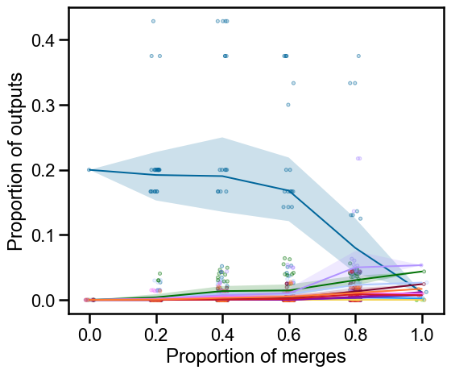

<!--  -->

<!-- _paginate: false -->
<!-- _class: title-slide -->

<!--  -->

<!-- <h1 style="margin-top: 200px;">
Connectivity properties in light of proofreading
</h1> -->

<!--   -->

# Connectivity properties in light of proofreading

Ben Pedigo
(he/him)
Scientist I
Allen Institute for Brain Science

 [ben.pedigo@alleninstitute.org](mailto:ben.pedigo@alleninstitute.org)
 [@bdpedigo (Github)](https://github.com/bdpedigo)
 [@bpedigod (Twitter)](https://twitter.com/bpedigod)
 [bdpedigo.github.io](https://bdpedigo.github.io/)

---

# Proofreading impacts on connectomes

<!--  -->

*Dorkenwald, Schneider-Mizell et al. *bioRxiv* (2023)*

Labor-intensive, Costly, Takes time

<!-- _footer: MICrONS Consortium et al. *bioRxiv* (2023), Dorkenwald et al. *bioRxiv* (2023) -->

### How and how much do these edits matter for downstream conclusions?

---

# CAVE allows us to extract the complete edit history

---

# Explain the proportion of outputs metric

{show how one of these neurons changes over time}

---

# Examples: stable neuron

<!-- Replaying some proportion of merges onto a neuron, evaluating connectivity -->

<!-- 
 -->

<!-- _footer: Neurons/colors from Schneider-Mizell et al *bioRxiv* (2023) -->

---

# Examples: unstable neuron

<!-- _footer: Neurons/colors from Schneider-Mizell et al *bioRxiv* (2023) -->

---
