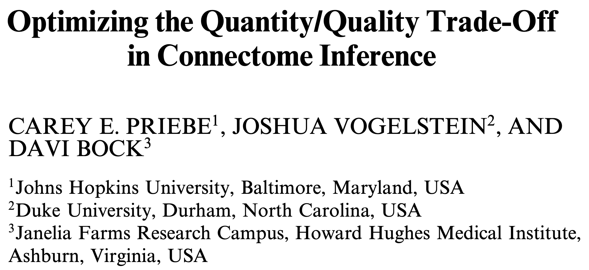

<!--  -->

<!-- _paginate: false -->
<!-- _class: title-slide -->

<!--  -->

<!-- <h1 style="margin-top: 200px;">
Connectivity properties in light of proofreading
</h1> -->

<!--   -->

# Quantifying proofreading effects on connectivity

Ben Pedigo
(he/him)
Scientist I
Allen Institute for Brain Science

 [ben.pedigo@alleninstitute.org](mailto:ben.pedigo@alleninstitute.org)
 [@bdpedigo (Github)](https://github.com/bdpedigo)
 [@bpedigod (Twitter)](https://twitter.com/bpedigod)
 [bdpedigo.github.io](https://bdpedigo.github.io/)

---

# Measurement design in connectomics

 

> Would you rather have many noisy connectivity measurements, or a few high-quality ones?

> There exists cases where you'd actually prefer the "sloppy" version

 

### Given finite resources, worth reflecting on how to proofread with specific scientific goals in mind

<!-- _footer: Priebe et al. *Communications in Statistics* (2013) -->

---

# Measurements in modern connectomics

### Automated segmentation + proofreading

<!--  -->

CAVE: Connectome Annotation Versioning Engine
Dorkenwald, Schneider-Mizell et al. _bioRxiv_ (2023)

<!-- ### How do these edits affect downstream conclusions? -->

<!-- _footer: MICrONS Consortium et al. *bioRxiv* (2023), Schneider-Mizell et al. *bioRxiv* (2023) -->

---

# Inhibition in mouse visual cortex

<!-- _footer: Schneider-Mizell et al. *bioRxiv* (2023) -->

<!-- ---

# Inhibition in mouse visual cortex

- 163 inhibitory neurons were heavily proofread
- Characterized how inhibitory neurons distribute their outputs:

{diagram of proportion of outputs metric}

<!--
# CAVE allows us to extract the complete edit history

_footer: Dorkenwald, Schneider-Mizell et al. *bioRxiv* (2023) -->

---

<!-- # Connectivity during proofreading -->

---

<!-- # Connectivity during proofreading -->

<!-- _backgroundImage: None -->

<!-- 

 -->

---

---

# Cell-type specific connectivity converged quickly

---

# Counterfactual proofreading

Replay specific edits and not others, reconstruct what the network would look like

### What if I'd proofread each neuron to 50% extension?

### Full proofreading

 

NMI(50% proofreading, full proofreading) = 0.82

<!-- - So far, have looked at how neurons changed over the course of proofreading in actuality, but this is a somewhat arbitrary historical ordering
- Can replay edits (or not) according to alternative schemes
- E.g. what if we only had half the proofreading resources - how should we allocate them? -->

---

# Summary

<!-- - Worth understanding whether most neurons look like they have converged -->

- NOT saying we need less proofreading...
- Monitoring proofreading with specific analyses/metrics in mind could help us decide how much proofreading is needed for a specific question
- Counterfactual replay of edits can help understand how alternative proofreading strategies would affect downstream analyses

# Ongoing work

- Prediction of edit impact with respect to a feature of interest
- Prediction of whether a neuron is proofread enough for a specific analysis

<!-- - Counterfactual replay of various edit schemes can help understand how alternative proofreading strategies might affect downstream analyses -->
<!-- - Analyses could be applied to other datasets or even to analyze how design of automated proofreading systems affects conclusions -->

---

# Acknowledgements

**Network Anatomy**
Clay Reid
Agnes Bodor
Adam Bleckert
JoAnn Buchanan
Casey M. Schneider-Mizell
Dan Bumbarger
Derrick Brittain
Forrest Collman
Steven Cook
Nuno da Costa
Bethanny Danskin
Sven Dorkenwald
Leila Elabbady
Emily Joyce
Dan Kapner
Sam Kinn
Cheryl Lea
Gayathri Mahalingam
Ben Pedigo
Sharmi Seshamani
Jenna Schardt
Marc Takeno
Russel Torres
Wenjing Yin
Chi Zhang

**PM**
Lynne Becker
Florence D'Orazi
Sarah Naylor
Shelby Suckow
David Vumbaco
Susan Sunkin

**Morphology and 3D Reconstruction**
Rachel Dalley
Clare Gamlin
Staci Sorensen
Grace Williams

**Modeling & Simulation**
Ani Nandi
Tom Chartrand
Anatoly Buchin
Yina Wei
Soo Yeun Lee
Costas Anastassiou

**Technology**
Tim Fliss
Rob Young
And others

**IT**
Brian Youngstrom
Stuart Kendrick
Scott Harrison
Nathaniel Middleton
And others

**MPE**
Jay Borseth
Collin Farrell
And others

**MindScope**
Reza Abbasi-Asi
Anton Arkhipov
Michael Buice
Daniel Denman
Brian Hu
Josh Larkin
Stefan Mihalas
Daniel Millmann
Gabe Ocker
Naveen Ouellette
Kevin Takasaki
Saskia de Vries
Jun Zhuang

**Alen Institute for Brain Sciences**
Tanya Daigle
Shenqin Yao
Nikolas Jorstad
Trygve Bakken
Rebecca Hodge
Nathan Gouwens
Bosiljka Tasic
Ed Lein
Hongkui Zeng
And many others

**Princeton**
Sven Dorkenwald
Tommy Macrina
Sebastian Seung
Nick Turner
And team

**Baylor**
Jake Riemer
Andreas Tolias
And team

**Harvard Medical School**
Brett Graham
Wei-Chung Lee
And team

**Janelia**
Khaled Khairy
Stephan Saalfeld
Carolyn Ott
Jennifer Lippincott-Schwartz
And others

**JHU**
Jenna Glatzer
Dwight Bergles

**APL**
Brock Wester
And team

**Neuro Surgery and Behavior**
**Lab Animal Services**
**Transgenic Colony Management**
**Finance**
**Legal**

**Computing Resources**
BBP5 Supercomputing Resources
National Energy Research Computing Center
AI HPC
Google Cloud

**Funding**
IARPA - MICRONS
NSF - NeuroNex
NIH – BICCN

<!-- ---

# How would clustering change with different proofreading schemes?

--- -->
<!--
# Impactful edits are more often near the soma

--- -->
<!--
# Space of simple edit allocation schemes

 -->

<!-- # (1) "sloppy" proofreading?

 -->

<!-- ---

# (2) what if I omit individual edits? (importance)

 -->

<!-- ---

# (3) which neurons are "good enough"?

 -->

## <!--

# Estimating reciprocal ratios

 -->
