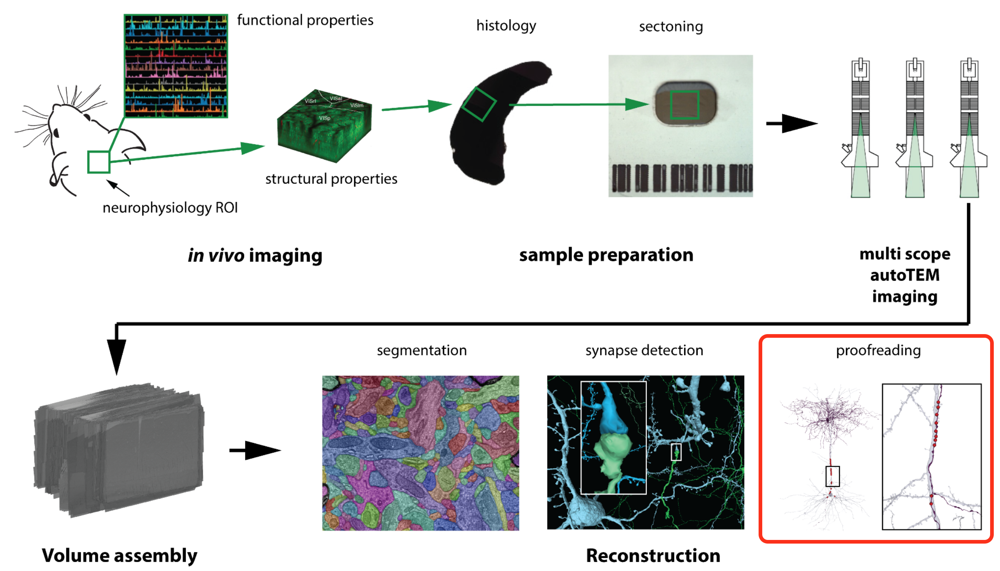
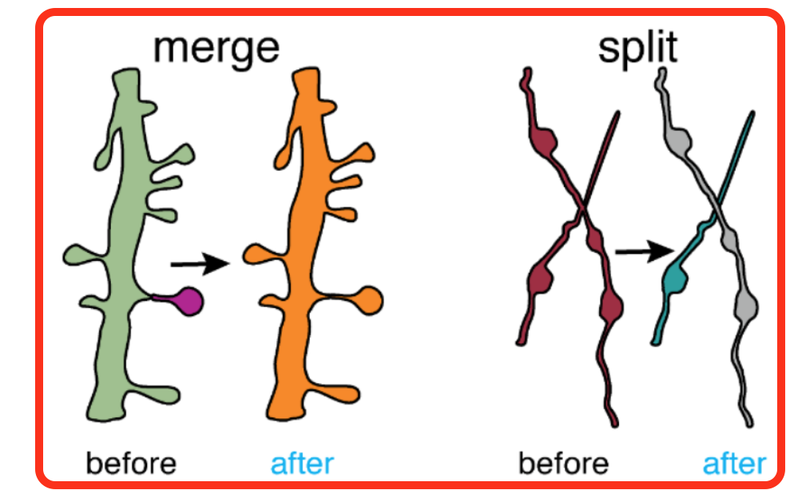
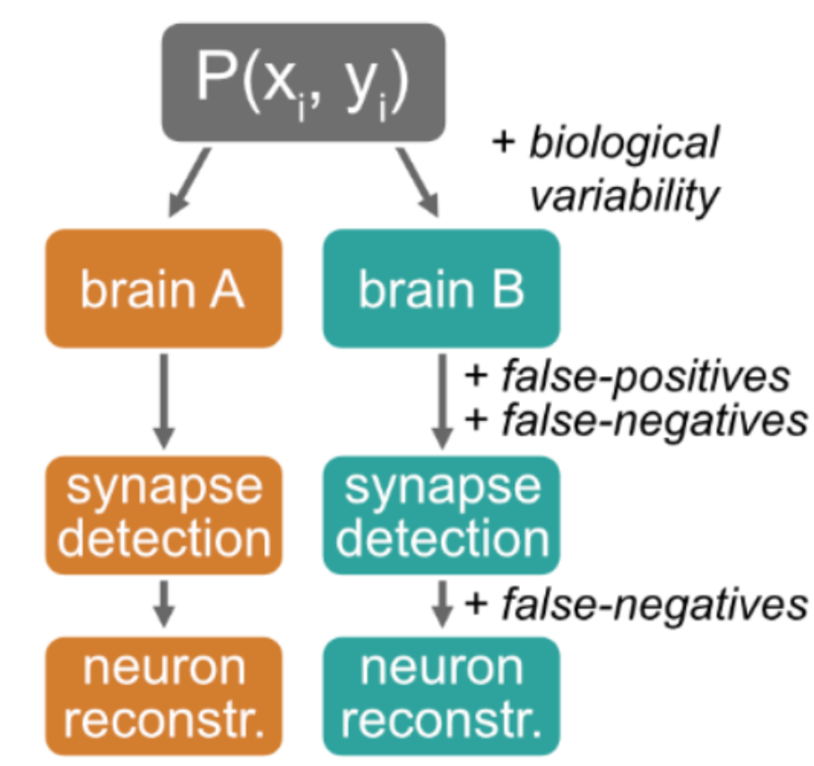

<!-- _paginate: false -->
<!-- _class: title-slide -->

# Quantifying proofreading effects on connectivity

Ben Pedigo
(he/him)
Scientist I
Allen Institute for Brain Science

 [ben.pedigo@alleninstitute.org](mailto:ben.pedigo@alleninstitute.org)
 [@bdpedigo (Github)](https://github.com/bdpedigo)
 [@bpedigod (Twitter)](https://twitter.com/bpedigod)
 [bdpedigo.github.io](https://bdpedigo.github.io/)

---

# Outline

- Background on proofreading in connectomics
- Framework for quantifying proofreading effects
- Examples
  - Example 1
  - Example 2
  - Example 3
- Conclusions

---

# Background

<!-- - EM connectomics is done by automated segmentation, followed by human proofreading
- This process is labor intensive, takes a while, and costly -->

<!-- _footer: MICrONS Consortium et al. (2023) -->

---

# Background

<!-- - EM connectomics is done by automated segmentation, followed by human proofreading
- This process is labor intensive, takes a while, and costly -->

- Labor-intensive
- Costly
- Takes time

<!-- _footer: MICrONS Consortium et al. *bioRxiv* (2023), Dorkenwald et al. *bioRxiv* (2023) -->

---

# Proofreading edits

- We have a record of many edits now, across several datasets
  - **>800K in Minnie, ~2.5 million in V1dd**
    

### How (and how much) do these edits matter for downstream conclusions?

---

# Why investigate the effect of proofreading?

- Learn how much proofreading is needed to answer a question
  - E.g. how much proofreading to identify connectivity type?
- Understand what quantitative claims we can make given proofreading-induced variability
  - E.g. how to compare short-range vs. long-range connections?
- Learn what future proofreading strategies could be most effective

<!-- _footer: Schlegel et al. bioRxiv (2023) -->

---

# CAVE provides a full history of edits

---
