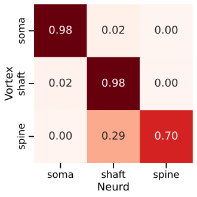
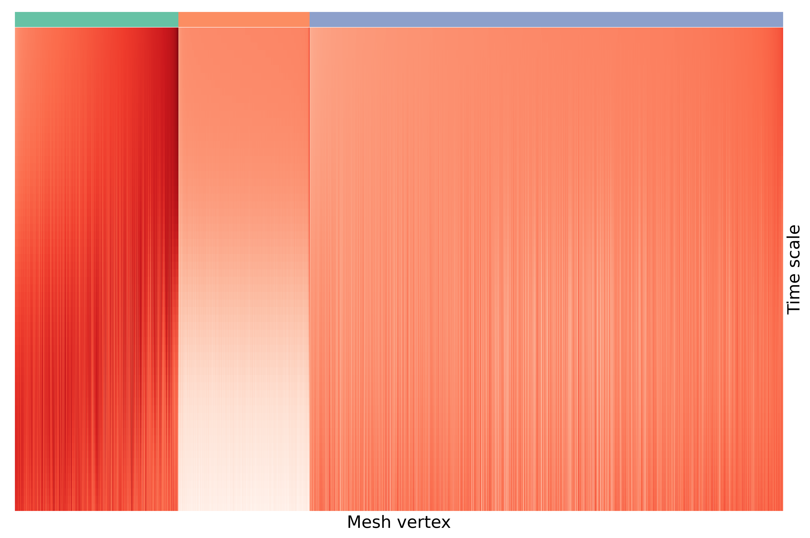

<!-- _paginate: false -->
<!-- _class: title-slide -->

# Mesh signatures

Ben Pedigo
(he/him)
Scientist I
Allen Institute for Brain Science

 [ben.pedigo@alleninstitute.org](mailto:ben.pedigo@alleninstitute.org)
 [@bdpedigo (Github)](https://github.com/bdpedigo)
 [@bpedigod (Twitter)](https://twitter.com/bpedigod)
 [bdpedigo.github.io](https://bdpedigo.github.io/)

---

# Outline

- **Motivation**
- Intuition for heat kernel signatures
- Computing heat kernel signatures
- Application to spine prediction
- Extensions

---

<!-- ---

# Morphological featurization of neuron morphology

- "Kernel" based: compare all $n$ neurons to all other $n-1$ neurons, build up a similarity/dissimilarity matrix
  - NBLAST
  - CAJAL
- Hand-crafted features:
  - IVSCC pipeline features
  - Nuclear features
- Learning-based:
  - GNNs on skeletons (Weis papers)
  - NEURD
  - SegCLR -->

<!-- ---

# Problem statement

## Current spine classifcations have remained unsatisfying -->

---

# Motivation

---

# NEURD classifies many spines as shaft

Coverage: 66% of VORTEX compartment labels are in the NEURD table

---

<!-- <iframe name="myiFrame" src="about:blank"> -->
<!--  -->

<!-- <a href="./images/vortex_neurd/vortex_neurd_sample_meshes_0.html" target="myiFrame">Click me!</a> -->

<!--  -->

<!-- var iframe = document.createElement('iframe');
document.body.appendChild(iframe);
iframe.contentDocument.open();
iframe.contentDocument.close(); -->

<!-- <iframe src="./images/vortex_neurd/vortex_neurd_sample_meshes_0.svg" width="800px" height="660px" style="border:0px; object-fit: contain;" name="myiFrame"></iframe> -->
<!--  -->

<embed src="./images/vortex_neurd/vortex_neurd_sample_meshes_0.svg" width="96%" height="620px" style="border:0px;" name="myiFrame"></embed>

<a href="./images/vortex_neurd/vortex_neurd_sample_meshes_0.html" target="myiFrame" style="border:0px">
</img>
</a>

<!-- <svg xmlns="http://www.w3.org/2000/svg" viewBox="0 0 512 512"><path d="M416 208c0 45.9-14.9 88.3-40 122.7L502.6 457.4c12.5 12.5 12.5 32.8 0 45.3s-32.8 12.5-45.3 0L330.7 376c-34.4 25.2-76.8 40-122.7 40C93.1 416 0 322.9 0 208S93.1 0 208 0S416 93.1 416 208zM208 352a144 144 0 1 0 0-288 144 144 0 1 0 0 288z"/></svg></a> -->

<!-- <!-- <iframe src="./images/vortex_neurd/vortex_neurd_sample_meshes_0.svg" width="100%" height="660px" style="border:0px" name="myiFrame"></iframe> -->

<!-- Claire's -->
<!-- <iframe src="./images/vortex_neurd/vortex_neurd_sample_meshes_0.svg" width="100%" height="660px" onclick="this.src = ((this.src === '"file:///Users/ben.pedigo/code/talks/docs/slides/mesh-signatures/images/vortex_neurd/vortex_neurd_sample_meshes_0.svg") ? "./images/vortex_neurd/vortex_neurd_sample_meshes_0.html" : "./images/vortex_neurd/vortex_neurd_sample_meshes_0.svg");'> -->

<!-- <iframe src='./images/heat_diffusion_curves.svg' width="100%" height="660px" onclick="alert(this.src)"> -->

<!-- 

<a href="./images/vortex_neurd/vortex_neurd_sample_meshes_0.html" target="myiFrame" height="100px" width="100px">Click me</a>

<iframe src="./images/heat_diffusion_curves.svg" width="100%" height="660px" style="border:0px" name="myiFrame"></iframe> -->

<!-- <iframe src="./images/vortex_neurd/vortex_neurd_sample_meshes_0.html" width="100%" height="660px" style="border:0px"></iframe> -->

---

<!-- <iframe src="./images/vortex_neurd/vortex_neurd_sample_meshes_1.html" width="100%" height="660px" style="border:0px"></iframe> -->

---

<!-- <iframe src="./images/vortex_neurd/vortex_neurd_sample_meshes_2.html" width="100%" height="660px" style="border:0px"></iframe> -->

---

<!-- <iframe src="./images/vortex_neurd/vortex_neurd_sample_meshes_3.html" width="100%" height="660px" style="border:0px"></iframe> -->

---

<!-- <iframe src="./images/vortex_neurd/vortex_neurd_sample_meshes_4.html" width="100%" height="660px" style="border:0px"></iframe> -->

---

# Outline

- Motivation
- **Intuition for heat kernel signatures**
- Computing heat kernel signatures
- Application to spine prediction
- Extensions

---

# Intuition

Imagine placing a unit of heat at a point on a surface, watching how that heat diffuses

---

<!-- _backgroundImage: -->

---

# Tracking heat diffusion

---

# Defining the heat kernel signature (HKS)

Let $k_{\tau}(x, y)$ be the amount of heat that diffuses from point $x$ to point $y$ after time $\tau$.

The authors then consider $k_{\tau}(x, x)$; in other words, how much heat is left at $x$ after some amount of time $\tau$.

Then, for some set of timescales $T = \{\tau_1, \tau_2, ... \tau_d\}$, the HKS for a node $x$ is

$$HKS(x) = [k_{\tau_1}(x,x), k_{\tau_2}(x,x), ..., k_{\tau_d}(x,x)]$$

<!-- _footer: Sun et al. (2008) -->

---

# Intuition for multiscale matching

<!-- Do a scoped resizing of the font here -->

> Since all four points have isometric neighborhoods at small scales, their HKS’s are the same for small $t$’s ($< t_1$). Point 1 and point 3 have isometric neighborhoods at middle scales and thus their HKS’s coincide even for middle $t$’s ($[t_1,t_3]$), as do the HKS’s of point 2 and point 4 ($[t_1,t_2]$). The signatures of points 3 and 4 are similar for large $t$’s since ... their neighborhoods at large scale are close.

<!-- _footer: Sun et al., _Eurographics_ (2008) -->

---

# Clustering on heat kernel signatures

<!-- <iframe src="./images/hks_clustered.html" width="100%" height="500px" style="border:0px"></iframe> -->

---

# Outline

- Motivation
- **Intuition for heat kernel signatures**
- Computing heat kernel signatures
- Application to spine prediction
- Extensions

---

# Heat in 1D

---

# Heat in 2D

---

# Heat in HKS

The heat kernel has the form
$$k_t(x,y) = \sum_{i=0}^{\infty} e^{-\lambda_i t} \phi_i(x) \phi_i(y)$$
where $\lambda_i$ and $\phi_i$ are the eigenvalues and eigenvectors of the mesh's laplacian.

In practice, we use a truncated eigendecomposition. And since we only care about $k_t(x,x)$, we get
$$k_t(x,x) = \sum_{i=0}^{d} e^{-\lambda_i t} \phi_i(x)^2$$
where $d$ is the number of eigenpairs we keep.

---

# Scaling the eigendecomposition

- Need $O(1000\text{'s})$ of eigenvectors to get resolution down to the scale of spines
- Very sparse problem: power iteration methods/ARAPACK makes this scalable
- Band-by-band algorithm of Vallet and Levy (2008)
  - Makes power iteration methods efficient for mid-scale eigenvalues
  - Memory efficiency: HKS is a sum over eigenpairs, so can compute a band of eigenpairs, compute HKS component, and then throw away
- Chunking: if we don't need very low frequencies, can chunk the mesh into pieces and compute the eigendecomposition on each chunk
  - I use overlapping mesh chunking to minimize edge effects at borders

<!-- _footer: Vallet and Levy, _Eurographics_ (2008) -->

---

# Timing

Need to profile more comprehensively, but,

~1-2 min to simplify mesh
~1-2 min to subdivide mesh
~1-4 min for (parallelized on 12 cores) eigendecomposition/HKS, longer for very big neurons

---

# Eigenvector of mesh laplacian

<iframe src="./images/fastest-evec.html" width="100%" height="500px" style="border:0px"></iframe>

---

# Outline

- Motivation
- Intuition for heat kernel signatures
- **Computing heat kernel signatures**
- Application to spine prediction
- Extensions

---

# Spine prediction

- Trained on dense spine labels for 6 neurons
- Did a little bit of hand-curating mistakes on another ~20 neurons
- Simple random forest classifier trained on HKS features

---

<!-- <iframe src="./images/posteriors/864691135182486274.html" width="100%" height="660px" style="border:0px"></iframe> -->

---

<!-- <iframe src="./images/posteriors/864691135182839810.html" width="100%" height="660px" style="border:0px"></iframe> -->

---

<!-- <iframe src="./images/posteriors/864691135335398121.html" width="100%" height="660px" style="border:0px"></iframe> -->

---

<!-- <iframe src="./images/posteriors/864691135361404743.html" width="100%" height="660px" style="border:0px"></iframe> -->

---

<!-- <iframe src="./images/posteriors/864691135416507322.html" width="100%" height="660px" style="border:0px"></iframe> -->

---

<!-- <iframe src="./images/posteriors/864691135182486274.html" width="100%" height="660px" style="border:0px"></iframe> -->

---

<!-- <iframe src="./images/posteriors/864691135491229535.html" width="100%" height="660px" style="border:0px"></iframe> -->

---

<!-- <iframe src="./images/posteriors/864691135501563458.html" width="100%" height="660px" style="border:0px"></iframe> -->

---

<!-- <iframe src="./images/posteriors/864691135645292783.html" width="100%" height="660px" style="border:0px"></iframe> -->

---

<!-- <iframe src="./images/posteriors/864691135655141314.html" width="100%" height="660px" style="border:0px"></iframe> -->

---

<!-- <iframe src="./images/posteriors/864691135693690303.html" width="100%" height="660px" style="border:0px"></iframe> -->

---

<!-- <iframe src="./images/posteriors/864691135696697498.html" width="100%" height="660px" style="border:0px"></iframe> -->

---

<!-- <iframe src="./images/posteriors/864691135697250714.html" width="100%" height="660px" style="border:0px"></iframe> -->

---

# Spine prediction statistics

---

# Gallery of errors

---

# Zero-shot prediction on a H01 neuron

<!-- <iframe src="./images/posteriors/h01_posterior.html" width="100%" height="500px" style="border:0px solid white"></iframe> -->

---

# Outline

- Motivation
- Intuition for heat kernel signatures
- Computing heat kernel signatures
- Application to spine prediction
- **Extensions**

---

# Extensions

---

# Volumetric diffusion distance / HKS

<!-- _footer: Rustamov et al., *Eurographics* (2009); Rustamov, *The Visual Computer* (2011)  -->

---

# Computing heat signatures from local integration

- Padé-Chebyshev polynomials paper

---

# Scale-invariance

- Bronstein paper

---

# More elaborate learning schemes

- DiffusionNet/Hodge Net
- Self-supervised learning?

---

# Summary

- Introduced the application of heat kernel signatures to neuron morphology; has many nice properties
  - Translation/rotation/reflection invariance
  - Has an intrinsic "knowledge" of shape without learning
- Showed how to efficiently scale computation of HKS to neuronal methods
- Showed these features can be used to create accurate classifiers for morphological features with relatively little training data

---

# Acknowledgements
