

<!-- _paginate: false -->
<!-- _backgroundImage: ../themes/aibs-backgrounds/blank.png -->

 

# Heat kernel signatures

# (and how to compute them)

# (and one way to use them)

 
 
 
 

Ben Pedigo
(he/him)
Scientist I
Allen Institute for Brain Science
[ben.pedigo@alleninstitute.org](mailto:ben.pedigo@alleninstitute.org)

<!--  [@bdpedigo (Github)](https://github.com/bdpedigo) -->
<!--  [@bpedigod (Twitter)](https://twitter.com/bpedigod) -->
<!--  [bdpedigo.github.io](https://bdpedigo.github.io/) -->

---

# Outline

- **Motivation**
- Intuition for heat kernel signatures
- Computing heat kernel signatures
- Application to spine prediction
- Extensions

<!-- ---

# Morphological featurization of neuron morphology

- "Kernel" based: compare all $n$ neurons to all other $n-1$ neurons, build up a similarity/dissimilarity matrix
  - NBLAST
  - CAJAL
- Hand-crafted features:
  - IVSCC pipeline features
  - Nuclear features
- Learning-based:
  - GNNs on skeletons (Weis papers)
  - NEURD
  - SegCLR -->

<!-- ---

# Problem statement

## Current spine classifcations have remained unsatisfying -->

---

# NEURD classifies many spines as shaft

_Bethanny Danskin, Erika Neace, Rachael Swanstrom_

Coverage: 66% of VORTEX compartment labels are in the NEURD table

<!-- Celii et al. _bioRxiv_ (2024) -->

---

soma shaft spine 
</img> vortex
</img> model

<embed src="./images/vortex_neurd/vortex_neurd_sample_meshes_0.svg" width="96%" height="600px" name="vortex_neurd_sample_meshes_0"></embed>

<a href="./images/vortex_neurd/vortex_neurd_sample_meshes_0.html" target="vortex_neurd_sample_meshes_0">
</img>
</a>

<!-- _footer:  -->

---

soma shaft spine 
</img> vortex
</img> model

<embed src="./images/vortex_neurd/vortex_neurd_sample_meshes_1.svg" width="96%" height="600px" name="vortex_neurd_sample_meshes_1"></embed>

<a href="./images/vortex_neurd/vortex_neurd_sample_meshes_1.html" target="vortex_neurd_sample_meshes_1">
</img>
</a>

---

soma shaft spine 
</img> vortex
</img> model

<embed src="./images/vortex_neurd/vortex_neurd_sample_meshes_2.svg" width="96%" height="600px" name="vortex_neurd_sample_meshes_2"></embed>

<a href="./images/vortex_neurd/vortex_neurd_sample_meshes_2.html" target="vortex_neurd_sample_meshes_2">
</img>
</a>

---

soma shaft spine 
</img> vortex
</img> model

<embed src="./images/vortex_neurd/vortex_neurd_sample_meshes_3.svg" width="96%" height="600px" name="vortex_neurd_sample_meshes_3"></embed>

<a href="./images/vortex_neurd/vortex_neurd_sample_meshes_3.html" target="vortex_neurd_sample_meshes_3">
</img>
</a>

---

soma shaft spine 
</img> vortex
</img> model

<embed src="./images/vortex_neurd/vortex_neurd_sample_meshes_4.svg" width="96%" height="600px" name="vortex_neurd_sample_meshes_4"></embed>

<a href="./images/vortex_neurd/vortex_neurd_sample_meshes_4.html" target="vortex_neurd_sample_meshes_4">
</img>
</a>

---

# Morphological feature learning

**Resolution:**

Segmentation/imagery $>$ Mesh $>$ Skeleton

**Speed:**

Skeleton $>$ Mesh $>$ Segmentation/imagery

 
 

#### How to people do learning on meshes?

---

# Outline

- Motivation
- **Intuition for heat kernel signatures**
- Computing heat kernel signatures
- Application to spine prediction
- Extensions

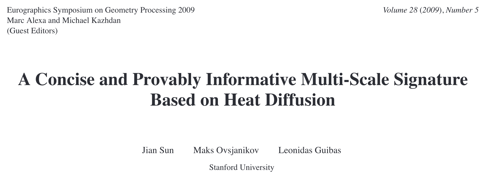

---

# Heat diffusion

Imagine placing a unit of heat at a point on a surface, watching how that heat diffuses

<!-- _footer: https://en.wikipedia.org/wiki/Heat_equation -->

---

 &nbsp;&nbsp;&nbsp;&nbsp;&nbsp;&nbsp;&nbsp;&nbsp;&nbsp;&nbsp;&nbsp;&nbsp;&nbsp;&nbsp;&nbsp;&nbsp;&nbsp;&nbsp;&nbsp;&nbsp; soma shaft spine

<!-- </img> -->

Increasing time $\rightarrow$

---

# Tracking heat diffusion

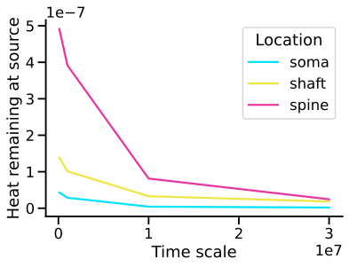

---

# Defining the heat kernel signature (HKS)

$k_{t}(x, y)$: the amount of heat that diffuses from point $x$ to point $y$ after time $t$.

Consider $k_{t}(x, x)$: how much heat is left at $x$ after some amount of time $t$.

For timescales $T = \{t_1, t_2, ... t_d\}$, the HKS for a point on the mesh $x$ is

$$HKS(x) = [k_{t_1}(x,x), k_{t_2}(x,x), ..., k_{t_d}(x,x)]$$

Often scale these: $\frac{k_{t_1}(x,x)}{\sum_i k_{t_1}(i,i)}$
<!-- _footer: Sun et al., _Eurographics_ (2008) -->

---

# Intuition for HKS matching

> ...all four points have isometric neighborhoods at small scales, their HKS’s are the same for small $t$’s ($< t_1$).
>
> ...Point 1 and point 3 have isometric neighborhoods at middle scales and thus their HKS’s coincide even for middle $t$’s ($[t_1,t_3]$)...

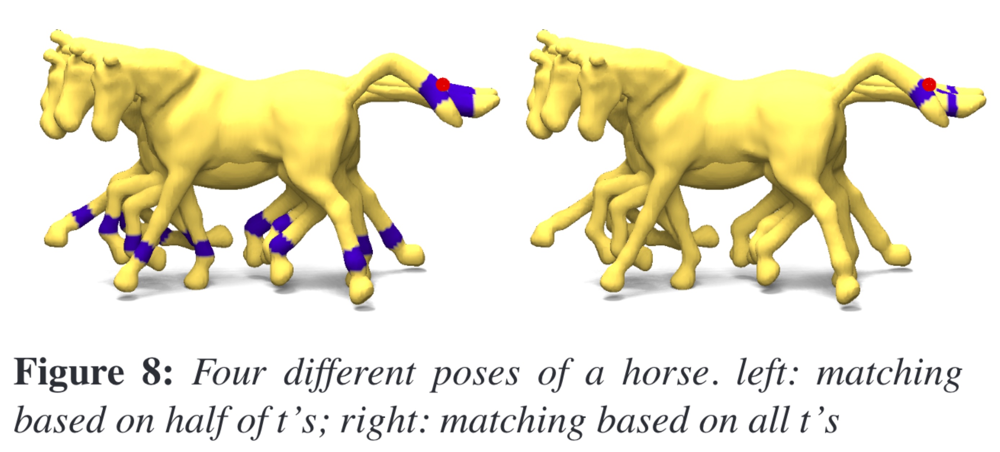

<!-- _footer: Sun et al., _Eurographics_ (2008) -->

---

# Clustering on heat kernel signatures

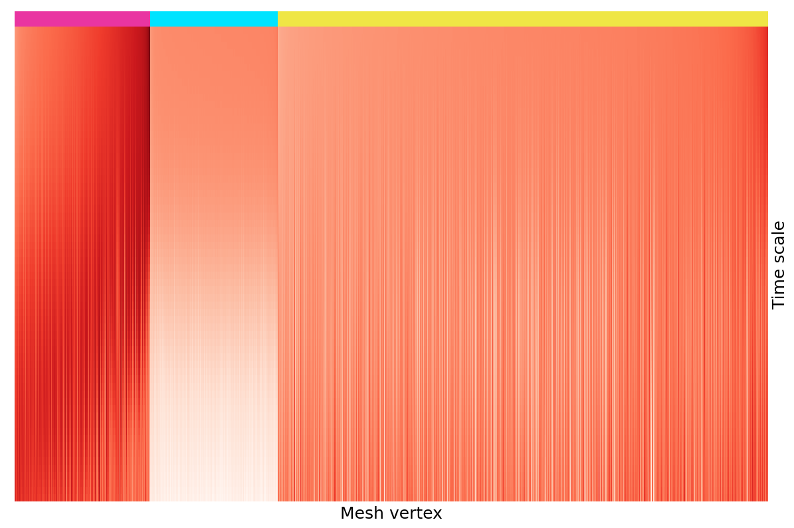

<embed src="./images/show_heat_diffusion/hks_clustered.svg" width="96%" height="550px" name="hks_clustered"></embed>

<a href="./images/show_heat_diffusion/hks_clustered.html" target="hks_clustered">
</img>
</a>

---

# Outline

- Motivation
- Intuition for heat kernel signatures
- **Computing heat kernel signatures**
- Application to spine prediction
- Extensions

---

# Heat diffusion

Evolution of heat $u$ over time $t$ is governed by the heat equation:

$$\frac{\partial{u}}{\partial{t}} = \Delta u$$

where $\Delta$ is the Laplacian (2nd derivative) operator.

Heat transferred from point $x$ to $y$ at time $t$ is given by the heat kernel $k_t(x,y)$:

$$k_t(x,y) = \sum_{i=0}^{\infty} e^{-\lambda_i t} \phi_i(x) \phi_i(y)$$

where $\lambda_i$ and $\phi_i$ are the eigenvalues and eigenvectors of the Laplacian operator.

**We just need these eigenvectors/eigenvalues to describe heat**

<!-- _footer: https://en.wikipedia.org/wiki/Heat_kernel -->

---

# Heat on a 1D grid

For a 1D grid,

the eigenvectors of the Laplacian are the Fourier series:

---

# Laplacian eigenvectors

### 1D grid

### 2D grid

### Mesh

<!-- 
 -->

<!-- <embed src="./images/fastest-evec.html" width="100%" height="400px" style="border:0px"></embed> -->

<embed src="./images/show_heat_diffusion/eigenvector_on_mesh.svg" width="96%" height="380px" name="eigenvector_on_mesh"></embed>

<a href="./images/show_heat_diffusion/eigenvector_on_mesh.html" target="eigenvector_on_mesh">
</img>
</a>

---

# Computing the eigendecomposition

- :white_check_mark: Very sparse problem: power iteration methods/ARPACK are efficient
- :white_check_mark: Can truncate the eigendecomposition to get an approximate solution
- :x: Need $O(\text{Thousands})$ of eigenvectors to get resolution down to the scale of spines, mesh has $O(\text{Millions})$ of points
  - Was taking $\thicksim$ 1-3 Hours to compute eigendecomposition on a single neuron

---

# Improvement #1: band-by-band algorithm

Band-by-band algorithm of Vallet and Levy (2008):

- Use the "shift-invert" trick, do $\tilde{L} = L - \lambda_S I$ for some $\lambda_S$
  - Converts the problem to one where power iteration methods are efficient for that range of eigenvalues
- Compute eigenpairs (ARPACK)
- Compute contribution of each eigenpair to HKS, throw away
  - Memory efficient
- Compute a new $\lambda_S$, repeat until reach desired eigenvalue

<!--

> - Replace L with L - $\lambda_S$ I
> -

 -->

<!-- _footer: Vallet and Levy, _Eurographics_ (2008) -->

---

# Improvement #2: chunking

- Intuition: don't need low frequency information to distinguish local features
- Can break the mesh into pieces, compute the eigendecomposition on each chunk
- Use overlapping mesh chunking to minimize edge effects at borders

---

# Timing

<!-- Need to profile more comprehensively, but,

~1-2 min to simplify mesh
~1-2 min to subdivide mesh
~1-4 min for (parallelized on 12 cores) eigendecomposition/HKS, longer for very big neurons -->

Per chunk

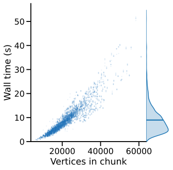

Whole neuron

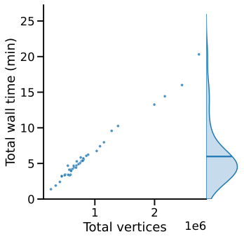

$*$ Doesn't include mesh simplification/subdivision, adds $\thicksim 1-3$ minutes per neuron

---

# Outline

- Motivation
- Intuition for heat kernel signatures
- Computing heat kernel signatures
- **Application to spine prediction**
- Extensions

---

# Spine prediction

- Used dense spine labels for 6 neurons
  - _Bethanny Danskin, Erika Neace, Rachael Swanstrom_
- Trained on HKS features from the mesh point closest to synapse center point
- Used a simple random forest, didn't do much tuning or exploration here
- Didn't try to do anything with the axon, so that gets labeled arbitrarily

---

# Random forest, leave-one-neuron-out testing

<!-- ---

# Best neuron

soma shaft spine 
</img> vortex
</img> model

<embed src="./images/model0/neuron_posterior_best.svg" width="96%" height="520px" name="neuron_posterior_best"></embed>

<a href="./images/model0/neuron_posterior_best.html" target="neuron_posterior_best">
</img>
</a>

 -->

---

# Worst neuron

soma shaft spine 
</img> vortex
</img> model

<embed src="./images/model0/neuron_posterior_worst.svg" width="96%" height="520px" name="neuron_posterior_worst"></embed>

<a href="./images/model0/neuron_posterior_worst.html" target="neuron_posterior_worst">
</img>
</a>

---

soma shaft spine 
</img> vortex
</img> model

<embed src="./images/model0/incorrect_gallery.svg" width="96%" height="600px" name="incorrect_gallery"></embed>

<a href="./images/model0/incorrect_gallery.html" target="incorrect_gallery">
</img>
</a>

---

# Pseudo-active learning

- Used model from these 6 neurons to predict on 20 more neurons
  - These varied more in dendrite thickness and spine density
- Plotted the posterior on the mesh, hand-labeled points I thought looked bad
- Took $\thicksim 2$ clicky hours
- Retrain
- Applied model to another 20 more neurons (not the ones trained on)

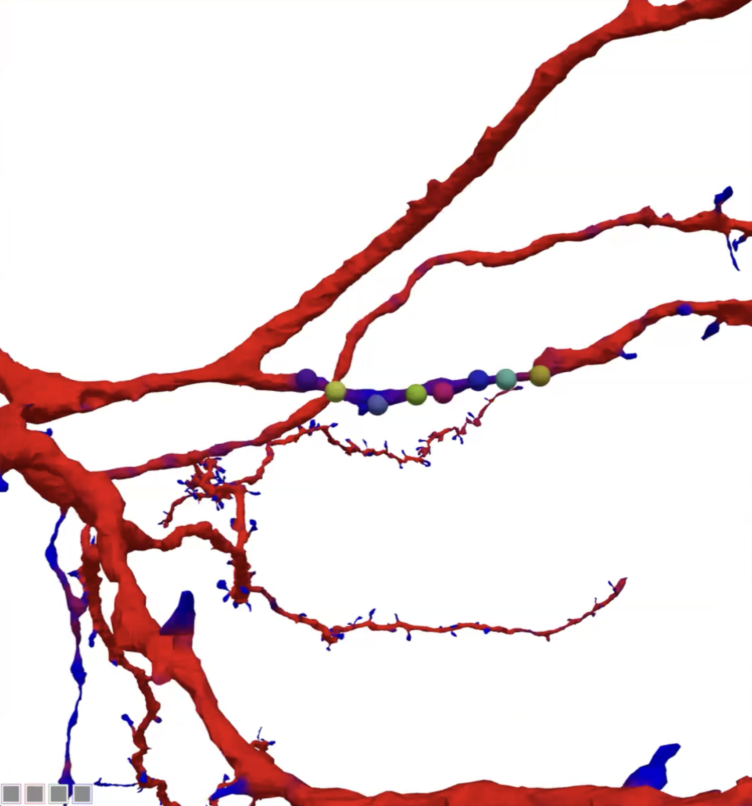

---

<embed src="./images/boosted_model_posteriors/864691135182486274_posterior.svg" width="96%" height="600px" name="864691135182486274_posterior"></embed>

<a href="./images/boosted_model_posteriors/864691135182486274_posterior.html" target="864691135182486274_posterior">
</img>
</a>

---

<embed src="./images/boosted_model_posteriors/864691135182839810_posterior.svg" width="96%" height="600px" name="864691135182839810_posterior"></embed>

<a href="./images/boosted_model_posteriors/864691135182839810_posterior.html" target="864691135182839810_posterior">
</img>
</a>

---

<embed src="./images/boosted_model_posteriors/864691135335398121_posterior.svg" width="96%" height="600px" name="864691135335398121_posterior"></embed>

<a href="./images/boosted_model_posteriors/864691135335398121_posterior.html" target="864691135335398121_posterior">
</img>
</a>

---

<embed src="./images/boosted_model_posteriors/864691135361404743_posterior.svg" width="96%" height="600px" name="864691135361404743_posterior"></embed>

<a href="./images/boosted_model_posteriors/864691135361404743_posterior.html" target="864691135361404743_posterior">
</img>
</a>

---

<embed src="./images/boosted_model_posteriors/864691135416507322_posterior.svg" width="96%" height="600px" name="864691135416507322_posterior"></embed>

<a href="./images/boosted_model_posteriors/864691135416507322_posterior.html" target="864691135416507322_posterior">
</img>
</a>

---

<embed src="./images/boosted_model_posteriors/864691135491229535_posterior.svg" width="96%" height="600px" name="864691135491229535_posterior"></embed>

<a href="./images/boosted_model_posteriors/864691135491229535_posterior.html" target="864691135491229535_posterior">
</img>
</a>

---

<embed src="./images/boosted_model_posteriors/864691135501563458_posterior.svg" width="96%" height="600px" name="864691135501563458_posterior"></embed>

<a href="./images/boosted_model_posteriors/864691135501563458_posterior.html" target="864691135501563458_posterior">
</img>
</a>

---

<embed src="./images/boosted_model_posteriors/864691135645292783_posterior.svg" width="96%" height="600px" name="864691135645292783_posterior"></embed>

<a href="./images/boosted_model_posteriors/864691135645292783_posterior.html" target="864691135645292783_posterior">
</img>
</a>

---

<embed src="./images/boosted_model_posteriors/864691135655141314_posterior.svg" width="96%" height="600px" name="864691135655141314_posterior"></embed>

<a href="./images/boosted_model_posteriors/864691135655141314_posterior.html" target="864691135655141314_posterior">
</img>
</a>

---

<embed src="./images/boosted_model_posteriors/864691135693690303_posterior.svg" width="96%" height="600px" name="864691135693690303_posterior"></embed>

<a href="./images/boosted_model_posteriors/864691135693690303_posterior.html" target="864691135693690303_posterior">
</img>
</a>

---

<embed src="./images/boosted_model_posteriors/864691135696697498_posterior.svg" width="96%" height="600px" name="864691135696697498_posterior"></embed>

<a href="./images/boosted_model_posteriors/864691135696697498_posterior.html" target="864691135696697498_posterior">
</img>
</a>

---

<embed src="./images/boosted_model_posteriors/864691135697250714_posterior.svg" width="96%" height="600px" name="864691135697250714_posterior"></embed>

<a href="./images/boosted_model_posteriors/864691135697250714_posterior.html" target="864691135697250714_posterior">
</img>
</a>

---

<embed src="./images/boosted_model_posteriors/864691135737477764_posterior.svg" width="96%" height="600px" name="864691135737477764_posterior"></embed>

<a href="./images/boosted_model_posteriors/864691135737477764_posterior.html" target="864691135737477764_posterior">
</img>
</a>

---

<embed src="./images/boosted_model_posteriors/864691135800244578_posterior.svg" width="96%" height="600px" name="864691135800244578_posterior"></embed>

<a href="./images/boosted_model_posteriors/864691135800244578_posterior.html" target="864691135800244578_posterior">
</img>
</a>

---

<embed src="./images/boosted_model_posteriors/864691135851482823_posterior.svg" width="96%" height="600px" name="864691135851482823_posterior"></embed>

<a href="./images/boosted_model_posteriors/864691135851482823_posterior.html" target="864691135851482823_posterior">
</img>
</a>

---

<embed src="./images/boosted_model_posteriors/864691135875972691_posterior.svg" width="96%" height="600px" name="864691135875972691_posterior"></embed>

<a href="./images/boosted_model_posteriors/864691135875972691_posterior.html" target="864691135875972691_posterior">
</img>
</a>

---

<embed src="./images/boosted_model_posteriors/864691136005566154_posterior.svg" width="96%" height="600px" name="864691136005566154_posterior"></embed>

<a href="./images/boosted_model_posteriors/864691136005566154_posterior.html" target="864691136005566154_posterior">
</img>
</a>

---

<embed src="./images/boosted_model_posteriors/864691136109645240_posterior.svg" width="96%" height="600px" name="864691136109645240_posterior"></embed>

<a href="./images/boosted_model_posteriors/864691136109645240_posterior.html" target="864691136109645240_posterior">
</img>
</a>

---

<embed src="./images/boosted_model_posteriors/864691136437250718_posterior.svg" width="96%" height="600px" name="864691136437250718_posterior"></embed>

<a href="./images/boosted_model_posteriors/864691136437250718_posterior.html" target="864691136437250718_posterior">
</img>
</a>

---

<embed src="./images/boosted_model_posteriors/864691136923636708_posterior.svg" width="96%" height="600px" name="864691136923636708_posterior"></embed>

<a href="./images/boosted_model_posteriors/864691136923636708_posterior.html" target="864691136923636708_posterior">
</img>
</a>

---

# Inhibitory neurons

---

<embed src="./images/boosted_model_posteriors/864691135014021110_posterior.svg" width="96%" height="600px" name="864691135014021110_posterior"></embed>

<a href="./images/boosted_model_posteriors/864691135014021110_posterior.html" target="864691135014021110_posterior">
</img>
</a>

---

<embed src="./images/boosted_model_posteriors/864691135497617939_posterior.svg" width="96%" height="600px" name="864691135497617939_posterior"></embed>

<a href="./images/boosted_model_posteriors/864691135497617939_posterior.html" target="864691135497617939_posterior">
</img>
</a>

---

<embed src="./images/boosted_model_posteriors/864691136195002188_posterior.svg" width="96%" height="600px" name="864691136195002188_posterior"></embed>

<a href="./images/boosted_model_posteriors/864691136195002188_posterior.html" target="864691136195002188_posterior">
</img>
</a>

---

<embed src="./images/boosted_model_posteriors/864691136143786292_posterior.svg" width="96%" height="600px" name="864691136143786292_posterior"></embed>

<a href="./images/boosted_model_posteriors/864691136143786292_posterior.html" target="864691136143786292_posterior">
</img>
</a>

---

<embed src="./images/boosted_model_posteriors/864691137020205166_posterior.svg" width="96%" height="600px" name="864691137020205166_posterior"></embed>

<a href="./images/boosted_model_posteriors/864691137020205166_posterior.html" target="864691137020205166_posterior">
</img>
</a>

---

# Zero-shot prediction on a H01 neuron

<embed src="./images/h01/h01_posterior.svg" width="96%" height="550px" name="h01_posterior"></embed>

<a href="./images/h01/h01_posterior.html" target="h01_posterior">
</img>
</a>

---

# Outline

- Motivation
- Intuition for heat kernel signatures
- Computing heat kernel signatures
- Application to spine prediction
- **Extensions**

---

# HKS modifications

Volumetric HKS (w/ or w/o voxelization): Raviv et al. 2010; Rustamov et al. 2009; Rustamov 2011

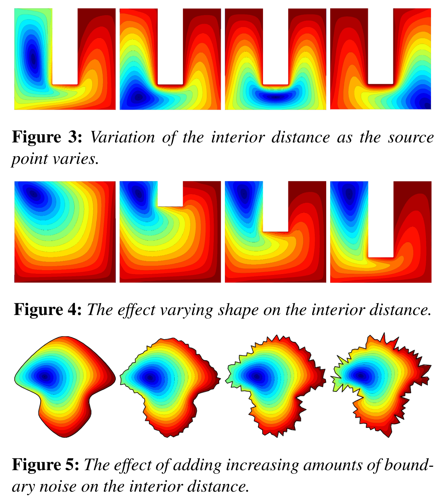

Scale-invariance: Bronstein et al. 2011

---

# Computation

Projection-based methods: Nasikun et al. 2018; Nasikun et al. 2022; Magnet and Ovsjanikov 2023

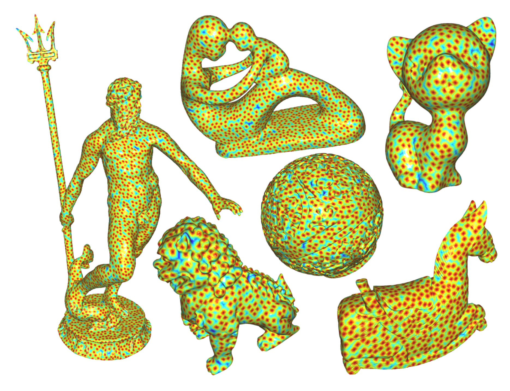

Chebyshev polynomials: Hammond et al. 2009; Shuman et al. 2011; Huang et al. 2020

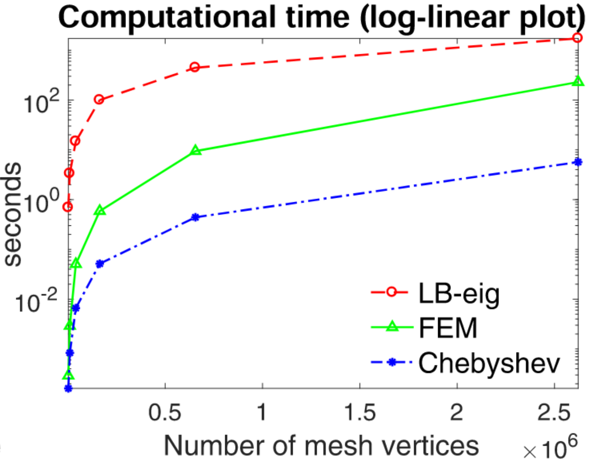

---

# Learning

Learning more general functions of eigenvectors to discriminate classes: Litman & Bronstein 2014; Boscaini et al. 2015; Smirnov & Solomon 2021

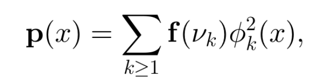

<!-- - Halimi et al. 2019: Self-supervised learning  -->

Using approximate diffusion as an operator for local aggregation: Sharp et al. 2020

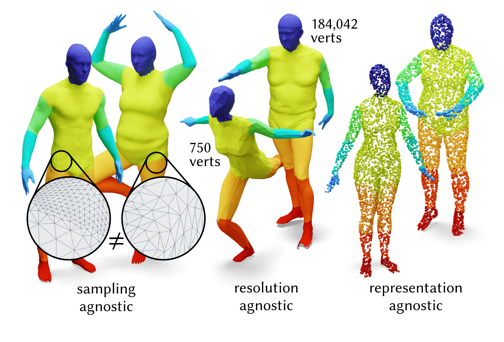

---

# Summary

- Introduced the application of heat kernel signatures to neuron morphology
  - Even without learning, capture some local structures of morphology
- Showed how to scale computation of HKS to scale/resolution of neuronal meshes
- Showed these features can be used to create accurate classifiers (at least for spines) with relatively little training data
- There is a rich literature extending these ideas with different computational and learning techniques

<!-- ---

# Acknowledgements

Casey M. Schneider-Mizell
Forrest Collman
Bethanny Danskin
Erika Neace
Rachael Swanstrom -->

---

# Acknowledgements

_Network Anatomy_
Clay Reid
Agnes Bodor
Adam Bleckert
JoAnn Buchanan
**Casey M. Schneider-Mizell**
Dan Bumbarger
Derrick Brittain
**Forrest Collman**
Steven Cook
Nuno da Costa
**Bethanny Danskin**
Cameron Devine
Sven Dorkenwald
Leila Elabbady
Emily Joyce
Dan Kapner
Sam Kinn
Cheryl Lea
Melissa Lerch
Xiaoyu Lu
Gayathri Mahalingam
**Erika Neace**
Ben Pedigo
Sharmi Seshamani
Jenna Schardt
**Rachael Swanstrom**
Marc Takeno
Russel Torres
Keith Wiley
Wenjing Yin
Chi Zhang

_PM_
Lynne Becker
Florence D'Orazi
Sarah Naylor
Shelby Suckow
David Vumbaco
Susan Sunkin

_Morphology and 3D Reconstruction_
Rachel Dalley
Clare Gamlin
Staci Sorensen
Grace Williams

_Modeling & Simulation_
Ani Nandi
Tom Chartrand
Anatoly Buchin
Yina Wei
Soo Yeun Lee
Costas Anastassiou

_Technology_
Tim Fliss
Rob Young
And others

_IT_
Brian Youngstrom
Stuart Kendrick
Scott Harrison
Nathaniel Middleton
And others

_MPE_
Jay Borseth
Collin Farrell
And others

_MindScope_
Reza Abbasi-Asi
Anton Arkhipov
Michael Buice
Daniel Denman
Brian Hu
Josh Larkin
Stefan Mihalas
Daniel Millmann
Gabe Ocker
Naveen Ouellette
Kevin Takasaki
Saskia de Vries
Jun Zhuang

_Alen Institute for Brain Sciences_
Tanya Daigle
Shenqin Yao
Nikolas Jorstad
Trygve Bakken
Rebecca Hodge
Nathan Gouwens
Bosiljka Tasic
Ed Lein
Hongkui Zeng
And many others

_Princeton_
Sven Dorkenwald
Tommy Macrina
Sebastian Seung
Nick Turner
And team

_Baylor_
Jake Riemer
Andreas Tolias
And team

_Harvard Medical School_
Brett Graham
Wei-Chung Lee
And team

_Janelia_
Khaled Khairy
Stephan Saalfeld
Carolyn Ott
Jennifer Lippincott-Schwartz
And others

_JHU_
Jenna Glatzer
Dwight Bergles

_APL_
Brock Wester
And team

_Neuro Surgery and Behavior_
_Lab Animal Services_
_Transgenic Colony Management_
_Finance_
_Legal_

_Computing Resources_
BBP5 Supercomputing Resources
National Energy Research Computing Center
AI HPC
Google Cloud

_Funding_
IARPA - MICRONS
NSF - NeuroNex
NIH – BICCN

